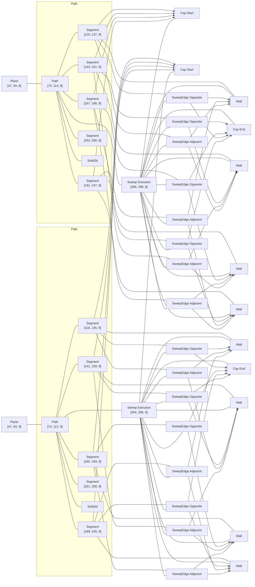

```mermaid
flowchart LR
  subgraph path3 [Path]
    3["Path<br>[74, 114, 8]"]
    5["Segment<br>[120, 137, 8]"]
    6["Segment<br>[143, 161, 8]"]
    7["Segment<br>[167, 185, 8]"]
    8["Segment<br>[191, 247, 8]"]
    9["Segment<br>[253, 260, 8]"]
    15[Solid2d]
  end
  subgraph path4 [Path]
    4["Path<br>[74, 112, 9]"]
    10["Segment<br>[118, 135, 9]"]
    11["Segment<br>[141, 159, 9]"]
    12["Segment<br>[165, 183, 9]"]
    13["Segment<br>[189, 245, 9]"]
    14["Segment<br>[251, 258, 9]"]
    16[Solid2d]
  end
  1["Plane<br>[47, 64, 8]"]
  2["Plane<br>[47, 64, 9]"]
  17["Sweep Extrusion<br>[266, 288, 8]"]
  18["Sweep Extrusion<br>[264, 286, 9]"]
  19[Wall]
  20[Wall]
  21[Wall]
  22[Wall]
  23[Wall]
  24[Wall]
  25[Wall]
  26[Wall]
  27["Cap Start"]
  28["Cap Start"]
  29["Cap End"]
  30["Cap End"]
  31["SweepEdge Opposite"]
  32["SweepEdge Opposite"]
  33["SweepEdge Opposite"]
  34["SweepEdge Opposite"]
  35["SweepEdge Opposite"]
  36["SweepEdge Opposite"]
  37["SweepEdge Opposite"]
  38["SweepEdge Opposite"]
  39["SweepEdge Adjacent"]
  40["SweepEdge Adjacent"]
  41["SweepEdge Adjacent"]
  42["SweepEdge Adjacent"]
  43["SweepEdge Adjacent"]
  44["SweepEdge Adjacent"]
  45["SweepEdge Adjacent"]
  46["SweepEdge Adjacent"]
  1 --- 3
  2 --- 4
  3 --- 5
  3 --- 6
  3 --- 7
  3 --- 8
  3 --- 9
  3 --- 15
  3 ---- 17
  4 --- 10
  4 --- 11
  4 --- 12
  4 --- 13
  4 --- 14
  4 --- 16
  4 ---- 18
  5 --- 24
  5 x--> 27
  5 --- 37
  5 --- 46
  6 --- 25
  6 x--> 27
  6 --- 35
  6 --- 45
  7 --- 26
  7 x--> 27
  7 --- 36
  7 --- 44
  8 --- 23
  8 x--> 27
  8 --- 38
  8 --- 43
  10 --- 19
  10 x--> 28
  10 --- 31
  10 --- 39
  11 --- 22
  11 x--> 28
  11 --- 34
  11 --- 41
  12 --- 21
  12 x--> 28
  12 --- 32
  12 --- 42
  13 --- 20
  13 x--> 28
  13 --- 33
  13 --- 40
  17 --- 23
  17 --- 24
  17 --- 25
  17 --- 26
  17 --- 27
  17 --- 29
  17 --- 35
  17 --- 36
  17 --- 37
  17 --- 38
  17 --- 43
  17 --- 44
  17 --- 45
  17 --- 46
  18 --- 19
  18 --- 20
  18 --- 21
  18 --- 22
  18 --- 28
  18 --- 30
  18 --- 31
  18 --- 32
  18 --- 33
  18 --- 34
  18 --- 39
  18 --- 40
  18 --- 41
  18 --- 42
  31 <--x 19
  39 <--x 19
  40 <--x 19
  33 <--x 20
  40 <--x 20
  42 <--x 20
  32 <--x 21
  41 <--x 21
  42 <--x 21
  34 <--x 22
  39 <--x 22
  41 <--x 22
  38 <--x 23
  43 <--x 23
  44 <--x 23
  37 <--x 24
  43 <--x 24
  46 <--x 24
  35 <--x 25
  45 <--x 25
  46 <--x 25
  36 <--x 26
  44 <--x 26
  45 <--x 26
  35 <--x 29
  36 <--x 29
  37 <--x 29
  38 <--x 29
  31 <--x 30
  32 <--x 30
  33 <--x 30
  34 <--x 30
```
