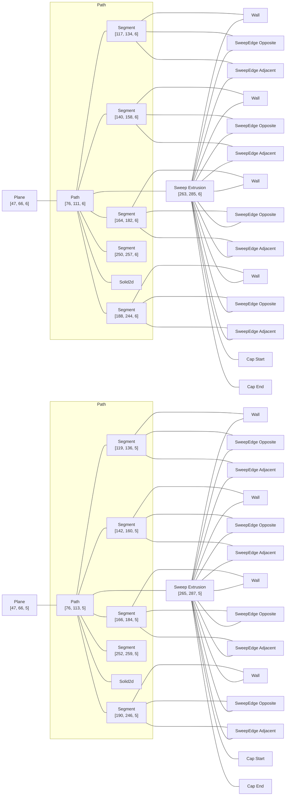

```mermaid
flowchart LR
  subgraph path3 [Path]
    3["Path<br>[76, 111, 6]"]
    5["Segment<br>[117, 134, 6]"]
    7["Segment<br>[140, 158, 6]"]
    9["Segment<br>[164, 182, 6]"]
    11["Segment<br>[188, 244, 6]"]
    13["Segment<br>[250, 257, 6]"]
    14[Solid2d]
  end
  subgraph path4 [Path]
    4["Path<br>[76, 113, 5]"]
    6["Segment<br>[119, 136, 5]"]
    8["Segment<br>[142, 160, 5]"]
    10["Segment<br>[166, 184, 5]"]
    12["Segment<br>[190, 246, 5]"]
    15["Segment<br>[252, 259, 5]"]
    16[Solid2d]
  end
  1["Plane<br>[47, 66, 6]"]
  2["Plane<br>[47, 66, 5]"]
  17["Sweep Extrusion<br>[263, 285, 6]"]
  18[Wall]
  19[Wall]
  20[Wall]
  21[Wall]
  22["Cap Start"]
  23["Cap End"]
  24["Sweep Extrusion<br>[265, 287, 5]"]
  25[Wall]
  26[Wall]
  27[Wall]
  28[Wall]
  29["Cap Start"]
  30["Cap End"]
  31["SweepEdge Opposite"]
  32["SweepEdge Adjacent"]
  33["SweepEdge Opposite"]
  34["SweepEdge Adjacent"]
  35["SweepEdge Opposite"]
  36["SweepEdge Adjacent"]
  37["SweepEdge Opposite"]
  38["SweepEdge Adjacent"]
  39["SweepEdge Opposite"]
  40["SweepEdge Adjacent"]
  41["SweepEdge Opposite"]
  42["SweepEdge Adjacent"]
  43["SweepEdge Opposite"]
  44["SweepEdge Adjacent"]
  45["SweepEdge Opposite"]
  46["SweepEdge Adjacent"]
  1 --- 3
  2 --- 4
  3 --- 5
  3 --- 7
  3 --- 9
  3 --- 11
  3 --- 13
  3 ---- 17
  3 --- 14
  4 --- 6
  4 --- 8
  4 --- 10
  4 --- 12
  4 --- 15
  4 ---- 24
  4 --- 16
  5 --- 21
  5 --- 37
  5 --- 38
  6 --- 28
  6 --- 45
  6 --- 46
  7 --- 20
  7 --- 35
  7 --- 36
  8 --- 27
  8 --- 43
  8 --- 44
  9 --- 19
  9 --- 33
  9 --- 34
  10 --- 26
  10 --- 41
  10 --- 42
  11 --- 18
  11 --- 31
  11 --- 32
  12 --- 25
  12 --- 39
  12 --- 40
  17 --- 18
  17 --- 19
  17 --- 20
  17 --- 21
  17 --- 22
  17 --- 23
  17 --- 31
  17 --- 32
  17 --- 33
  17 --- 34
  17 --- 35
  17 --- 36
  17 --- 37
  17 --- 38
  24 --- 25
  24 --- 26
  24 --- 27
  24 --- 28
  24 --- 29
  24 --- 30
  24 --- 39
  24 --- 40
  24 --- 41
  24 --- 42
  24 --- 43
  24 --- 44
  24 --- 45
  24 --- 46
```
