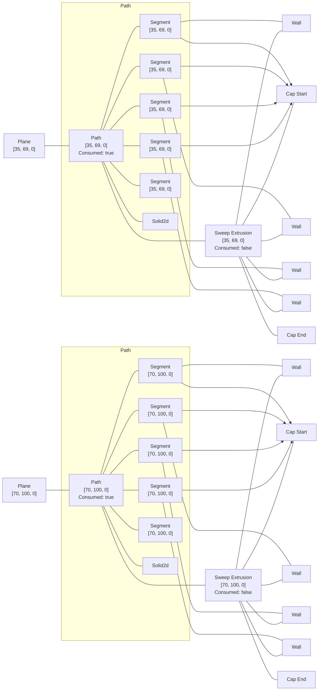

```mermaid
flowchart LR
  subgraph path2 [Path]
    2["Path<br>[35, 69, 0]<br>Consumed: true"]
      %% [ProgramBodyItem { index: 0 }]
    3["Segment<br>[35, 69, 0]"]
      %% [ProgramBodyItem { index: 0 }]
    4["Segment<br>[35, 69, 0]"]
      %% [ProgramBodyItem { index: 0 }]
    5["Segment<br>[35, 69, 0]"]
      %% [ProgramBodyItem { index: 0 }]
    6["Segment<br>[35, 69, 0]"]
      %% [ProgramBodyItem { index: 0 }]
    7["Segment<br>[35, 69, 0]"]
      %% [ProgramBodyItem { index: 0 }]
    8[Solid2d]
  end
  subgraph path17 [Path]
    17["Path<br>[70, 100, 0]<br>Consumed: true"]
      %% [ProgramBodyItem { index: 1 }]
    18["Segment<br>[70, 100, 0]"]
      %% [ProgramBodyItem { index: 1 }]
    19["Segment<br>[70, 100, 0]"]
      %% [ProgramBodyItem { index: 1 }]
    20["Segment<br>[70, 100, 0]"]
      %% [ProgramBodyItem { index: 1 }]
    21["Segment<br>[70, 100, 0]"]
      %% [ProgramBodyItem { index: 1 }]
    22["Segment<br>[70, 100, 0]"]
      %% [ProgramBodyItem { index: 1 }]
    23[Solid2d]
  end
  1["Plane<br>[35, 69, 0]"]
    %% [ProgramBodyItem { index: 0 }]
  9["Sweep Extrusion<br>[35, 69, 0]<br>Consumed: false"]
    %% [ProgramBodyItem { index: 0 }]
  10[Wall]
    %% face_code_ref=Missing NodePath
  11[Wall]
    %% face_code_ref=Missing NodePath
  12[Wall]
    %% face_code_ref=Missing NodePath
  13[Wall]
    %% face_code_ref=Missing NodePath
  14["Cap Start"]
    %% face_code_ref=Missing NodePath
  15["Cap End"]
    %% face_code_ref=Missing NodePath
  16["Plane<br>[70, 100, 0]"]
    %% [ProgramBodyItem { index: 1 }]
  24["Sweep Extrusion<br>[70, 100, 0]<br>Consumed: false"]
    %% [ProgramBodyItem { index: 1 }]
  25[Wall]
    %% face_code_ref=Missing NodePath
  26[Wall]
    %% face_code_ref=Missing NodePath
  27[Wall]
    %% face_code_ref=Missing NodePath
  28[Wall]
    %% face_code_ref=Missing NodePath
  29["Cap Start"]
    %% face_code_ref=Missing NodePath
  30["Cap End"]
    %% face_code_ref=Missing NodePath
  1 --- 2
  2 --- 3
  2 --- 4
  2 --- 5
  2 --- 6
  2 --- 7
  2 --- 8
  2 ---- 9
  3 --- 13
  3 x--> 14
  4 --- 12
  4 x--> 14
  5 --- 11
  5 x--> 14
  6 --- 10
  6 x--> 14
  9 --- 10
  9 --- 11
  9 --- 12
  9 --- 13
  9 --- 14
  9 --- 15
  16 --- 17
  17 --- 18
  17 --- 19
  17 --- 20
  17 --- 21
  17 --- 22
  17 --- 23
  17 ---- 24
  18 --- 28
  18 x--> 29
  19 --- 27
  19 x--> 29
  20 --- 26
  20 x--> 29
  21 --- 25
  21 x--> 29
  24 --- 25
  24 --- 26
  24 --- 27
  24 --- 28
  24 --- 29
  24 --- 30
```
