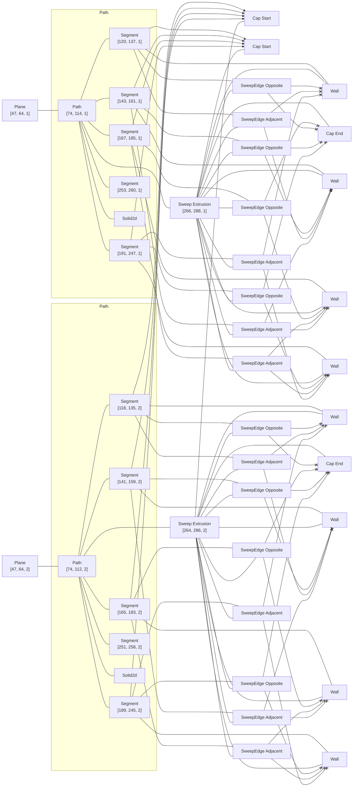

```mermaid
flowchart LR
  subgraph path3 [Path]
    3["Path<br>[74, 114, 1]"]
    5["Segment<br>[120, 137, 1]"]
    6["Segment<br>[143, 161, 1]"]
    7["Segment<br>[167, 185, 1]"]
    8["Segment<br>[191, 247, 1]"]
    9["Segment<br>[253, 260, 1]"]
    15[Solid2d]
  end
  subgraph path4 [Path]
    4["Path<br>[74, 112, 2]"]
    10["Segment<br>[118, 135, 2]"]
    11["Segment<br>[141, 159, 2]"]
    12["Segment<br>[165, 183, 2]"]
    13["Segment<br>[189, 245, 2]"]
    14["Segment<br>[251, 258, 2]"]
    16[Solid2d]
  end
  1["Plane<br>[47, 64, 1]"]
  2["Plane<br>[47, 64, 2]"]
  17["Sweep Extrusion<br>[266, 288, 1]"]
  18["Sweep Extrusion<br>[264, 286, 2]"]
  19[Wall]
  20[Wall]
  21[Wall]
  22[Wall]
  23[Wall]
  24[Wall]
  25[Wall]
  26[Wall]
  27["Cap Start"]
  28["Cap Start"]
  29["Cap End"]
  30["Cap End"]
  31["SweepEdge Opposite"]
  32["SweepEdge Opposite"]
  33["SweepEdge Opposite"]
  34["SweepEdge Opposite"]
  35["SweepEdge Opposite"]
  36["SweepEdge Opposite"]
  37["SweepEdge Opposite"]
  38["SweepEdge Opposite"]
  39["SweepEdge Adjacent"]
  40["SweepEdge Adjacent"]
  41["SweepEdge Adjacent"]
  42["SweepEdge Adjacent"]
  43["SweepEdge Adjacent"]
  44["SweepEdge Adjacent"]
  45["SweepEdge Adjacent"]
  46["SweepEdge Adjacent"]
  1 --- 3
  2 --- 4
  3 --- 5
  3 --- 6
  3 --- 7
  3 --- 8
  3 --- 9
  3 --- 15
  3 ---- 17
  4 --- 10
  4 --- 11
  4 --- 12
  4 --- 13
  4 --- 14
  4 --- 16
  4 ---- 18
  5 --- 25
  5 x--> 28
  5 --- 36
  5 --- 43
  6 --- 24
  6 x--> 28
  6 --- 37
  6 --- 45
  7 --- 23
  7 x--> 28
  7 --- 35
  7 --- 44
  8 --- 26
  8 x--> 28
  8 --- 38
  8 --- 46
  10 --- 19
  10 x--> 27
  10 --- 31
  10 --- 40
  11 --- 22
  11 x--> 27
  11 --- 33
  11 --- 41
  12 --- 21
  12 x--> 27
  12 --- 32
  12 --- 39
  13 --- 20
  13 x--> 27
  13 --- 34
  13 --- 42
  17 --- 23
  17 --- 24
  17 --- 25
  17 --- 26
  17 --- 28
  17 --- 30
  17 --- 35
  17 --- 36
  17 --- 37
  17 --- 38
  17 --- 43
  17 --- 44
  17 --- 45
  17 --- 46
  18 --- 19
  18 --- 20
  18 --- 21
  18 --- 22
  18 --- 27
  18 --- 29
  18 --- 31
  18 --- 32
  18 --- 33
  18 --- 34
  18 --- 39
  18 --- 40
  18 --- 41
  18 --- 42
  31 <--x 19
  40 <--x 19
  42 <--x 19
  34 <--x 20
  39 <--x 20
  42 <--x 20
  32 <--x 21
  39 <--x 21
  41 <--x 21
  33 <--x 22
  40 <--x 22
  41 <--x 22
  35 <--x 23
  44 <--x 23
  45 <--x 23
  37 <--x 24
  43 <--x 24
  45 <--x 24
  36 <--x 25
  43 <--x 25
  46 <--x 25
  38 <--x 26
  44 <--x 26
  46 <--x 26
  31 <--x 29
  32 <--x 29
  33 <--x 29
  34 <--x 29
  35 <--x 30
  36 <--x 30
  37 <--x 30
  38 <--x 30
```
