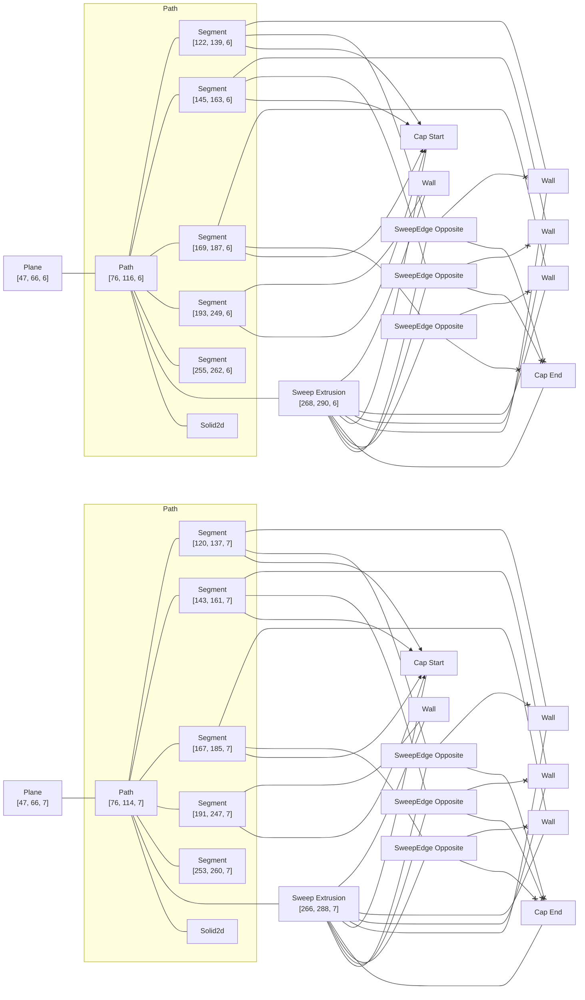

```mermaid
flowchart LR
  subgraph path2 [Path]
    2["Path<br>[76, 116, 6]"]
    3["Segment<br>[122, 139, 6]"]
    4["Segment<br>[145, 163, 6]"]
    5["Segment<br>[169, 187, 6]"]
    6["Segment<br>[193, 249, 6]"]
    7["Segment<br>[255, 262, 6]"]
    8[Solid2d]
  end
  subgraph path20 [Path]
    20["Path<br>[76, 114, 7]"]
    21["Segment<br>[120, 137, 7]"]
    22["Segment<br>[143, 161, 7]"]
    23["Segment<br>[167, 185, 7]"]
    24["Segment<br>[191, 247, 7]"]
    25["Segment<br>[253, 260, 7]"]
    26[Solid2d]
  end
  1["Plane<br>[47, 66, 6]"]
  9["Sweep Extrusion<br>[268, 290, 6]"]
  10[Wall]
  11[Wall]
  12[Wall]
  13[Wall]
  14["Cap Start"]
  15["Cap End"]
  16["SweepEdge Opposite"]
  17["SweepEdge Opposite"]
  18["SweepEdge Opposite"]
  19["Plane<br>[47, 66, 7]"]
  27["Sweep Extrusion<br>[266, 288, 7]"]
  28[Wall]
  29[Wall]
  30[Wall]
  31[Wall]
  32["Cap Start"]
  33["Cap End"]
  34["SweepEdge Opposite"]
  35["SweepEdge Opposite"]
  36["SweepEdge Opposite"]
  1 --- 2
  2 --- 3
  2 --- 4
  2 --- 5
  2 --- 6
  2 --- 7
  2 ---- 9
  2 --- 8
  3 --- 13
  3 --- 18
  3 x--> 14
  4 --- 12
  4 --- 17
  4 x--> 14
  5 --- 11
  5 --- 16
  5 x--> 14
  6 --- 10
  6 x--> 14
  9 --- 10
  9 --- 11
  9 --- 12
  9 --- 13
  9 --- 14
  9 --- 15
  9 --- 16
  9 --- 17
  9 --- 18
  16 <--x 11
  16 <--x 15
  17 <--x 12
  17 <--x 15
  18 <--x 13
  18 <--x 15
  19 --- 20
  20 --- 21
  20 --- 22
  20 --- 23
  20 --- 24
  20 --- 25
  20 ---- 27
  20 --- 26
  21 --- 31
  21 --- 36
  21 x--> 32
  22 --- 30
  22 --- 35
  22 x--> 32
  23 --- 29
  23 --- 34
  23 x--> 32
  24 --- 28
  24 x--> 32
  27 --- 28
  27 --- 29
  27 --- 30
  27 --- 31
  27 --- 32
  27 --- 33
  27 --- 34
  27 --- 35
  27 --- 36
  34 <--x 29
  34 <--x 33
  35 <--x 30
  35 <--x 33
  36 <--x 31
  36 <--x 33
```
