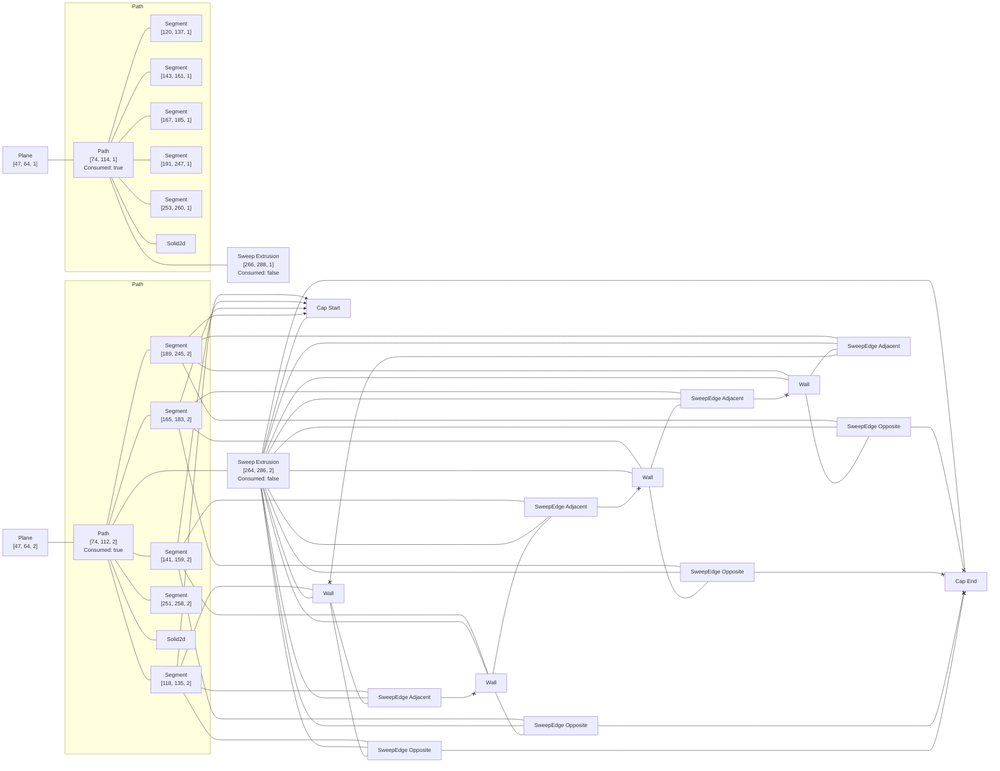

```mermaid
flowchart LR
  subgraph path2 [Path]
    2["Path<br>[74, 114, 1]<br>Consumed: true"]
      %% [ProgramBodyItem { index: 0 }]
    3["Segment<br>[120, 137, 1]"]
      %% [ProgramBodyItem { index: 0 }]
    4["Segment<br>[143, 161, 1]"]
      %% [ProgramBodyItem { index: 0 }]
    5["Segment<br>[167, 185, 1]"]
      %% [ProgramBodyItem { index: 0 }]
    6["Segment<br>[191, 247, 1]"]
      %% [ProgramBodyItem { index: 0 }]
    7["Segment<br>[253, 260, 1]"]
      %% [ProgramBodyItem { index: 0 }]
    8[Solid2d]
  end
  subgraph path11 [Path]
    11["Path<br>[74, 112, 2]<br>Consumed: true"]
      %% [ProgramBodyItem { index: 1 }]
    12["Segment<br>[118, 135, 2]"]
      %% [ProgramBodyItem { index: 1 }]
    13["Segment<br>[141, 159, 2]"]
      %% [ProgramBodyItem { index: 1 }]
    14["Segment<br>[165, 183, 2]"]
      %% [ProgramBodyItem { index: 1 }]
    15["Segment<br>[189, 245, 2]"]
      %% [ProgramBodyItem { index: 1 }]
    16["Segment<br>[251, 258, 2]"]
      %% [ProgramBodyItem { index: 1 }]
    17[Solid2d]
  end
  1["Plane<br>[47, 64, 1]"]
    %% [ProgramBodyItem { index: 0 }]
  9["Sweep Extrusion<br>[266, 288, 1]<br>Consumed: false"]
    %% [ProgramBodyItem { index: 0 }]
  10["Plane<br>[47, 64, 2]"]
    %% [ProgramBodyItem { index: 1 }]
  18["Sweep Extrusion<br>[264, 286, 2]<br>Consumed: false"]
    %% [ProgramBodyItem { index: 1 }]
  19[Wall]
    %% face_code_ref=Missing NodePath
  20[Wall]
    %% face_code_ref=Missing NodePath
  21[Wall]
    %% face_code_ref=Missing NodePath
  22[Wall]
    %% face_code_ref=Missing NodePath
  23["Cap Start"]
    %% face_code_ref=Missing NodePath
  24["Cap End"]
    %% face_code_ref=Missing NodePath
  25["SweepEdge Opposite"]
  26["SweepEdge Adjacent"]
  27["SweepEdge Opposite"]
  28["SweepEdge Adjacent"]
  29["SweepEdge Opposite"]
  30["SweepEdge Adjacent"]
  31["SweepEdge Opposite"]
  32["SweepEdge Adjacent"]
  1 --- 2
  2 --- 3
  2 --- 4
  2 --- 5
  2 --- 6
  2 --- 7
  2 --- 8
  2 ---- 9
  10 --- 11
  11 --- 12
  11 --- 13
  11 --- 14
  11 --- 15
  11 --- 16
  11 --- 17
  11 ---- 18
  12 --- 22
  12 x--> 23
  12 --- 31
  12 --- 32
  13 --- 21
  13 x--> 23
  13 --- 29
  13 --- 30
  14 --- 20
  14 x--> 23
  14 --- 27
  14 --- 28
  15 --- 19
  15 x--> 23
  15 --- 25
  15 --- 26
  18 --- 19
  18 --- 20
  18 --- 21
  18 --- 22
  18 --- 23
  18 --- 24
  18 --- 25
  18 --- 26
  18 --- 27
  18 --- 28
  18 --- 29
  18 --- 30
  18 --- 31
  18 --- 32
  19 --- 25
  19 --- 26
  28 <--x 19
  20 --- 27
  20 --- 28
  30 <--x 20
  21 --- 29
  21 --- 30
  32 <--x 21
  26 <--x 22
  22 --- 31
  22 --- 32
  25 <--x 24
  27 <--x 24
  29 <--x 24
  31 <--x 24
```
