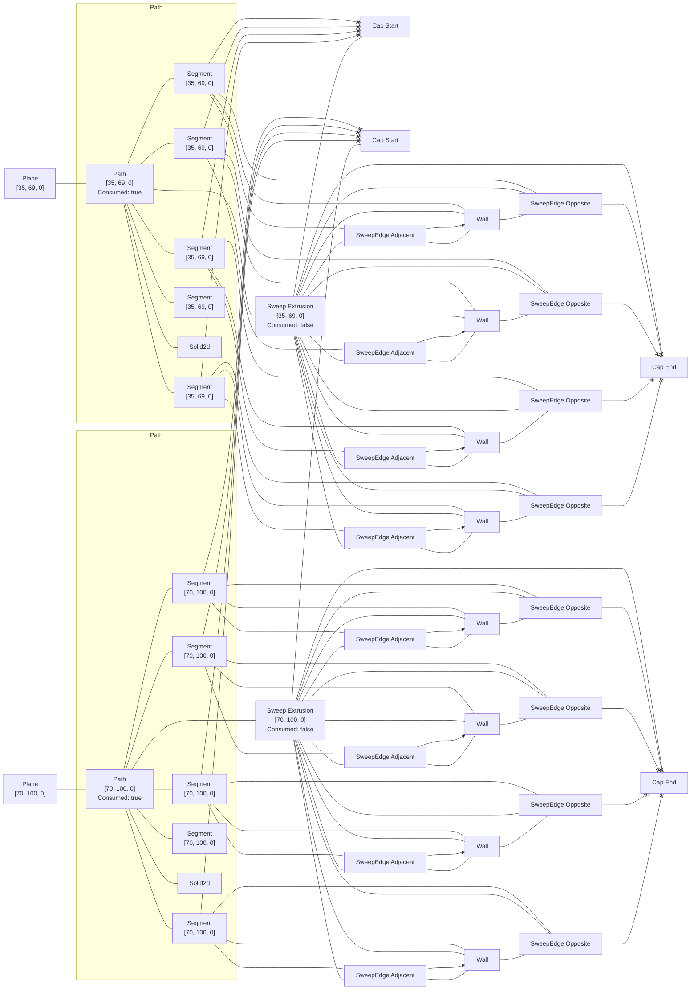

```mermaid
flowchart LR
  subgraph path5 [Path]
    5["Path<br>[35, 69, 0]<br>Consumed: true"]
      %% [ProgramBodyItem { index: 0 }]
    9["Segment<br>[35, 69, 0]"]
      %% [ProgramBodyItem { index: 0 }]
    10["Segment<br>[35, 69, 0]"]
      %% [ProgramBodyItem { index: 0 }]
    11["Segment<br>[35, 69, 0]"]
      %% [ProgramBodyItem { index: 0 }]
    12["Segment<br>[35, 69, 0]"]
      %% [ProgramBodyItem { index: 0 }]
    13["Segment<br>[35, 69, 0]"]
      %% [ProgramBodyItem { index: 0 }]
    19[Solid2d]
  end
  subgraph path6 [Path]
    6["Path<br>[70, 100, 0]<br>Consumed: true"]
      %% [ProgramBodyItem { index: 1 }]
    14["Segment<br>[70, 100, 0]"]
      %% [ProgramBodyItem { index: 1 }]
    15["Segment<br>[70, 100, 0]"]
      %% [ProgramBodyItem { index: 1 }]
    16["Segment<br>[70, 100, 0]"]
      %% [ProgramBodyItem { index: 1 }]
    17["Segment<br>[70, 100, 0]"]
      %% [ProgramBodyItem { index: 1 }]
    18["Segment<br>[70, 100, 0]"]
      %% [ProgramBodyItem { index: 1 }]
    20[Solid2d]
  end
  1["Cap End"]
    %% face_code_ref=Missing NodePath
  2["Cap End"]
    %% face_code_ref=Missing NodePath
  3["Cap Start"]
    %% face_code_ref=Missing NodePath
  4["Cap Start"]
    %% face_code_ref=Missing NodePath
  7["Plane<br>[35, 69, 0]"]
    %% [ProgramBodyItem { index: 0 }]
  8["Plane<br>[70, 100, 0]"]
    %% [ProgramBodyItem { index: 1 }]
  21["Sweep Extrusion<br>[35, 69, 0]<br>Consumed: false"]
    %% [ProgramBodyItem { index: 0 }]
  22["Sweep Extrusion<br>[70, 100, 0]<br>Consumed: false"]
    %% [ProgramBodyItem { index: 1 }]
  23["SweepEdge Adjacent"]
  24["SweepEdge Adjacent"]
  25["SweepEdge Adjacent"]
  26["SweepEdge Adjacent"]
  27["SweepEdge Adjacent"]
  28["SweepEdge Adjacent"]
  29["SweepEdge Adjacent"]
  30["SweepEdge Adjacent"]
  31["SweepEdge Opposite"]
  32["SweepEdge Opposite"]
  33["SweepEdge Opposite"]
  34["SweepEdge Opposite"]
  35["SweepEdge Opposite"]
  36["SweepEdge Opposite"]
  37["SweepEdge Opposite"]
  38["SweepEdge Opposite"]
  39[Wall]
    %% face_code_ref=Missing NodePath
  40[Wall]
    %% face_code_ref=Missing NodePath
  41[Wall]
    %% face_code_ref=Missing NodePath
  42[Wall]
    %% face_code_ref=Missing NodePath
  43[Wall]
    %% face_code_ref=Missing NodePath
  44[Wall]
    %% face_code_ref=Missing NodePath
  45[Wall]
    %% face_code_ref=Missing NodePath
  46[Wall]
    %% face_code_ref=Missing NodePath
  21 --- 1
  31 <--x 1
  32 <--x 1
  33 <--x 1
  34 <--x 1
  22 --- 2
  35 <--x 2
  36 <--x 2
  37 <--x 2
  38 <--x 2
  9 <--x 3
  10 <--x 3
  11 <--x 3
  12 <--x 3
  21 --- 3
  14 <--x 4
  15 <--x 4
  16 <--x 4
  17 <--x 4
  22 --- 4
  7 --- 5
  5 --- 9
  5 --- 10
  5 --- 11
  5 --- 12
  5 --- 13
  5 --- 19
  5 ---- 21
  8 --- 6
  6 --- 14
  6 --- 15
  6 --- 16
  6 --- 17
  6 --- 18
  6 --- 20
  6 ---- 22
  9 --- 23
  9 --- 31
  9 --- 39
  10 --- 24
  10 --- 32
  10 --- 40
  11 --- 25
  11 --- 33
  11 --- 41
  12 --- 26
  12 --- 34
  12 --- 42
  14 --- 27
  14 --- 35
  14 --- 43
  15 --- 28
  15 --- 36
  15 --- 44
  16 --- 29
  16 --- 37
  16 --- 45
  17 --- 30
  17 --- 38
  17 --- 46
  21 --- 23
  21 --- 24
  21 --- 25
  21 --- 26
  21 --- 31
  21 --- 32
  21 --- 33
  21 --- 34
  21 --- 39
  21 --- 40
  21 --- 41
  21 --- 42
  22 --- 27
  22 --- 28
  22 --- 29
  22 --- 30
  22 --- 35
  22 --- 36
  22 --- 37
  22 --- 38
  22 --- 43
  22 --- 44
  22 --- 45
  22 --- 46
  39 --- 23
  23 x--> 39
  24 x--> 40
  40 --- 24
  25 x--> 41
  41 --- 25
  26 x--> 42
  42 --- 26
  43 --- 27
  27 x--> 43
  28 x--> 44
  44 --- 28
  29 x--> 45
  45 --- 29
  30 x--> 46
  46 --- 30
  39 --- 31
  40 --- 32
  41 --- 33
  42 --- 34
  43 --- 35
  44 --- 36
  45 --- 37
  46 --- 38
```
