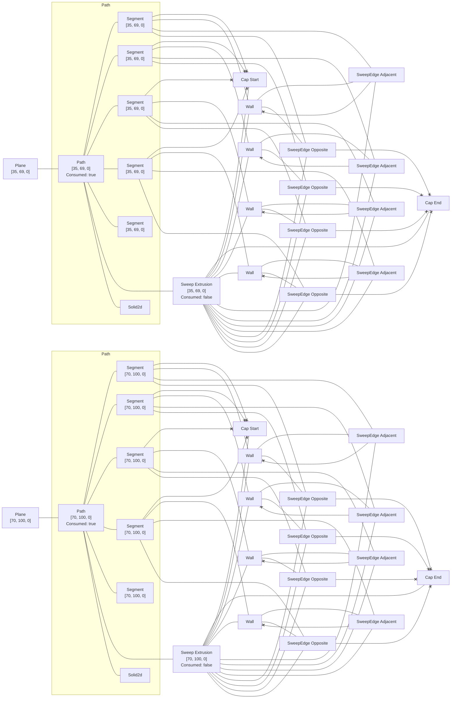

```mermaid
flowchart LR
  subgraph path13 [Path]
    13["Path<br>[35, 69, 0]<br>Consumed: true"]
      %% [ProgramBodyItem { index: 0 }]
    15["Segment<br>[35, 69, 0]"]
      %% [ProgramBodyItem { index: 0 }]
    16["Segment<br>[35, 69, 0]"]
      %% [ProgramBodyItem { index: 0 }]
    17["Segment<br>[35, 69, 0]"]
      %% [ProgramBodyItem { index: 0 }]
    18["Segment<br>[35, 69, 0]"]
      %% [ProgramBodyItem { index: 0 }]
    19["Segment<br>[35, 69, 0]"]
      %% [ProgramBodyItem { index: 0 }]
    29[Solid2d]
  end
  subgraph path21 [Path]
    21["Path<br>[70, 100, 0]<br>Consumed: true"]
      %% [ProgramBodyItem { index: 1 }]
    23["Segment<br>[70, 100, 0]"]
      %% [ProgramBodyItem { index: 1 }]
    24["Segment<br>[70, 100, 0]"]
      %% [ProgramBodyItem { index: 1 }]
    25["Segment<br>[70, 100, 0]"]
      %% [ProgramBodyItem { index: 1 }]
    26["Segment<br>[70, 100, 0]"]
      %% [ProgramBodyItem { index: 1 }]
    27["Segment<br>[70, 100, 0]"]
      %% [ProgramBodyItem { index: 1 }]
    30[Solid2d]
  end
  1["Cap End"]
    %% face_code_ref=Missing NodePath
  2["Cap End"]
    %% face_code_ref=Missing NodePath
  3["Cap Start"]
    %% face_code_ref=Missing NodePath
  4["Cap Start"]
    %% face_code_ref=Missing NodePath
  5[Wall]
    %% face_code_ref=Missing NodePath
  6[Wall]
    %% face_code_ref=Missing NodePath
  7[Wall]
    %% face_code_ref=Missing NodePath
  8[Wall]
    %% face_code_ref=Missing NodePath
  9[Wall]
    %% face_code_ref=Missing NodePath
  10[Wall]
    %% face_code_ref=Missing NodePath
  11[Wall]
    %% face_code_ref=Missing NodePath
  12[Wall]
    %% face_code_ref=Missing NodePath
  14["Plane<br>[35, 69, 0]"]
    %% [ProgramBodyItem { index: 0 }]
  20["Sweep Extrusion<br>[35, 69, 0]<br>Consumed: false"]
    %% [ProgramBodyItem { index: 0 }]
  22["Plane<br>[70, 100, 0]"]
    %% [ProgramBodyItem { index: 1 }]
  28["Sweep Extrusion<br>[70, 100, 0]<br>Consumed: false"]
    %% [ProgramBodyItem { index: 1 }]
  31["SweepEdge Adjacent"]
  32["SweepEdge Adjacent"]
  33["SweepEdge Adjacent"]
  34["SweepEdge Adjacent"]
  35["SweepEdge Adjacent"]
  36["SweepEdge Adjacent"]
  37["SweepEdge Adjacent"]
  38["SweepEdge Adjacent"]
  39["SweepEdge Opposite"]
  40["SweepEdge Opposite"]
  41["SweepEdge Opposite"]
  42["SweepEdge Opposite"]
  43["SweepEdge Opposite"]
  44["SweepEdge Opposite"]
  45["SweepEdge Opposite"]
  46["SweepEdge Opposite"]
  20 --- 1
  39 <--x 1
  40 <--x 1
  41 <--x 1
  42 <--x 1
  28 --- 2
  43 <--x 2
  44 <--x 2
  45 <--x 2
  46 <--x 2
  15 <--x 3
  16 <--x 3
  17 <--x 3
  18 <--x 3
  20 --- 3
  23 <--x 4
  24 <--x 4
  25 <--x 4
  26 <--x 4
  28 --- 4
  15 --- 5
  20 --- 5
  5 --- 31
  31 <--x 5
  5 --- 39
  16 --- 6
  20 --- 6
  6 --- 32
  32 <--x 6
  6 --- 40
  17 --- 7
  20 --- 7
  7 --- 33
  33 <--x 7
  7 --- 41
  18 --- 8
  20 --- 8
  8 --- 34
  34 <--x 8
  8 --- 42
  23 --- 9
  28 --- 9
  9 --- 35
  35 <--x 9
  9 --- 43
  24 --- 10
  28 --- 10
  10 --- 36
  36 <--x 10
  10 --- 44
  25 --- 11
  28 --- 11
  11 --- 37
  37 <--x 11
  11 --- 45
  26 --- 12
  28 --- 12
  12 --- 38
  38 <--x 12
  12 --- 46
  14 --- 13
  13 --- 15
  13 --- 16
  13 --- 17
  13 --- 18
  13 --- 19
  13 ---- 20
  13 --- 29
  15 --- 31
  15 --- 39
  16 --- 32
  16 --- 40
  17 --- 33
  17 --- 41
  18 --- 34
  18 --- 42
  20 --- 31
  20 --- 32
  20 --- 33
  20 --- 34
  20 --- 39
  20 --- 40
  20 --- 41
  20 --- 42
  22 --- 21
  21 --- 23
  21 --- 24
  21 --- 25
  21 --- 26
  21 --- 27
  21 ---- 28
  21 --- 30
  23 --- 35
  23 --- 43
  24 --- 36
  24 --- 44
  25 --- 37
  25 --- 45
  26 --- 38
  26 --- 46
  28 --- 35
  28 --- 36
  28 --- 37
  28 --- 38
  28 --- 43
  28 --- 44
  28 --- 45
  28 --- 46
```
