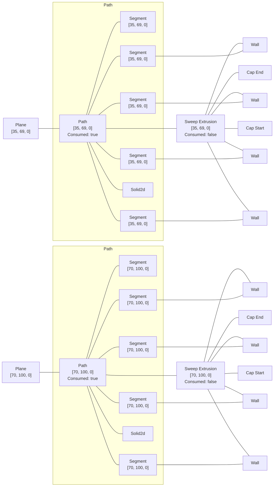

```mermaid
flowchart LR
  subgraph path5 [Path]
    5["Path<br>[35, 69, 0]<br>Consumed: true"]
      %% [ProgramBodyItem { index: 0 }]
    9["Segment<br>[35, 69, 0]"]
      %% [ProgramBodyItem { index: 0 }]
    10["Segment<br>[35, 69, 0]"]
      %% [ProgramBodyItem { index: 0 }]
    11["Segment<br>[35, 69, 0]"]
      %% [ProgramBodyItem { index: 0 }]
    12["Segment<br>[35, 69, 0]"]
      %% [ProgramBodyItem { index: 0 }]
    13["Segment<br>[35, 69, 0]"]
      %% [ProgramBodyItem { index: 0 }]
    19[Solid2d]
  end
  subgraph path6 [Path]
    6["Path<br>[70, 100, 0]<br>Consumed: true"]
      %% [ProgramBodyItem { index: 1 }]
    14["Segment<br>[70, 100, 0]"]
      %% [ProgramBodyItem { index: 1 }]
    15["Segment<br>[70, 100, 0]"]
      %% [ProgramBodyItem { index: 1 }]
    16["Segment<br>[70, 100, 0]"]
      %% [ProgramBodyItem { index: 1 }]
    17["Segment<br>[70, 100, 0]"]
      %% [ProgramBodyItem { index: 1 }]
    18["Segment<br>[70, 100, 0]"]
      %% [ProgramBodyItem { index: 1 }]
    20[Solid2d]
  end
  1["Cap End"]
    %% face_code_ref=Missing NodePath
  2["Cap End"]
    %% face_code_ref=Missing NodePath
  3["Cap Start"]
    %% face_code_ref=Missing NodePath
  4["Cap Start"]
    %% face_code_ref=Missing NodePath
  7["Plane<br>[35, 69, 0]"]
    %% [ProgramBodyItem { index: 0 }]
  8["Plane<br>[70, 100, 0]"]
    %% [ProgramBodyItem { index: 1 }]
  21["Sweep Extrusion<br>[35, 69, 0]<br>Consumed: false"]
    %% [ProgramBodyItem { index: 0 }]
  22["Sweep Extrusion<br>[70, 100, 0]<br>Consumed: false"]
    %% [ProgramBodyItem { index: 1 }]
  23[Wall]
    %% face_code_ref=Missing NodePath
  24[Wall]
    %% face_code_ref=Missing NodePath
  25[Wall]
    %% face_code_ref=Missing NodePath
  26[Wall]
    %% face_code_ref=Missing NodePath
  27[Wall]
    %% face_code_ref=Missing NodePath
  28[Wall]
    %% face_code_ref=Missing NodePath
  29[Wall]
    %% face_code_ref=Missing NodePath
  30[Wall]
    %% face_code_ref=Missing NodePath
  21 --- 1
  22 --- 2
  21 --- 3
  22 --- 4
  7 --- 5
  5 --- 9
  5 --- 10
  5 --- 11
  5 --- 12
  5 --- 13
  5 --- 19
  5 ---- 21
  8 --- 6
  6 --- 14
  6 --- 15
  6 --- 16
  6 --- 17
  6 --- 18
  6 --- 20
  6 ---- 22
  10 --- 23
  11 --- 24
  12 --- 25
  13 --- 26
  15 --- 27
  16 --- 28
  17 --- 29
  18 --- 30
  21 --- 23
  21 --- 24
  21 --- 25
  21 --- 26
  22 --- 27
  22 --- 28
  22 --- 29
  22 --- 30
```
