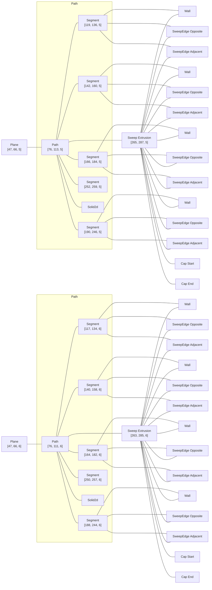

```mermaid
flowchart LR
  subgraph path2 [Path]
    2["Path<br>[76, 113, 5]"]
    3["Segment<br>[119, 136, 5]"]
    4["Segment<br>[142, 160, 5]"]
    5["Segment<br>[166, 184, 5]"]
    6["Segment<br>[190, 246, 5]"]
    7["Segment<br>[252, 259, 5]"]
    8[Solid2d]
  end
  subgraph path25 [Path]
    25["Path<br>[76, 111, 6]"]
    26["Segment<br>[117, 134, 6]"]
    27["Segment<br>[140, 158, 6]"]
    28["Segment<br>[164, 182, 6]"]
    29["Segment<br>[188, 244, 6]"]
    30["Segment<br>[250, 257, 6]"]
    31[Solid2d]
  end
  1["Plane<br>[47, 66, 5]"]
  9["Sweep Extrusion<br>[265, 287, 5]"]
  10[Wall]
  11[Wall]
  12[Wall]
  13[Wall]
  14["Cap Start"]
  15["Cap End"]
  16["SweepEdge Opposite"]
  17["SweepEdge Adjacent"]
  18["SweepEdge Opposite"]
  19["SweepEdge Adjacent"]
  20["SweepEdge Opposite"]
  21["SweepEdge Adjacent"]
  22["SweepEdge Opposite"]
  23["SweepEdge Adjacent"]
  24["Plane<br>[47, 66, 6]"]
  32["Sweep Extrusion<br>[263, 285, 6]"]
  33[Wall]
  34[Wall]
  35[Wall]
  36[Wall]
  37["Cap Start"]
  38["Cap End"]
  39["SweepEdge Opposite"]
  40["SweepEdge Adjacent"]
  41["SweepEdge Opposite"]
  42["SweepEdge Adjacent"]
  43["SweepEdge Opposite"]
  44["SweepEdge Adjacent"]
  45["SweepEdge Opposite"]
  46["SweepEdge Adjacent"]
  1 --- 2
  2 --- 3
  2 --- 4
  2 --- 5
  2 --- 6
  2 --- 7
  2 ---- 9
  2 --- 8
  3 --- 13
  3 --- 22
  3 --- 23
  4 --- 12
  4 --- 20
  4 --- 21
  5 --- 11
  5 --- 18
  5 --- 19
  6 --- 10
  6 --- 16
  6 --- 17
  9 --- 10
  9 --- 11
  9 --- 12
  9 --- 13
  9 --- 14
  9 --- 15
  9 --- 16
  9 --- 17
  9 --- 18
  9 --- 19
  9 --- 20
  9 --- 21
  9 --- 22
  9 --- 23
  24 --- 25
  25 --- 26
  25 --- 27
  25 --- 28
  25 --- 29
  25 --- 30
  25 ---- 32
  25 --- 31
  26 --- 36
  26 --- 45
  26 --- 46
  27 --- 35
  27 --- 43
  27 --- 44
  28 --- 34
  28 --- 41
  28 --- 42
  29 --- 33
  29 --- 39
  29 --- 40
  32 --- 33
  32 --- 34
  32 --- 35
  32 --- 36
  32 --- 37
  32 --- 38
  32 --- 39
  32 --- 40
  32 --- 41
  32 --- 42
  32 --- 43
  32 --- 44
  32 --- 45
  32 --- 46
```
