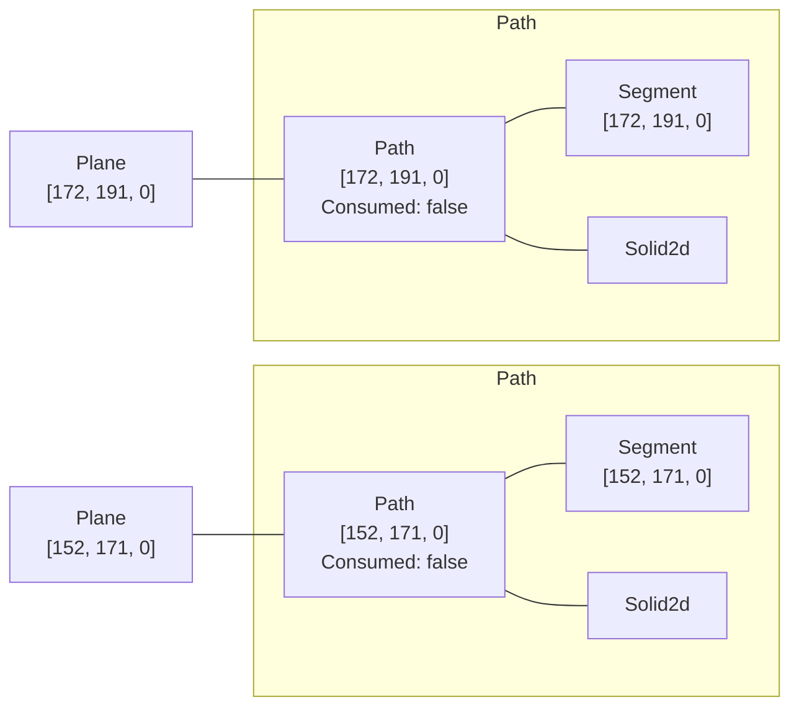

```mermaid
flowchart LR
  subgraph path2 [Path]
    2["Path<br>[152, 171, 0]<br>Consumed: false"]
      %% [ProgramBodyItem { index: 0 }]
    3["Segment<br>[152, 171, 0]"]
      %% [ProgramBodyItem { index: 0 }]
    4[Solid2d]
  end
  subgraph path6 [Path]
    6["Path<br>[172, 191, 0]<br>Consumed: false"]
      %% [ProgramBodyItem { index: 1 }]
    7["Segment<br>[172, 191, 0]"]
      %% [ProgramBodyItem { index: 1 }]
    8[Solid2d]
  end
  1["Plane<br>[152, 171, 0]"]
    %% [ProgramBodyItem { index: 0 }]
  5["Plane<br>[172, 191, 0]"]
    %% [ProgramBodyItem { index: 1 }]
  1 --- 2
  2 --- 3
  2 --- 4
  5 --- 6
  6 --- 7
  6 --- 8
```
