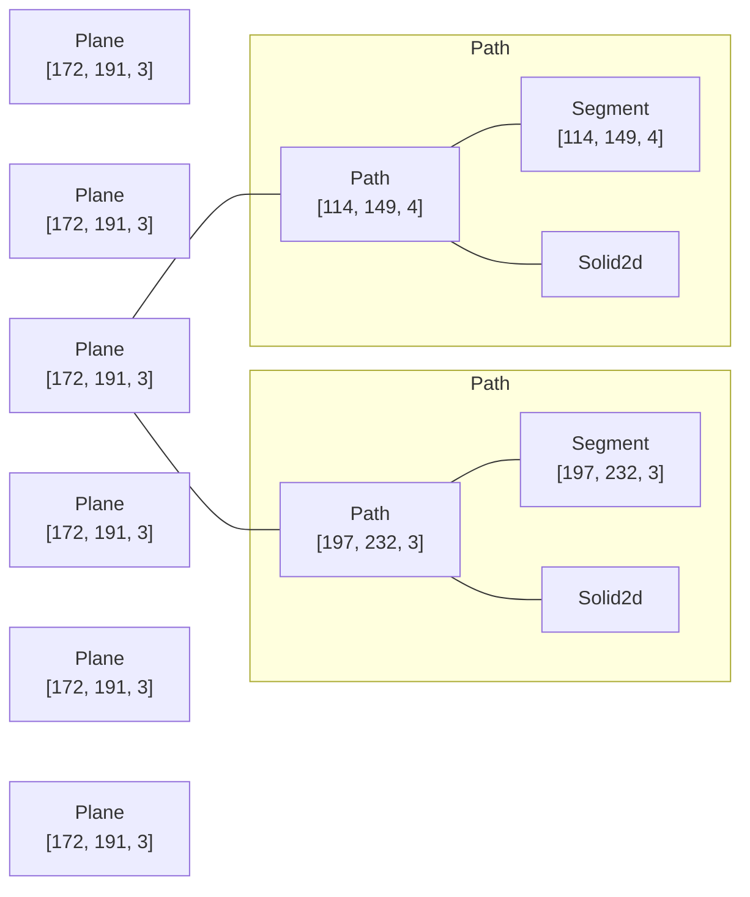

```mermaid
flowchart LR
  subgraph path7 [Path]
    7["Path<br>[197, 232, 3]"]
    8["Segment<br>[197, 232, 3]"]
    9[Solid2d]
  end
  subgraph path10 [Path]
    10["Path<br>[114, 149, 4]"]
    11["Segment<br>[114, 149, 4]"]
    12[Solid2d]
  end
  1["Plane<br>[172, 191, 3]"]
  2["Plane<br>[172, 191, 3]"]
  3["Plane<br>[172, 191, 3]"]
  4["Plane<br>[172, 191, 3]"]
  5["Plane<br>[172, 191, 3]"]
  6["Plane<br>[172, 191, 3]"]
  3 --- 7
  3 --- 10
  7 --- 8
  7 --- 9
  10 --- 11
  10 --- 12
```
