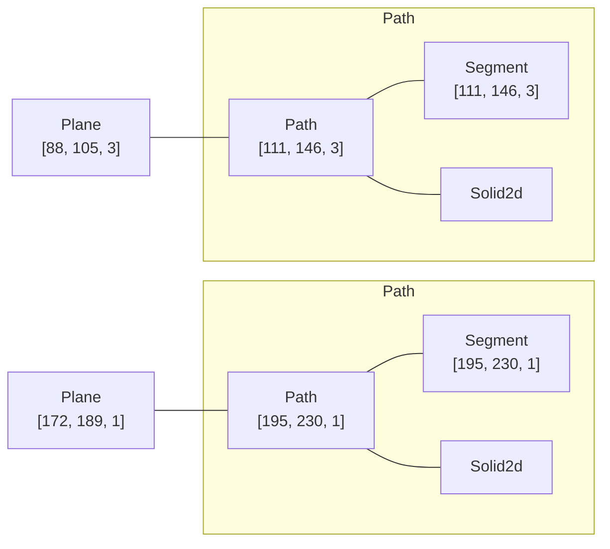

```mermaid
flowchart LR
  subgraph path3 [Path]
    3["Path<br>[195, 230, 1]"]
    5["Segment<br>[195, 230, 1]"]
    8[Solid2d]
  end
  subgraph path4 [Path]
    4["Path<br>[111, 146, 3]"]
    6["Segment<br>[111, 146, 3]"]
    7[Solid2d]
  end
  1["Plane<br>[172, 189, 1]"]
  2["Plane<br>[88, 105, 3]"]
  1 --- 3
  2 --- 4
  3 --- 5
  3 --- 8
  4 --- 6
  4 --- 7
```
