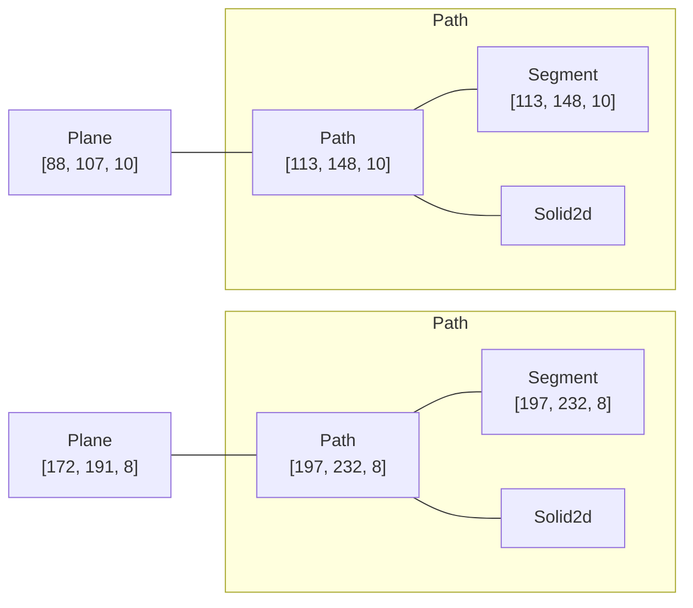

```mermaid
flowchart LR
  subgraph path3 [Path]
    3["Path<br>[197, 232, 8]"]
    5["Segment<br>[197, 232, 8]"]
    7[Solid2d]
  end
  subgraph path4 [Path]
    4["Path<br>[113, 148, 10]"]
    6["Segment<br>[113, 148, 10]"]
    8[Solid2d]
  end
  1["Plane<br>[172, 191, 8]"]
  2["Plane<br>[88, 107, 10]"]
  1 --- 3
  2 --- 4
  3 --- 5
  3 --- 7
  4 --- 6
  4 --- 8
```
