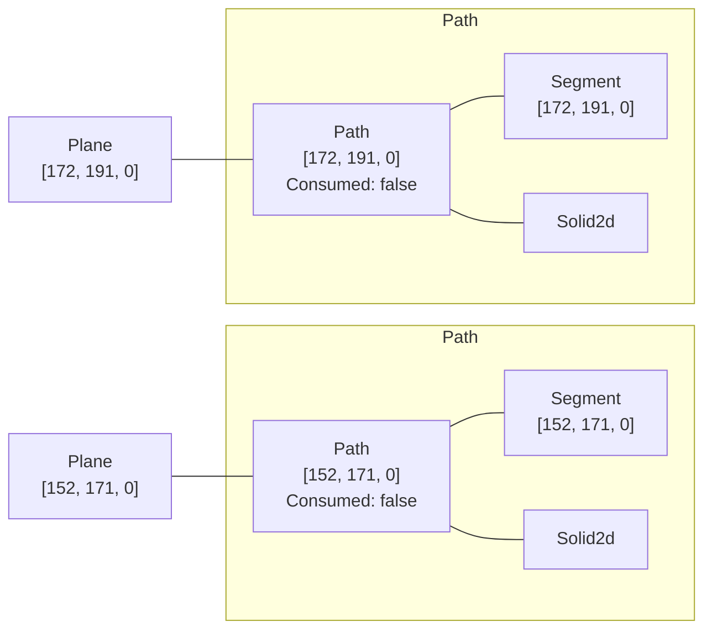

```mermaid
flowchart LR
  subgraph path1 [Path]
    1["Path<br>[152, 171, 0]<br>Consumed: false"]
      %% [ProgramBodyItem { index: 0 }]
    5["Segment<br>[152, 171, 0]"]
      %% [ProgramBodyItem { index: 0 }]
    7[Solid2d]
  end
  subgraph path2 [Path]
    2["Path<br>[172, 191, 0]<br>Consumed: false"]
      %% [ProgramBodyItem { index: 1 }]
    6["Segment<br>[172, 191, 0]"]
      %% [ProgramBodyItem { index: 1 }]
    8[Solid2d]
  end
  3["Plane<br>[152, 171, 0]"]
    %% [ProgramBodyItem { index: 0 }]
  4["Plane<br>[172, 191, 0]"]
    %% [ProgramBodyItem { index: 1 }]
  3 --- 1
  1 --- 5
  1 --- 7
  4 --- 2
  2 --- 6
  2 --- 8
```
