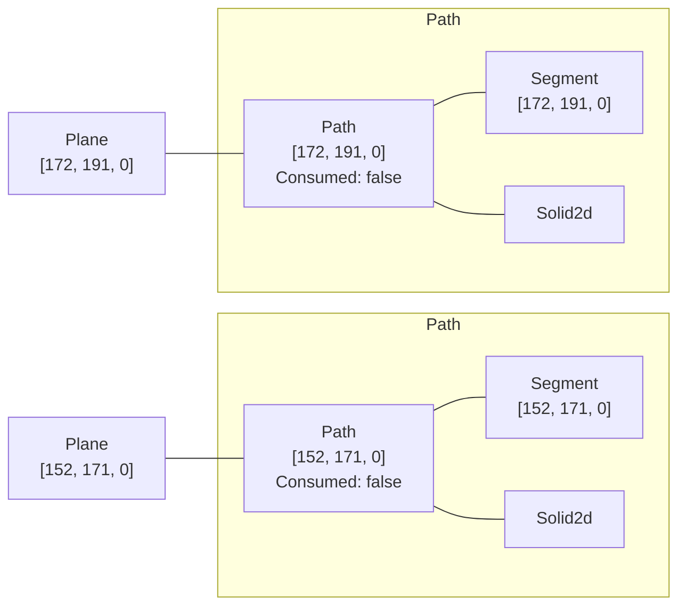

```mermaid
flowchart LR
  subgraph path1 [Path]
    1["Path<br>[152, 171, 0]<br>Consumed: false"]
      %% [ProgramBodyItem { index: 0 }]
    3["Segment<br>[152, 171, 0]"]
      %% [ProgramBodyItem { index: 0 }]
    7[Solid2d]
  end
  subgraph path4 [Path]
    4["Path<br>[172, 191, 0]<br>Consumed: false"]
      %% [ProgramBodyItem { index: 1 }]
    6["Segment<br>[172, 191, 0]"]
      %% [ProgramBodyItem { index: 1 }]
    8[Solid2d]
  end
  2["Plane<br>[152, 171, 0]"]
    %% [ProgramBodyItem { index: 0 }]
  5["Plane<br>[172, 191, 0]"]
    %% [ProgramBodyItem { index: 1 }]
  2 --- 1
  1 --- 3
  1 --- 7
  5 --- 4
  4 --- 6
  4 --- 8
```
