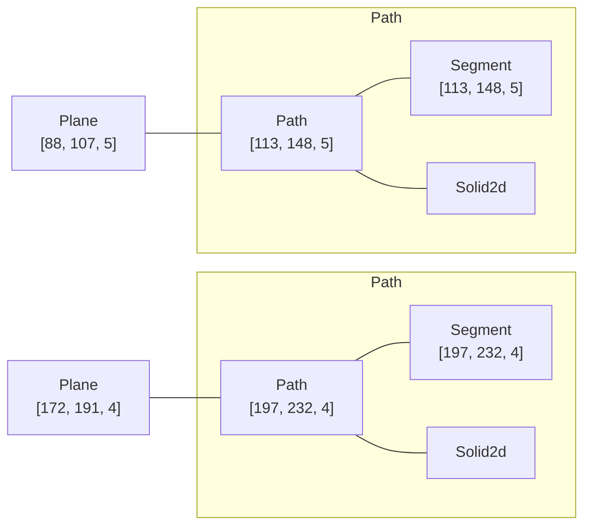

```mermaid
flowchart LR
  subgraph path2 [Path]
    2["Path<br>[197, 232, 4]"]
    3["Segment<br>[197, 232, 4]"]
    4[Solid2d]
  end
  subgraph path6 [Path]
    6["Path<br>[113, 148, 5]"]
    7["Segment<br>[113, 148, 5]"]
    8[Solid2d]
  end
  1["Plane<br>[172, 191, 4]"]
  5["Plane<br>[88, 107, 5]"]
  1 --- 2
  2 --- 3
  2 --- 4
  5 --- 6
  6 --- 7
  6 --- 8
```
