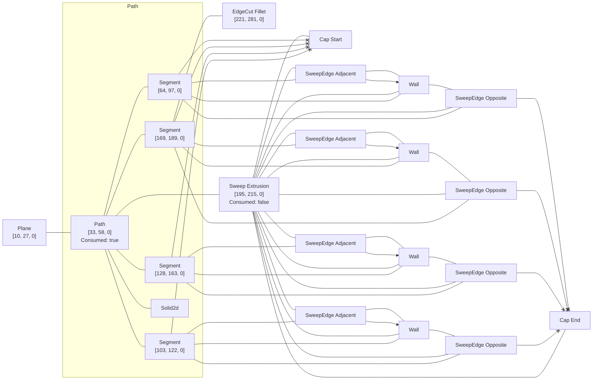

```mermaid
flowchart LR
  subgraph path4 [Path]
    4["Path<br>[33, 58, 0]<br>Consumed: true"]
      %% [ProgramBodyItem { index: 0 }, VariableDeclarationDeclaration, VariableDeclarationInit, PipeBodyItem { index: 1 }]
    9["Segment<br>[64, 97, 0]"]
      %% [ProgramBodyItem { index: 0 }, VariableDeclarationDeclaration, VariableDeclarationInit, PipeBodyItem { index: 2 }]
    6["Segment<br>[103, 122, 0]"]
      %% [ProgramBodyItem { index: 0 }, VariableDeclarationDeclaration, VariableDeclarationInit, PipeBodyItem { index: 3 }]
    7["Segment<br>[128, 163, 0]"]
      %% [ProgramBodyItem { index: 0 }, VariableDeclarationDeclaration, VariableDeclarationInit, PipeBodyItem { index: 4 }]
    8["Segment<br>[169, 189, 0]"]
      %% [ProgramBodyItem { index: 0 }, VariableDeclarationDeclaration, VariableDeclarationInit, PipeBodyItem { index: 5 }]
    10[Solid2d]
  end
  5["Plane<br>[10, 27, 0]"]
    %% [ProgramBodyItem { index: 0 }, VariableDeclarationDeclaration, VariableDeclarationInit, PipeBodyItem { index: 0 }]
  11["Sweep Extrusion<br>[195, 215, 0]<br>Consumed: false"]
    %% [ProgramBodyItem { index: 0 }, VariableDeclarationDeclaration, VariableDeclarationInit, PipeBodyItem { index: 6 }]
  22[Wall]
    %% face_code_ref=Missing NodePath
  21[Wall]
    %% face_code_ref=Missing NodePath
  20[Wall]
    %% face_code_ref=Missing NodePath
  23[Wall]
    %% face_code_ref=Missing NodePath
  2["Cap Start"]
    %% face_code_ref=Missing NodePath
  1["Cap End"]
    %% face_code_ref=Missing NodePath
  18["SweepEdge Opposite"]
  14["SweepEdge Adjacent"]
  17["SweepEdge Opposite"]
  13["SweepEdge Adjacent"]
  16["SweepEdge Opposite"]
  12["SweepEdge Adjacent"]
  19["SweepEdge Opposite"]
  15["SweepEdge Adjacent"]
  3["EdgeCut Fillet<br>[221, 281, 0]"]
    %% [ProgramBodyItem { index: 0 }, VariableDeclarationDeclaration, VariableDeclarationInit, PipeBodyItem { index: 7 }]
  11 --- 1
  16 <--x 1
  17 <--x 1
  18 <--x 1
  19 <--x 1
  6 <--x 2
  7 <--x 2
  8 <--x 2
  9 <--x 2
  11 --- 2
  8 --- 3
  5 --- 4
  4 --- 6
  4 --- 7
  4 --- 8
  4 --- 9
  4 --- 10
  4 ---- 11
  6 --- 12
  6 --- 16
  6 --- 20
  7 --- 13
  7 --- 17
  7 --- 21
  8 --- 14
  8 --- 18
  8 --- 22
  9 --- 15
  9 --- 19
  9 --- 23
  11 --- 12
  11 --- 13
  11 --- 14
  11 --- 15
  11 --- 16
  11 --- 17
  11 --- 18
  11 --- 19
  11 --- 20
  11 --- 21
  11 --- 22
  11 --- 23
  20 --- 12
  12 x--> 20
  21 --- 13
  13 x--> 21
  22 --- 14
  14 x--> 22
  23 --- 15
  15 x--> 23
  20 --- 16
  21 --- 17
  22 --- 18
  23 --- 19
```
