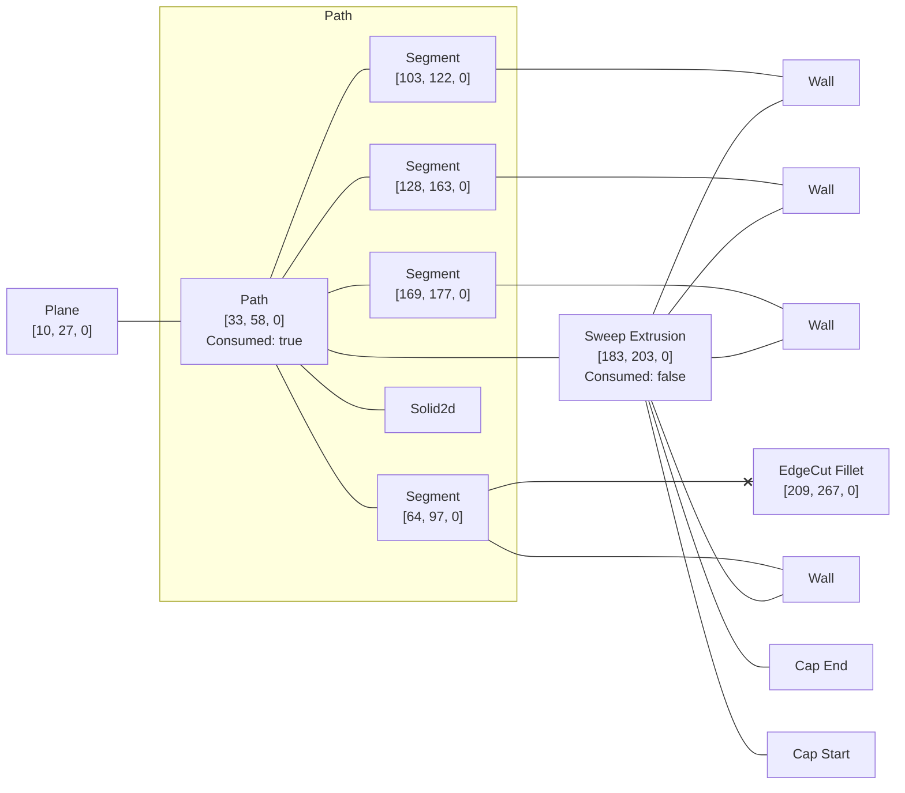

```mermaid
flowchart LR
  subgraph path4 [Path]
    4["Path<br>[33, 58, 0]<br>Consumed: true"]
      %% [ProgramBodyItem { index: 0 }, VariableDeclarationDeclaration, VariableDeclarationInit, PipeBodyItem { index: 1 }]
    6["Segment<br>[103, 122, 0]"]
      %% [ProgramBodyItem { index: 0 }, VariableDeclarationDeclaration, VariableDeclarationInit, PipeBodyItem { index: 3 }]
    7["Segment<br>[128, 163, 0]"]
      %% [ProgramBodyItem { index: 0 }, VariableDeclarationDeclaration, VariableDeclarationInit, PipeBodyItem { index: 4 }]
    8["Segment<br>[169, 177, 0]"]
      %% [ProgramBodyItem { index: 0 }, VariableDeclarationDeclaration, VariableDeclarationInit, PipeBodyItem { index: 5 }]
    9["Segment<br>[64, 97, 0]"]
      %% [ProgramBodyItem { index: 0 }, VariableDeclarationDeclaration, VariableDeclarationInit, PipeBodyItem { index: 2 }]
    10[Solid2d]
  end
  1["Cap End"]
    %% face_code_ref=Missing NodePath
  2["Cap Start"]
    %% face_code_ref=Missing NodePath
  3["EdgeCut Fillet<br>[209, 267, 0]"]
    %% [ProgramBodyItem { index: 0 }, VariableDeclarationDeclaration, VariableDeclarationInit, PipeBodyItem { index: 7 }]
  5["Plane<br>[10, 27, 0]"]
    %% [ProgramBodyItem { index: 0 }, VariableDeclarationDeclaration, VariableDeclarationInit, PipeBodyItem { index: 0 }]
  11["Sweep Extrusion<br>[183, 203, 0]<br>Consumed: false"]
    %% [ProgramBodyItem { index: 0 }, VariableDeclarationDeclaration, VariableDeclarationInit, PipeBodyItem { index: 6 }]
  12[Wall]
    %% face_code_ref=Missing NodePath
  13[Wall]
    %% face_code_ref=Missing NodePath
  14[Wall]
    %% face_code_ref=Missing NodePath
  15[Wall]
    %% face_code_ref=Missing NodePath
  11 --- 1
  11 --- 2
  9 <--x 3
  5 --- 4
  4 --- 6
  4 --- 7
  4 --- 8
  4 --- 9
  4 --- 10
  4 ---- 11
  6 --- 12
  7 --- 13
  8 --- 14
  9 --- 15
  11 --- 12
  11 --- 13
  11 --- 14
  11 --- 15
```
