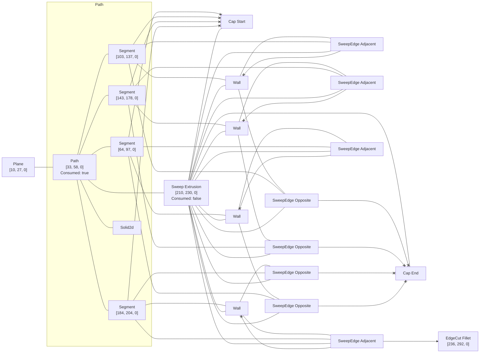

```mermaid
flowchart LR
  subgraph path8 [Path]
    8["Path<br>[33, 58, 0]<br>Consumed: true"]
      %% [ProgramBodyItem { index: 0 }, VariableDeclarationDeclaration, VariableDeclarationInit, PipeBodyItem { index: 1 }]
    9["Segment<br>[64, 97, 0]"]
      %% [ProgramBodyItem { index: 0 }, VariableDeclarationDeclaration, VariableDeclarationInit, PipeBodyItem { index: 2 }]
    10["Segment<br>[103, 137, 0]"]
      %% [ProgramBodyItem { index: 0 }, VariableDeclarationDeclaration, VariableDeclarationInit, PipeBodyItem { index: 3 }]
    11["Segment<br>[143, 178, 0]"]
      %% [ProgramBodyItem { index: 0 }, VariableDeclarationDeclaration, VariableDeclarationInit, PipeBodyItem { index: 4 }]
    12["Segment<br>[184, 204, 0]"]
      %% [ProgramBodyItem { index: 0 }, VariableDeclarationDeclaration, VariableDeclarationInit, PipeBodyItem { index: 5 }]
    15[Solid2d]
  end
  1["Cap End"]
    %% face_code_ref=Missing NodePath
  2["Cap Start"]
    %% face_code_ref=Missing NodePath
  3[Wall]
    %% face_code_ref=Missing NodePath
  4[Wall]
    %% face_code_ref=Missing NodePath
  5[Wall]
    %% face_code_ref=Missing NodePath
  6[Wall]
    %% face_code_ref=Missing NodePath
  7["Plane<br>[10, 27, 0]"]
    %% [ProgramBodyItem { index: 0 }, VariableDeclarationDeclaration, VariableDeclarationInit, PipeBodyItem { index: 0 }]
  13["Sweep Extrusion<br>[210, 230, 0]<br>Consumed: false"]
    %% [ProgramBodyItem { index: 0 }, VariableDeclarationDeclaration, VariableDeclarationInit, PipeBodyItem { index: 6 }]
  14["EdgeCut Fillet<br>[236, 292, 0]"]
    %% [ProgramBodyItem { index: 0 }, VariableDeclarationDeclaration, VariableDeclarationInit, PipeBodyItem { index: 7 }]
  16["SweepEdge Adjacent"]
  17["SweepEdge Adjacent"]
  18["SweepEdge Adjacent"]
  19["SweepEdge Adjacent"]
  20["SweepEdge Opposite"]
  21["SweepEdge Opposite"]
  22["SweepEdge Opposite"]
  23["SweepEdge Opposite"]
  13 --- 1
  20 <--x 1
  21 <--x 1
  22 <--x 1
  23 <--x 1
  9 <--x 2
  10 <--x 2
  11 <--x 2
  12 <--x 2
  13 --- 2
  10 --- 3
  13 --- 3
  3 --- 16
  16 <--x 3
  3 --- 20
  11 --- 4
  13 --- 4
  4 --- 17
  17 <--x 4
  4 --- 21
  12 --- 5
  13 --- 5
  5 --- 18
  18 <--x 5
  5 --- 22
  9 --- 6
  13 --- 6
  6 --- 19
  19 <--x 6
  6 --- 23
  7 --- 8
  8 --- 9
  8 --- 10
  8 --- 11
  8 --- 12
  8 ---- 13
  8 --- 15
  9 --- 19
  9 --- 23
  10 --- 16
  10 --- 20
  11 --- 17
  11 --- 21
  12 --- 18
  12 --- 22
  13 --- 16
  13 --- 17
  13 --- 18
  13 --- 19
  13 --- 20
  13 --- 21
  13 --- 22
  13 --- 23
  18 x--> 14
```
