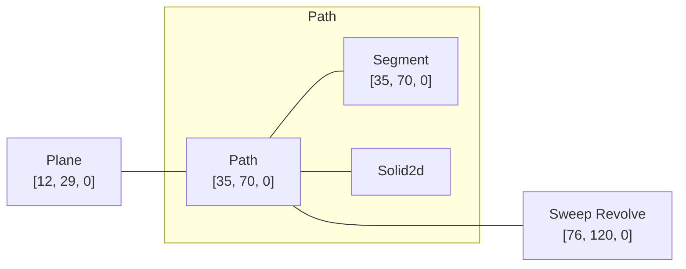

```mermaid
flowchart LR
  subgraph path2 [Path]
    2["Path<br>[35, 70, 0]"]
    3["Segment<br>[35, 70, 0]"]
    4[Solid2d]
  end
  1["Plane<br>[12, 29, 0]"]
  5["Sweep Revolve<br>[76, 120, 0]"]
  1 --- 2
  2 --- 3
  2 --- 4
  2 ---- 5
```
