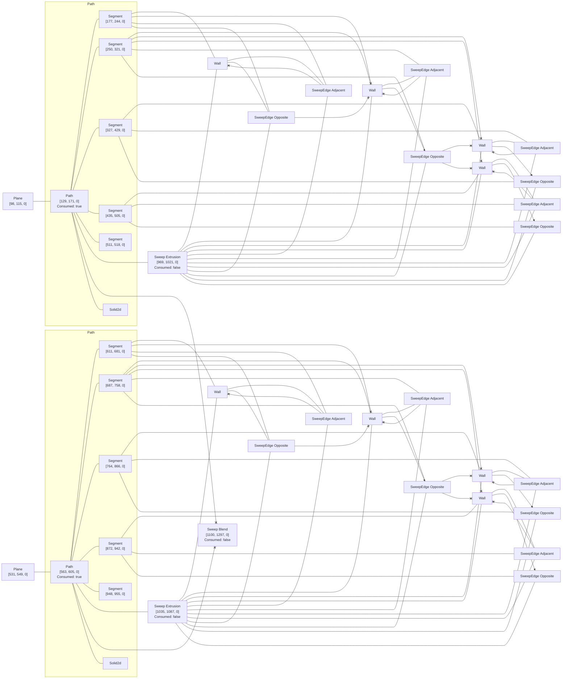

```mermaid
flowchart LR
  subgraph path10 [Path]
    10["Path<br>[129, 171, 0]<br>Consumed: true"]
      %% [ProgramBodyItem { index: 1 }, VariableDeclarationDeclaration, VariableDeclarationInit, PipeBodyItem { index: 0 }]
    11["Segment<br>[177, 244, 0]"]
      %% [ProgramBodyItem { index: 1 }, VariableDeclarationDeclaration, VariableDeclarationInit, PipeBodyItem { index: 1 }]
    12["Segment<br>[250, 321, 0]"]
      %% [ProgramBodyItem { index: 1 }, VariableDeclarationDeclaration, VariableDeclarationInit, PipeBodyItem { index: 2 }]
    13["Segment<br>[327, 429, 0]"]
      %% [ProgramBodyItem { index: 1 }, VariableDeclarationDeclaration, VariableDeclarationInit, PipeBodyItem { index: 3 }]
    14["Segment<br>[435, 505, 0]"]
      %% [ProgramBodyItem { index: 1 }, VariableDeclarationDeclaration, VariableDeclarationInit, PipeBodyItem { index: 4 }]
    15["Segment<br>[511, 518, 0]"]
      %% [ProgramBodyItem { index: 1 }, VariableDeclarationDeclaration, VariableDeclarationInit, PipeBodyItem { index: 5 }]
    26[Solid2d]
  end
  subgraph path17 [Path]
    17["Path<br>[563, 605, 0]<br>Consumed: true"]
      %% [ProgramBodyItem { index: 3 }, VariableDeclarationDeclaration, VariableDeclarationInit, PipeBodyItem { index: 0 }]
    18["Segment<br>[611, 681, 0]"]
      %% [ProgramBodyItem { index: 3 }, VariableDeclarationDeclaration, VariableDeclarationInit, PipeBodyItem { index: 1 }]
    19["Segment<br>[687, 758, 0]"]
      %% [ProgramBodyItem { index: 3 }, VariableDeclarationDeclaration, VariableDeclarationInit, PipeBodyItem { index: 2 }]
    20["Segment<br>[764, 866, 0]"]
      %% [ProgramBodyItem { index: 3 }, VariableDeclarationDeclaration, VariableDeclarationInit, PipeBodyItem { index: 3 }]
    21["Segment<br>[872, 942, 0]"]
      %% [ProgramBodyItem { index: 3 }, VariableDeclarationDeclaration, VariableDeclarationInit, PipeBodyItem { index: 4 }]
    22["Segment<br>[948, 955, 0]"]
      %% [ProgramBodyItem { index: 3 }, VariableDeclarationDeclaration, VariableDeclarationInit, PipeBodyItem { index: 5 }]
    27[Solid2d]
  end
  1[Wall]
    %% face_code_ref=Missing NodePath
  2[Wall]
    %% face_code_ref=Missing NodePath
  3[Wall]
    %% face_code_ref=Missing NodePath
  4[Wall]
    %% face_code_ref=Missing NodePath
  5[Wall]
    %% face_code_ref=Missing NodePath
  6[Wall]
    %% face_code_ref=Missing NodePath
  7[Wall]
    %% face_code_ref=Missing NodePath
  8[Wall]
    %% face_code_ref=Missing NodePath
  9["Plane<br>[98, 115, 0]"]
    %% [ProgramBodyItem { index: 0 }, VariableDeclarationDeclaration, VariableDeclarationInit]
  16["Plane<br>[531, 549, 0]"]
    %% [ProgramBodyItem { index: 2 }, VariableDeclarationDeclaration, VariableDeclarationInit]
  23["Sweep Extrusion<br>[969, 1021, 0]<br>Consumed: false"]
    %% [ProgramBodyItem { index: 4 }, VariableDeclarationDeclaration, VariableDeclarationInit]
  24["Sweep Extrusion<br>[1035, 1087, 0]<br>Consumed: false"]
    %% [ProgramBodyItem { index: 5 }, VariableDeclarationDeclaration, VariableDeclarationInit]
  25["Sweep Blend<br>[1100, 1297, 0]<br>Consumed: false"]
    %% [ProgramBodyItem { index: 6 }, VariableDeclarationDeclaration, VariableDeclarationInit]
  28["SweepEdge Adjacent"]
  29["SweepEdge Adjacent"]
  30["SweepEdge Adjacent"]
  31["SweepEdge Adjacent"]
  32["SweepEdge Adjacent"]
  33["SweepEdge Adjacent"]
  34["SweepEdge Adjacent"]
  35["SweepEdge Adjacent"]
  36["SweepEdge Opposite"]
  37["SweepEdge Opposite"]
  38["SweepEdge Opposite"]
  39["SweepEdge Opposite"]
  40["SweepEdge Opposite"]
  41["SweepEdge Opposite"]
  42["SweepEdge Opposite"]
  43["SweepEdge Opposite"]
  11 --- 1
  23 --- 1
  1 --- 28
  28 <--x 1
  1 --- 36
  11 <--x 2
  12 --- 2
  23 --- 2
  2 --- 29
  29 <--x 2
  36 <--x 2
  2 x--> 37
  12 <--x 3
  13 --- 3
  23 --- 3
  3 --- 30
  30 <--x 3
  37 <--x 3
  3 x--> 38
  12 <--x 4
  14 --- 4
  23 --- 4
  4 --- 31
  31 <--x 4
  37 <--x 4
  4 x--> 39
  18 --- 5
  24 --- 5
  5 --- 32
  32 <--x 5
  5 --- 40
  18 <--x 6
  19 --- 6
  24 --- 6
  6 --- 33
  33 <--x 6
  40 <--x 6
  6 x--> 41
  19 <--x 7
  20 --- 7
  24 --- 7
  7 --- 34
  34 <--x 7
  41 <--x 7
  7 x--> 42
  19 <--x 8
  21 --- 8
  24 --- 8
  8 --- 35
  35 <--x 8
  41 <--x 8
  8 x--> 43
  9 --- 10
  10 --- 11
  10 --- 12
  10 --- 13
  10 --- 14
  10 --- 15
  10 ---- 23
  10 <---x 25
  10 --- 26
  11 --- 28
  11 --- 36
  12 --- 29
  12 --- 37
  13 --- 30
  13 --- 38
  14 --- 31
  14 --- 39
  16 --- 17
  17 --- 18
  17 --- 19
  17 --- 20
  17 --- 21
  17 --- 22
  17 ---- 24
  17 <---x 25
  17 --- 27
  18 --- 32
  18 --- 40
  19 --- 33
  19 --- 41
  20 --- 34
  20 --- 42
  21 --- 35
  21 --- 43
  23 --- 28
  23 --- 29
  23 --- 30
  23 --- 31
  23 --- 36
  23 --- 37
  23 --- 38
  23 --- 39
  24 --- 32
  24 --- 33
  24 --- 34
  24 --- 35
  24 --- 40
  24 --- 41
  24 --- 42
  24 --- 43
```
