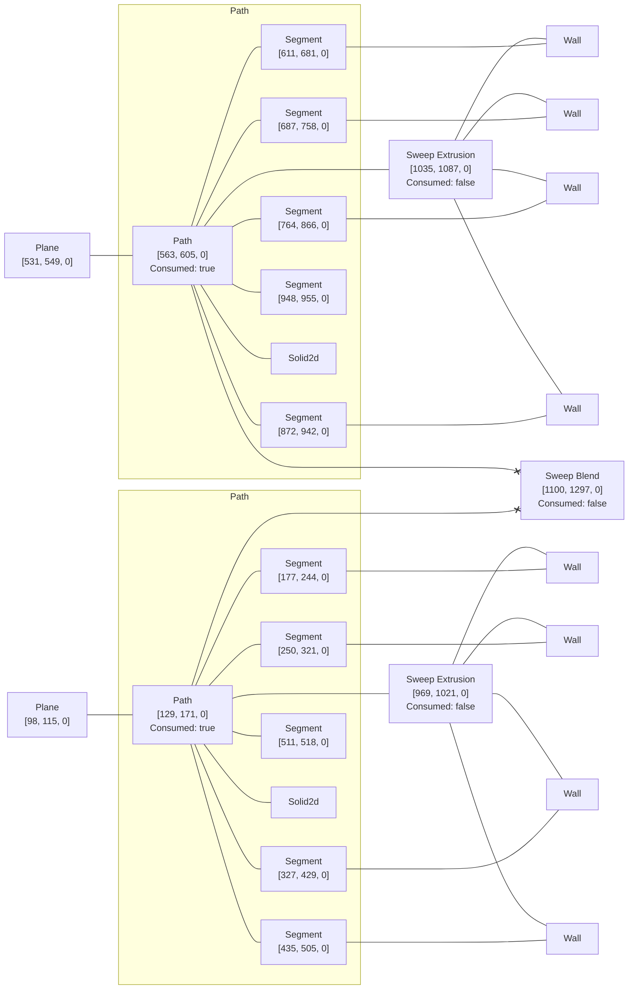

```mermaid
flowchart LR
  subgraph path1 [Path]
    1["Path<br>[129, 171, 0]<br>Consumed: true"]
      %% [ProgramBodyItem { index: 1 }, VariableDeclarationDeclaration, VariableDeclarationInit, PipeBodyItem { index: 0 }]
    5["Segment<br>[177, 244, 0]"]
      %% [ProgramBodyItem { index: 1 }, VariableDeclarationDeclaration, VariableDeclarationInit, PipeBodyItem { index: 1 }]
    6["Segment<br>[250, 321, 0]"]
      %% [ProgramBodyItem { index: 1 }, VariableDeclarationDeclaration, VariableDeclarationInit, PipeBodyItem { index: 2 }]
    7["Segment<br>[327, 429, 0]"]
      %% [ProgramBodyItem { index: 1 }, VariableDeclarationDeclaration, VariableDeclarationInit, PipeBodyItem { index: 3 }]
    8["Segment<br>[435, 505, 0]"]
      %% [ProgramBodyItem { index: 1 }, VariableDeclarationDeclaration, VariableDeclarationInit, PipeBodyItem { index: 4 }]
    9["Segment<br>[511, 518, 0]"]
      %% [ProgramBodyItem { index: 1 }, VariableDeclarationDeclaration, VariableDeclarationInit, PipeBodyItem { index: 5 }]
    15[Solid2d]
  end
  subgraph path2 [Path]
    2["Path<br>[563, 605, 0]<br>Consumed: true"]
      %% [ProgramBodyItem { index: 3 }, VariableDeclarationDeclaration, VariableDeclarationInit, PipeBodyItem { index: 0 }]
    10["Segment<br>[611, 681, 0]"]
      %% [ProgramBodyItem { index: 3 }, VariableDeclarationDeclaration, VariableDeclarationInit, PipeBodyItem { index: 1 }]
    11["Segment<br>[687, 758, 0]"]
      %% [ProgramBodyItem { index: 3 }, VariableDeclarationDeclaration, VariableDeclarationInit, PipeBodyItem { index: 2 }]
    12["Segment<br>[764, 866, 0]"]
      %% [ProgramBodyItem { index: 3 }, VariableDeclarationDeclaration, VariableDeclarationInit, PipeBodyItem { index: 3 }]
    13["Segment<br>[872, 942, 0]"]
      %% [ProgramBodyItem { index: 3 }, VariableDeclarationDeclaration, VariableDeclarationInit, PipeBodyItem { index: 4 }]
    14["Segment<br>[948, 955, 0]"]
      %% [ProgramBodyItem { index: 3 }, VariableDeclarationDeclaration, VariableDeclarationInit, PipeBodyItem { index: 5 }]
    16[Solid2d]
  end
  3["Plane<br>[531, 549, 0]"]
    %% [ProgramBodyItem { index: 2 }, VariableDeclarationDeclaration, VariableDeclarationInit]
  4["Plane<br>[98, 115, 0]"]
    %% [ProgramBodyItem { index: 0 }, VariableDeclarationDeclaration, VariableDeclarationInit]
  17["Sweep Blend<br>[1100, 1297, 0]<br>Consumed: false"]
    %% [ProgramBodyItem { index: 6 }, VariableDeclarationDeclaration, VariableDeclarationInit]
  18["Sweep Extrusion<br>[1035, 1087, 0]<br>Consumed: false"]
    %% [ProgramBodyItem { index: 5 }, VariableDeclarationDeclaration, VariableDeclarationInit]
  19["Sweep Extrusion<br>[969, 1021, 0]<br>Consumed: false"]
    %% [ProgramBodyItem { index: 4 }, VariableDeclarationDeclaration, VariableDeclarationInit]
  20[Wall]
    %% face_code_ref=Missing NodePath
  21[Wall]
    %% face_code_ref=Missing NodePath
  22[Wall]
    %% face_code_ref=Missing NodePath
  23[Wall]
    %% face_code_ref=Missing NodePath
  24[Wall]
    %% face_code_ref=Missing NodePath
  25[Wall]
    %% face_code_ref=Missing NodePath
  26[Wall]
    %% face_code_ref=Missing NodePath
  27[Wall]
    %% face_code_ref=Missing NodePath
  4 --- 1
  1 --- 5
  1 --- 6
  1 --- 7
  1 --- 8
  1 --- 9
  1 --- 15
  1 <---x 17
  1 ---- 19
  3 --- 2
  2 --- 10
  2 --- 11
  2 --- 12
  2 --- 13
  2 --- 14
  2 --- 16
  2 <---x 17
  2 ---- 18
  5 --- 20
  6 --- 21
  7 --- 22
  8 --- 23
  10 --- 24
  11 --- 25
  12 --- 26
  13 --- 27
  18 --- 24
  18 --- 25
  18 --- 26
  18 --- 27
  19 --- 20
  19 --- 21
  19 --- 22
  19 --- 23
```
