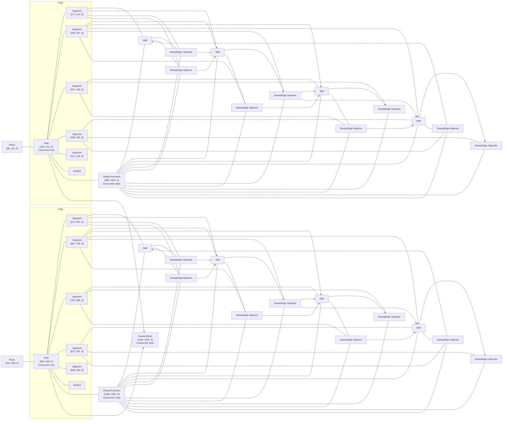

```mermaid
flowchart LR
  subgraph path2 [Path]
    2["Path<br>[129, 171, 0]<br>Consumed: true"]
      %% [ProgramBodyItem { index: 1 }, VariableDeclarationDeclaration, VariableDeclarationInit, PipeBodyItem { index: 0 }]
    3["Segment<br>[177, 244, 0]"]
      %% [ProgramBodyItem { index: 1 }, VariableDeclarationDeclaration, VariableDeclarationInit, PipeBodyItem { index: 1 }]
    4["Segment<br>[250, 321, 0]"]
      %% [ProgramBodyItem { index: 1 }, VariableDeclarationDeclaration, VariableDeclarationInit, PipeBodyItem { index: 2 }]
    5["Segment<br>[327, 429, 0]"]
      %% [ProgramBodyItem { index: 1 }, VariableDeclarationDeclaration, VariableDeclarationInit, PipeBodyItem { index: 3 }]
    6["Segment<br>[435, 505, 0]"]
      %% [ProgramBodyItem { index: 1 }, VariableDeclarationDeclaration, VariableDeclarationInit, PipeBodyItem { index: 4 }]
    7["Segment<br>[511, 518, 0]"]
      %% [ProgramBodyItem { index: 1 }, VariableDeclarationDeclaration, VariableDeclarationInit, PipeBodyItem { index: 5 }]
    8[Solid2d]
  end
  subgraph path10 [Path]
    10["Path<br>[563, 605, 0]<br>Consumed: true"]
      %% [ProgramBodyItem { index: 3 }, VariableDeclarationDeclaration, VariableDeclarationInit, PipeBodyItem { index: 0 }]
    11["Segment<br>[611, 681, 0]"]
      %% [ProgramBodyItem { index: 3 }, VariableDeclarationDeclaration, VariableDeclarationInit, PipeBodyItem { index: 1 }]
    12["Segment<br>[687, 758, 0]"]
      %% [ProgramBodyItem { index: 3 }, VariableDeclarationDeclaration, VariableDeclarationInit, PipeBodyItem { index: 2 }]
    13["Segment<br>[764, 866, 0]"]
      %% [ProgramBodyItem { index: 3 }, VariableDeclarationDeclaration, VariableDeclarationInit, PipeBodyItem { index: 3 }]
    14["Segment<br>[872, 942, 0]"]
      %% [ProgramBodyItem { index: 3 }, VariableDeclarationDeclaration, VariableDeclarationInit, PipeBodyItem { index: 4 }]
    15["Segment<br>[948, 955, 0]"]
      %% [ProgramBodyItem { index: 3 }, VariableDeclarationDeclaration, VariableDeclarationInit, PipeBodyItem { index: 5 }]
    16[Solid2d]
  end
  1["Plane<br>[98, 115, 0]"]
    %% [ProgramBodyItem { index: 0 }, VariableDeclarationDeclaration, VariableDeclarationInit]
  9["Plane<br>[531, 549, 0]"]
    %% [ProgramBodyItem { index: 2 }, VariableDeclarationDeclaration, VariableDeclarationInit]
  17["Sweep Extrusion<br>[969, 1021, 0]<br>Consumed: false"]
    %% [ProgramBodyItem { index: 4 }, VariableDeclarationDeclaration, VariableDeclarationInit]
  18[Wall]
    %% face_code_ref=Missing NodePath
  19[Wall]
    %% face_code_ref=Missing NodePath
  20[Wall]
    %% face_code_ref=Missing NodePath
  21[Wall]
    %% face_code_ref=Missing NodePath
  22["SweepEdge Opposite"]
  23["SweepEdge Adjacent"]
  24["SweepEdge Opposite"]
  25["SweepEdge Adjacent"]
  26["SweepEdge Opposite"]
  27["SweepEdge Adjacent"]
  28["SweepEdge Opposite"]
  29["SweepEdge Adjacent"]
  30["Sweep Extrusion<br>[1035, 1087, 0]<br>Consumed: false"]
    %% [ProgramBodyItem { index: 5 }, VariableDeclarationDeclaration, VariableDeclarationInit]
  31[Wall]
    %% face_code_ref=Missing NodePath
  32[Wall]
    %% face_code_ref=Missing NodePath
  33[Wall]
    %% face_code_ref=Missing NodePath
  34[Wall]
    %% face_code_ref=Missing NodePath
  35["SweepEdge Opposite"]
  36["SweepEdge Adjacent"]
  37["SweepEdge Opposite"]
  38["SweepEdge Adjacent"]
  39["SweepEdge Opposite"]
  40["SweepEdge Adjacent"]
  41["SweepEdge Opposite"]
  42["SweepEdge Adjacent"]
  43["Sweep Blend<br>[1100, 1297, 0]<br>Consumed: false"]
    %% [ProgramBodyItem { index: 6 }, VariableDeclarationDeclaration, VariableDeclarationInit]
  1 --- 2
  2 --- 3
  2 --- 4
  2 --- 5
  2 --- 6
  2 --- 7
  2 --- 8
  2 ---- 17
  2 <---x 43
  3 --- 18
  3 x--> 19
  3 --- 22
  3 --- 23
  4 --- 19
  4 x--> 20
  4 x--> 21
  4 --- 24
  4 --- 25
  5 --- 20
  5 --- 26
  5 --- 27
  6 --- 21
  6 --- 28
  6 --- 29
  9 --- 10
  10 --- 11
  10 --- 12
  10 --- 13
  10 --- 14
  10 --- 15
  10 --- 16
  10 ---- 30
  10 <---x 43
  11 --- 31
  11 x--> 32
  11 --- 35
  11 --- 36
  12 --- 32
  12 x--> 33
  12 x--> 34
  12 --- 37
  12 --- 38
  13 --- 33
  13 --- 39
  13 --- 40
  14 --- 34
  14 --- 41
  14 --- 42
  17 --- 18
  17 --- 19
  17 --- 20
  17 --- 21
  17 --- 22
  17 --- 23
  17 --- 24
  17 --- 25
  17 --- 26
  17 --- 27
  17 --- 28
  17 --- 29
  18 --- 22
  18 --- 23
  29 <--x 18
  22 <--x 19
  23 <--x 19
  19 x--> 24
  19 --- 25
  24 <--x 20
  25 <--x 20
  20 x--> 26
  20 --- 27
  24 <--x 21
  27 <--x 21
  21 x--> 28
  21 --- 29
  30 --- 31
  30 --- 32
  30 --- 33
  30 --- 34
  30 --- 35
  30 --- 36
  30 --- 37
  30 --- 38
  30 --- 39
  30 --- 40
  30 --- 41
  30 --- 42
  31 --- 35
  31 --- 36
  42 <--x 31
  35 <--x 32
  36 <--x 32
  32 x--> 37
  32 --- 38
  37 <--x 33
  38 <--x 33
  33 x--> 39
  33 --- 40
  37 <--x 34
  40 <--x 34
  34 x--> 41
  34 --- 42
```
