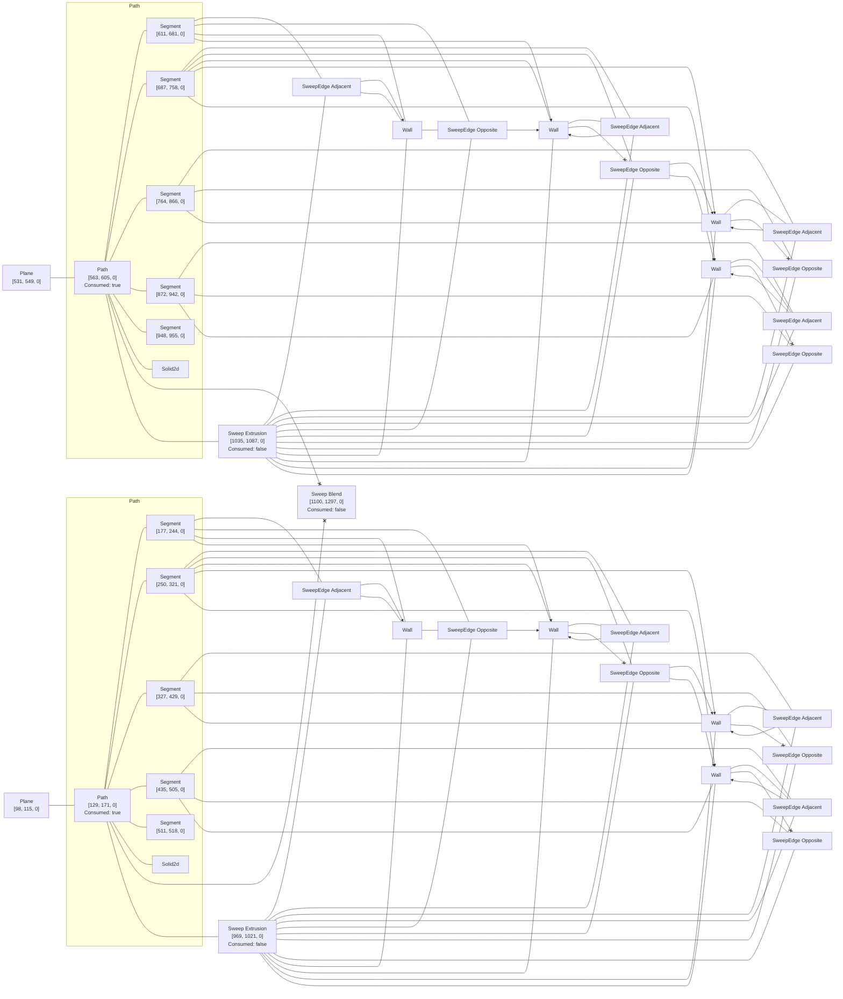

```mermaid
flowchart LR
  subgraph path1 [Path]
    1["Path<br>[129, 171, 0]<br>Consumed: true"]
      %% [ProgramBodyItem { index: 1 }, VariableDeclarationDeclaration, VariableDeclarationInit, PipeBodyItem { index: 0 }]
    5["Segment<br>[177, 244, 0]"]
      %% [ProgramBodyItem { index: 1 }, VariableDeclarationDeclaration, VariableDeclarationInit, PipeBodyItem { index: 1 }]
    6["Segment<br>[250, 321, 0]"]
      %% [ProgramBodyItem { index: 1 }, VariableDeclarationDeclaration, VariableDeclarationInit, PipeBodyItem { index: 2 }]
    7["Segment<br>[327, 429, 0]"]
      %% [ProgramBodyItem { index: 1 }, VariableDeclarationDeclaration, VariableDeclarationInit, PipeBodyItem { index: 3 }]
    8["Segment<br>[435, 505, 0]"]
      %% [ProgramBodyItem { index: 1 }, VariableDeclarationDeclaration, VariableDeclarationInit, PipeBodyItem { index: 4 }]
    9["Segment<br>[511, 518, 0]"]
      %% [ProgramBodyItem { index: 1 }, VariableDeclarationDeclaration, VariableDeclarationInit, PipeBodyItem { index: 5 }]
    15[Solid2d]
  end
  subgraph path2 [Path]
    2["Path<br>[563, 605, 0]<br>Consumed: true"]
      %% [ProgramBodyItem { index: 3 }, VariableDeclarationDeclaration, VariableDeclarationInit, PipeBodyItem { index: 0 }]
    10["Segment<br>[611, 681, 0]"]
      %% [ProgramBodyItem { index: 3 }, VariableDeclarationDeclaration, VariableDeclarationInit, PipeBodyItem { index: 1 }]
    11["Segment<br>[687, 758, 0]"]
      %% [ProgramBodyItem { index: 3 }, VariableDeclarationDeclaration, VariableDeclarationInit, PipeBodyItem { index: 2 }]
    12["Segment<br>[764, 866, 0]"]
      %% [ProgramBodyItem { index: 3 }, VariableDeclarationDeclaration, VariableDeclarationInit, PipeBodyItem { index: 3 }]
    13["Segment<br>[872, 942, 0]"]
      %% [ProgramBodyItem { index: 3 }, VariableDeclarationDeclaration, VariableDeclarationInit, PipeBodyItem { index: 4 }]
    14["Segment<br>[948, 955, 0]"]
      %% [ProgramBodyItem { index: 3 }, VariableDeclarationDeclaration, VariableDeclarationInit, PipeBodyItem { index: 5 }]
    16[Solid2d]
  end
  3["Plane<br>[531, 549, 0]"]
    %% [ProgramBodyItem { index: 2 }, VariableDeclarationDeclaration, VariableDeclarationInit]
  4["Plane<br>[98, 115, 0]"]
    %% [ProgramBodyItem { index: 0 }, VariableDeclarationDeclaration, VariableDeclarationInit]
  17["Sweep Blend<br>[1100, 1297, 0]<br>Consumed: false"]
    %% [ProgramBodyItem { index: 6 }, VariableDeclarationDeclaration, VariableDeclarationInit]
  18["Sweep Extrusion<br>[1035, 1087, 0]<br>Consumed: false"]
    %% [ProgramBodyItem { index: 5 }, VariableDeclarationDeclaration, VariableDeclarationInit]
  19["Sweep Extrusion<br>[969, 1021, 0]<br>Consumed: false"]
    %% [ProgramBodyItem { index: 4 }, VariableDeclarationDeclaration, VariableDeclarationInit]
  20["SweepEdge Adjacent"]
  21["SweepEdge Adjacent"]
  22["SweepEdge Adjacent"]
  23["SweepEdge Adjacent"]
  24["SweepEdge Adjacent"]
  25["SweepEdge Adjacent"]
  26["SweepEdge Adjacent"]
  27["SweepEdge Adjacent"]
  28["SweepEdge Opposite"]
  29["SweepEdge Opposite"]
  30["SweepEdge Opposite"]
  31["SweepEdge Opposite"]
  32["SweepEdge Opposite"]
  33["SweepEdge Opposite"]
  34["SweepEdge Opposite"]
  35["SweepEdge Opposite"]
  36[Wall]
    %% face_code_ref=Missing NodePath
  37[Wall]
    %% face_code_ref=Missing NodePath
  38[Wall]
    %% face_code_ref=Missing NodePath
  39[Wall]
    %% face_code_ref=Missing NodePath
  40[Wall]
    %% face_code_ref=Missing NodePath
  41[Wall]
    %% face_code_ref=Missing NodePath
  42[Wall]
    %% face_code_ref=Missing NodePath
  43[Wall]
    %% face_code_ref=Missing NodePath
  4 --- 1
  1 --- 5
  1 --- 6
  1 --- 7
  1 --- 8
  1 --- 9
  1 --- 15
  1 <---x 17
  1 ---- 19
  3 --- 2
  2 --- 10
  2 --- 11
  2 --- 12
  2 --- 13
  2 --- 14
  2 --- 16
  2 <---x 17
  2 ---- 18
  5 --- 20
  5 --- 28
  5 --- 36
  5 x--> 37
  6 --- 21
  6 --- 29
  6 --- 37
  6 x--> 38
  6 x--> 39
  7 --- 22
  7 --- 30
  7 --- 38
  8 --- 23
  8 --- 31
  8 --- 39
  10 --- 24
  10 --- 32
  10 --- 40
  10 x--> 41
  11 --- 25
  11 --- 33
  11 --- 41
  11 x--> 42
  11 x--> 43
  12 --- 26
  12 --- 34
  12 --- 42
  13 --- 27
  13 --- 35
  13 --- 43
  18 --- 24
  18 --- 25
  18 --- 26
  18 --- 27
  18 --- 32
  18 --- 33
  18 --- 34
  18 --- 35
  18 --- 40
  18 --- 41
  18 --- 42
  18 --- 43
  19 --- 20
  19 --- 21
  19 --- 22
  19 --- 23
  19 --- 28
  19 --- 29
  19 --- 30
  19 --- 31
  19 --- 36
  19 --- 37
  19 --- 38
  19 --- 39
  36 --- 20
  20 x--> 36
  37 --- 21
  21 x--> 37
  38 --- 22
  22 x--> 38
  23 x--> 39
  39 --- 23
  40 --- 24
  24 x--> 40
  41 --- 25
  25 x--> 41
  42 --- 26
  26 x--> 42
  27 x--> 43
  43 --- 27
  36 --- 28
  28 x--> 37
  37 <--x 29
  29 x--> 38
  29 x--> 39
  38 <--x 30
  39 <--x 31
  40 --- 32
  32 x--> 41
  41 <--x 33
  33 x--> 42
  33 x--> 43
  42 <--x 34
  43 <--x 35
```
