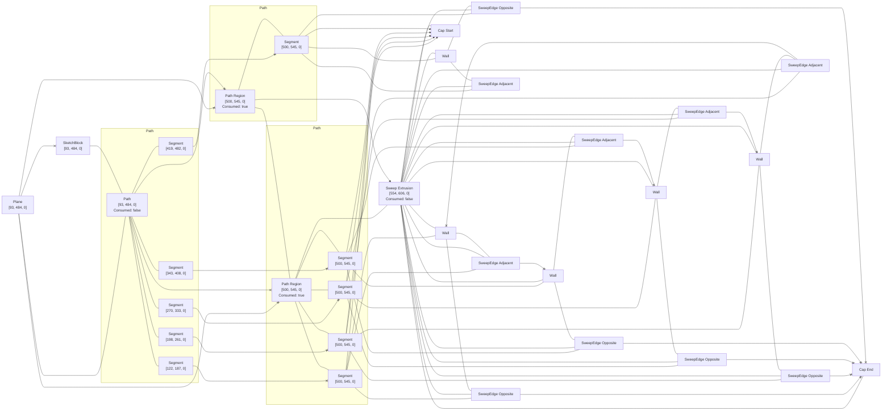

```mermaid
flowchart LR
  subgraph path2 [Path]
    2["Path<br>[93, 484, 0]<br>Consumed: false"]
      %% [ProgramBodyItem { index: 0 }, VariableDeclarationDeclaration, VariableDeclarationInit]
    3["Segment<br>[122, 187, 0]"]
      %% [ProgramBodyItem { index: 0 }, VariableDeclarationDeclaration, VariableDeclarationInit, SketchBlockBody, SketchBlockBodyItem { index: 0 }, VariableDeclarationDeclaration, VariableDeclarationInit]
    4["Segment<br>[198, 261, 0]"]
      %% [ProgramBodyItem { index: 0 }, VariableDeclarationDeclaration, VariableDeclarationInit, SketchBlockBody, SketchBlockBodyItem { index: 1 }, VariableDeclarationDeclaration, VariableDeclarationInit]
    5["Segment<br>[270, 333, 0]"]
      %% [ProgramBodyItem { index: 0 }, VariableDeclarationDeclaration, VariableDeclarationInit, SketchBlockBody, SketchBlockBodyItem { index: 2 }, VariableDeclarationDeclaration, VariableDeclarationInit]
    6["Segment<br>[343, 408, 0]"]
      %% [ProgramBodyItem { index: 0 }, VariableDeclarationDeclaration, VariableDeclarationInit, SketchBlockBody, SketchBlockBodyItem { index: 3 }, VariableDeclarationDeclaration, VariableDeclarationInit]
    7["Segment<br>[419, 482, 0]"]
      %% [ProgramBodyItem { index: 0 }, VariableDeclarationDeclaration, VariableDeclarationInit, SketchBlockBody, SketchBlockBodyItem { index: 4 }, VariableDeclarationDeclaration, VariableDeclarationInit]
  end
  subgraph path8 [Path]
    8["Path Region<br>[500, 545, 0]<br>Consumed: true"]
      %% [ProgramBodyItem { index: 1 }, VariableDeclarationDeclaration, VariableDeclarationInit]
    9["Segment<br>[500, 545, 0]"]
      %% [ProgramBodyItem { index: 1 }, VariableDeclarationDeclaration, VariableDeclarationInit]
    10["Segment<br>[500, 545, 0]"]
      %% [ProgramBodyItem { index: 1 }, VariableDeclarationDeclaration, VariableDeclarationInit]
    11["Segment<br>[500, 545, 0]"]
      %% [ProgramBodyItem { index: 1 }, VariableDeclarationDeclaration, VariableDeclarationInit]
    12["Segment<br>[500, 545, 0]"]
      %% [ProgramBodyItem { index: 1 }, VariableDeclarationDeclaration, VariableDeclarationInit]
  end
  subgraph path13 [Path]
    13["Path Region<br>[500, 545, 0]<br>Consumed: true"]
      %% [ProgramBodyItem { index: 1 }, VariableDeclarationDeclaration, VariableDeclarationInit]
    14["Segment<br>[500, 545, 0]"]
      %% [ProgramBodyItem { index: 1 }, VariableDeclarationDeclaration, VariableDeclarationInit]
  end
  1["Plane<br>[93, 484, 0]"]
    %% [ProgramBodyItem { index: 0 }, VariableDeclarationDeclaration, VariableDeclarationInit]
  15["Sweep Extrusion<br>[554, 606, 0]<br>Consumed: false"]
    %% [ProgramBodyItem { index: 2 }, VariableDeclarationDeclaration, VariableDeclarationInit]
  16[Wall]
    %% face_code_ref=Missing NodePath
  17[Wall]
    %% face_code_ref=Missing NodePath
  18[Wall]
    %% face_code_ref=Missing NodePath
  19[Wall]
    %% face_code_ref=Missing NodePath
  20[Wall]
    %% face_code_ref=Missing NodePath
  21["Cap Start"]
    %% face_code_ref=Missing NodePath
  22["Cap End"]
    %% face_code_ref=Missing NodePath
  23["SweepEdge Opposite"]
  24["SweepEdge Adjacent"]
  25["SweepEdge Opposite"]
  26["SweepEdge Adjacent"]
  27["SweepEdge Opposite"]
  28["SweepEdge Adjacent"]
  29["SweepEdge Opposite"]
  30["SweepEdge Adjacent"]
  31["SweepEdge Opposite"]
  32["SweepEdge Adjacent"]
  33["SketchBlock<br>[93, 484, 0]"]
    %% [ProgramBodyItem { index: 0 }, VariableDeclarationDeclaration, VariableDeclarationInit]
  1 --- 2
  1 <--x 8
  1 <--x 13
  1 <--x 33
  2 --- 3
  2 --- 4
  2 --- 5
  2 --- 6
  2 --- 7
  2 <--x 8
  2 <--x 13
  33 --- 2
  3 <--x 9
  4 <--x 10
  5 <--x 11
  6 <--x 12
  7 <--x 14
  8 --- 9
  8 --- 10
  8 --- 11
  8 --- 12
  13 --- 8
  8 ---- 15
  9 --- 16
  9 x--> 21
  9 --- 23
  9 --- 24
  10 --- 17
  10 x--> 21
  10 --- 25
  10 --- 26
  11 --- 18
  11 x--> 21
  11 --- 27
  11 --- 28
  12 --- 19
  12 x--> 21
  12 --- 29
  12 --- 30
  13 --- 14
  13 x---> 15
  14 --- 20
  14 x--> 21
  14 --- 31
  14 --- 32
  15 --- 16
  15 --- 17
  15 --- 18
  15 --- 19
  15 --- 20
  15 --- 21
  15 --- 22
  15 --- 23
  15 --- 24
  15 --- 25
  15 --- 26
  15 --- 27
  15 --- 28
  15 --- 29
  15 --- 30
  15 --- 31
  15 --- 32
  16 --- 23
  16 --- 24
  26 <--x 16
  17 --- 25
  17 --- 26
  28 <--x 17
  18 --- 27
  18 --- 28
  30 <--x 18
  24 <--x 19
  19 --- 29
  19 --- 30
  20 --- 31
  20 --- 32
  23 <--x 22
  25 <--x 22
  27 <--x 22
  29 <--x 22
  31 <--x 22
```
