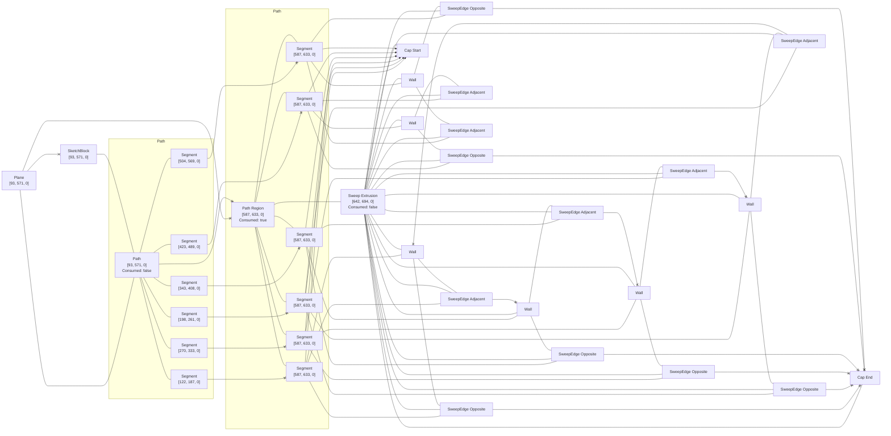

```mermaid
flowchart LR
  subgraph path2 [Path]
    2["Path<br>[93, 571, 0]<br>Consumed: false"]
      %% [ProgramBodyItem { index: 0 }, VariableDeclarationDeclaration, VariableDeclarationInit]
    3["Segment<br>[122, 187, 0]"]
      %% [ProgramBodyItem { index: 0 }, VariableDeclarationDeclaration, VariableDeclarationInit, SketchBlockBody, SketchBlockBodyItem { index: 0 }, VariableDeclarationDeclaration, VariableDeclarationInit]
    4["Segment<br>[198, 261, 0]"]
      %% [ProgramBodyItem { index: 0 }, VariableDeclarationDeclaration, VariableDeclarationInit, SketchBlockBody, SketchBlockBodyItem { index: 1 }, VariableDeclarationDeclaration, VariableDeclarationInit]
    5["Segment<br>[270, 333, 0]"]
      %% [ProgramBodyItem { index: 0 }, VariableDeclarationDeclaration, VariableDeclarationInit, SketchBlockBody, SketchBlockBodyItem { index: 2 }, VariableDeclarationDeclaration, VariableDeclarationInit]
    6["Segment<br>[343, 408, 0]"]
      %% [ProgramBodyItem { index: 0 }, VariableDeclarationDeclaration, VariableDeclarationInit, SketchBlockBody, SketchBlockBodyItem { index: 3 }, VariableDeclarationDeclaration, VariableDeclarationInit]
    7["Segment<br>[423, 489, 0]"]
      %% [ProgramBodyItem { index: 0 }, VariableDeclarationDeclaration, VariableDeclarationInit, SketchBlockBody, SketchBlockBodyItem { index: 4 }, VariableDeclarationDeclaration, VariableDeclarationInit]
    8["Segment<br>[504, 569, 0]"]
      %% [ProgramBodyItem { index: 0 }, VariableDeclarationDeclaration, VariableDeclarationInit, SketchBlockBody, SketchBlockBodyItem { index: 5 }, VariableDeclarationDeclaration, VariableDeclarationInit]
  end
  subgraph path9 [Path]
    9["Path Region<br>[587, 633, 0]<br>Consumed: true"]
      %% [ProgramBodyItem { index: 1 }, VariableDeclarationDeclaration, VariableDeclarationInit]
    10["Segment<br>[587, 633, 0]"]
      %% [ProgramBodyItem { index: 1 }, VariableDeclarationDeclaration, VariableDeclarationInit]
    11["Segment<br>[587, 633, 0]"]
      %% [ProgramBodyItem { index: 1 }, VariableDeclarationDeclaration, VariableDeclarationInit]
    12["Segment<br>[587, 633, 0]"]
      %% [ProgramBodyItem { index: 1 }, VariableDeclarationDeclaration, VariableDeclarationInit]
    13["Segment<br>[587, 633, 0]"]
      %% [ProgramBodyItem { index: 1 }, VariableDeclarationDeclaration, VariableDeclarationInit]
    14["Segment<br>[587, 633, 0]"]
      %% [ProgramBodyItem { index: 1 }, VariableDeclarationDeclaration, VariableDeclarationInit]
    15["Segment<br>[587, 633, 0]"]
      %% [ProgramBodyItem { index: 1 }, VariableDeclarationDeclaration, VariableDeclarationInit]
  end
  1["Plane<br>[93, 571, 0]"]
    %% [ProgramBodyItem { index: 0 }, VariableDeclarationDeclaration, VariableDeclarationInit]
  16["Sweep Extrusion<br>[642, 694, 0]<br>Consumed: false"]
    %% [ProgramBodyItem { index: 2 }, VariableDeclarationDeclaration, VariableDeclarationInit]
  17[Wall]
    %% face_code_ref=Missing NodePath
  18[Wall]
    %% face_code_ref=Missing NodePath
  19[Wall]
    %% face_code_ref=Missing NodePath
  20[Wall]
    %% face_code_ref=Missing NodePath
  21[Wall]
    %% face_code_ref=Missing NodePath
  22[Wall]
    %% face_code_ref=Missing NodePath
  23["Cap Start"]
    %% face_code_ref=Missing NodePath
  24["Cap End"]
    %% face_code_ref=Missing NodePath
  25["SweepEdge Opposite"]
  26["SweepEdge Adjacent"]
  27["SweepEdge Opposite"]
  28["SweepEdge Adjacent"]
  29["SweepEdge Opposite"]
  30["SweepEdge Adjacent"]
  31["SweepEdge Opposite"]
  32["SweepEdge Adjacent"]
  33["SweepEdge Opposite"]
  34["SweepEdge Adjacent"]
  35["SweepEdge Opposite"]
  36["SweepEdge Adjacent"]
  37["SketchBlock<br>[93, 571, 0]"]
    %% [ProgramBodyItem { index: 0 }, VariableDeclarationDeclaration, VariableDeclarationInit]
  1 --- 2
  1 <--x 9
  1 <--x 37
  2 --- 3
  2 --- 4
  2 --- 5
  2 --- 6
  2 --- 7
  2 --- 8
  2 <--x 9
  37 --- 2
  3 <--x 10
  4 <--x 11
  5 <--x 12
  6 <--x 13
  7 <--x 14
  8 <--x 15
  9 --- 10
  9 --- 11
  9 --- 12
  9 --- 13
  9 --- 14
  9 --- 15
  9 ---- 16
  10 --- 17
  10 x--> 23
  10 --- 25
  10 --- 26
  11 --- 18
  11 x--> 23
  11 --- 27
  11 --- 28
  12 --- 19
  12 x--> 23
  12 --- 29
  12 --- 30
  13 --- 20
  13 x--> 23
  13 --- 31
  13 --- 32
  14 --- 21
  14 x--> 23
  14 --- 33
  14 --- 34
  15 --- 22
  15 x--> 23
  15 --- 35
  15 --- 36
  16 --- 17
  16 --- 18
  16 --- 19
  16 --- 20
  16 --- 21
  16 --- 22
  16 --- 23
  16 --- 24
  16 --- 25
  16 --- 26
  16 --- 27
  16 --- 28
  16 --- 29
  16 --- 30
  16 --- 31
  16 --- 32
  16 --- 33
  16 --- 34
  16 --- 35
  16 --- 36
  17 --- 25
  17 --- 26
  28 <--x 17
  18 --- 27
  18 --- 28
  30 <--x 18
  19 --- 29
  19 --- 30
  32 <--x 19
  26 <--x 20
  20 --- 31
  20 --- 32
  21 --- 33
  21 --- 34
  22 --- 35
  22 --- 36
  25 <--x 24
  27 <--x 24
  29 <--x 24
  31 <--x 24
  33 <--x 24
  35 <--x 24
```
