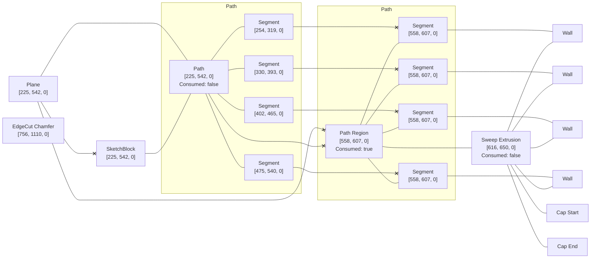

```mermaid
flowchart LR
  subgraph path2 [Path]
    2["Path<br>[225, 542, 0]<br>Consumed: false"]
      %% [ProgramBodyItem { index: 0 }, VariableDeclarationDeclaration, VariableDeclarationInit]
    3["Segment<br>[254, 319, 0]"]
      %% [ProgramBodyItem { index: 0 }, VariableDeclarationDeclaration, VariableDeclarationInit, SketchBlockBody, SketchBlockBodyItem { index: 0 }, VariableDeclarationDeclaration, VariableDeclarationInit]
    4["Segment<br>[330, 393, 0]"]
      %% [ProgramBodyItem { index: 0 }, VariableDeclarationDeclaration, VariableDeclarationInit, SketchBlockBody, SketchBlockBodyItem { index: 1 }, VariableDeclarationDeclaration, VariableDeclarationInit]
    5["Segment<br>[402, 465, 0]"]
      %% [ProgramBodyItem { index: 0 }, VariableDeclarationDeclaration, VariableDeclarationInit, SketchBlockBody, SketchBlockBodyItem { index: 2 }, VariableDeclarationDeclaration, VariableDeclarationInit]
    6["Segment<br>[475, 540, 0]"]
      %% [ProgramBodyItem { index: 0 }, VariableDeclarationDeclaration, VariableDeclarationInit, SketchBlockBody, SketchBlockBodyItem { index: 3 }, VariableDeclarationDeclaration, VariableDeclarationInit]
  end
  subgraph path7 [Path]
    7["Path Region<br>[558, 607, 0]<br>Consumed: true"]
      %% [ProgramBodyItem { index: 1 }, VariableDeclarationDeclaration, VariableDeclarationInit]
    8["Segment<br>[558, 607, 0]"]
      %% [ProgramBodyItem { index: 1 }, VariableDeclarationDeclaration, VariableDeclarationInit]
    9["Segment<br>[558, 607, 0]"]
      %% [ProgramBodyItem { index: 1 }, VariableDeclarationDeclaration, VariableDeclarationInit]
    10["Segment<br>[558, 607, 0]"]
      %% [ProgramBodyItem { index: 1 }, VariableDeclarationDeclaration, VariableDeclarationInit]
    11["Segment<br>[558, 607, 0]"]
      %% [ProgramBodyItem { index: 1 }, VariableDeclarationDeclaration, VariableDeclarationInit]
  end
  1["Plane<br>[225, 542, 0]"]
    %% [ProgramBodyItem { index: 0 }, VariableDeclarationDeclaration, VariableDeclarationInit]
  12["Sweep Extrusion<br>[616, 650, 0]<br>Consumed: false"]
    %% [ProgramBodyItem { index: 2 }, VariableDeclarationDeclaration, VariableDeclarationInit]
  13[Wall]
    %% face_code_ref=Missing NodePath
  14[Wall]
    %% face_code_ref=Missing NodePath
  15[Wall]
    %% face_code_ref=Missing NodePath
  16[Wall]
    %% face_code_ref=Missing NodePath
  17["Cap Start"]
    %% face_code_ref=Missing NodePath
  18["Cap End"]
    %% face_code_ref=Missing NodePath
  19["EdgeCut Chamfer<br>[756, 1110, 0]"]
    %% [ProgramBodyItem { index: 3 }, VariableDeclarationDeclaration, VariableDeclarationInit]
  20["SketchBlock<br>[225, 542, 0]"]
    %% [ProgramBodyItem { index: 0 }, VariableDeclarationDeclaration, VariableDeclarationInit]
  1 --- 2
  1 <--x 7
  1 <--x 20
  2 --- 3
  2 --- 4
  2 --- 5
  2 --- 6
  2 <--x 7
  20 --- 2
  3 <--x 8
  4 <--x 9
  5 <--x 10
  6 <--x 11
  7 --- 8
  7 --- 9
  7 --- 10
  7 --- 11
  7 ---- 12
  8 --- 13
  9 --- 14
  10 --- 15
  11 --- 16
  12 --- 13
  12 --- 14
  12 --- 15
  12 --- 16
  12 --- 17
  12 --- 18
```
