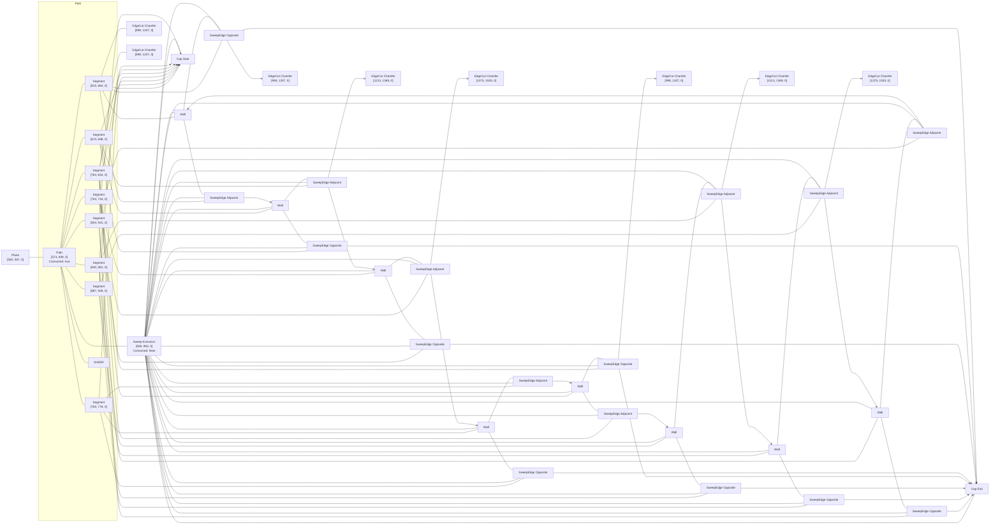

```mermaid
flowchart LR
  subgraph path2 [Path]
    2["Path<br>[573, 609, 0]<br>Consumed: true"]
      %% [ProgramBodyItem { index: 8 }, VariableDeclarationDeclaration, VariableDeclarationInit, PipeBodyItem { index: 1 }]
    3["Segment<br>[615, 664, 0]"]
      %% [ProgramBodyItem { index: 8 }, VariableDeclarationDeclaration, VariableDeclarationInit, PipeBodyItem { index: 2 }]
    4["Segment<br>[670, 698, 0]"]
      %% [ProgramBodyItem { index: 8 }, VariableDeclarationDeclaration, VariableDeclarationInit, PipeBodyItem { index: 3 }]
    5["Segment<br>[704, 744, 0]"]
      %% [ProgramBodyItem { index: 8 }, VariableDeclarationDeclaration, VariableDeclarationInit, PipeBodyItem { index: 4 }]
    6["Segment<br>[750, 778, 0]"]
      %% [ProgramBodyItem { index: 8 }, VariableDeclarationDeclaration, VariableDeclarationInit, PipeBodyItem { index: 5 }]
    7["Segment<br>[784, 834, 0]"]
      %% [ProgramBodyItem { index: 8 }, VariableDeclarationDeclaration, VariableDeclarationInit, PipeBodyItem { index: 6 }]
    8["Segment<br>[840, 881, 0]"]
      %% [ProgramBodyItem { index: 8 }, VariableDeclarationDeclaration, VariableDeclarationInit, PipeBodyItem { index: 7 }]
    9["Segment<br>[887, 928, 0]"]
      %% [ProgramBodyItem { index: 8 }, VariableDeclarationDeclaration, VariableDeclarationInit, PipeBodyItem { index: 8 }]
    10["Segment<br>[934, 941, 0]"]
      %% [ProgramBodyItem { index: 8 }, VariableDeclarationDeclaration, VariableDeclarationInit, PipeBodyItem { index: 9 }]
    11[Solid2d]
  end
  1["Plane<br>[550, 567, 0]"]
    %% [ProgramBodyItem { index: 8 }, VariableDeclarationDeclaration, VariableDeclarationInit, PipeBodyItem { index: 0 }]
  12["Sweep Extrusion<br>[959, 993, 0]<br>Consumed: false"]
    %% [ProgramBodyItem { index: 9 }, VariableDeclarationDeclaration, VariableDeclarationInit, PipeBodyItem { index: 0 }]
  13[Wall]
    %% face_code_ref=Missing NodePath
  14[Wall]
    %% face_code_ref=Missing NodePath
  15[Wall]
    %% face_code_ref=Missing NodePath
  16[Wall]
    %% face_code_ref=Missing NodePath
  17[Wall]
    %% face_code_ref=Missing NodePath
  18[Wall]
    %% face_code_ref=Missing NodePath
  19[Wall]
    %% face_code_ref=Missing NodePath
  20[Wall]
    %% face_code_ref=Missing NodePath
  21["Cap Start"]
    %% face_code_ref=Missing NodePath
  22["Cap End"]
    %% face_code_ref=Missing NodePath
  23["SweepEdge Opposite"]
  24["SweepEdge Adjacent"]
  25["SweepEdge Opposite"]
  26["SweepEdge Adjacent"]
  27["SweepEdge Opposite"]
  28["SweepEdge Adjacent"]
  29["SweepEdge Opposite"]
  30["SweepEdge Adjacent"]
  31["SweepEdge Opposite"]
  32["SweepEdge Adjacent"]
  33["SweepEdge Opposite"]
  34["SweepEdge Adjacent"]
  35["SweepEdge Opposite"]
  36["SweepEdge Adjacent"]
  37["SweepEdge Opposite"]
  38["SweepEdge Adjacent"]
  39["EdgeCut Chamfer<br>[999, 1207, 0]"]
    %% [ProgramBodyItem { index: 9 }, VariableDeclarationDeclaration, VariableDeclarationInit, PipeBodyItem { index: 1 }]
  40["EdgeCut Chamfer<br>[999, 1207, 0]"]
    %% [ProgramBodyItem { index: 9 }, VariableDeclarationDeclaration, VariableDeclarationInit, PipeBodyItem { index: 1 }]
  41["EdgeCut Chamfer<br>[999, 1207, 0]"]
    %% [ProgramBodyItem { index: 9 }, VariableDeclarationDeclaration, VariableDeclarationInit, PipeBodyItem { index: 1 }]
  42["EdgeCut Chamfer<br>[999, 1207, 0]"]
    %% [ProgramBodyItem { index: 9 }, VariableDeclarationDeclaration, VariableDeclarationInit, PipeBodyItem { index: 1 }]
  43["EdgeCut Chamfer<br>[1213, 1369, 0]"]
    %% [ProgramBodyItem { index: 9 }, VariableDeclarationDeclaration, VariableDeclarationInit, PipeBodyItem { index: 2 }]
  44["EdgeCut Chamfer<br>[1213, 1369, 0]"]
    %% [ProgramBodyItem { index: 9 }, VariableDeclarationDeclaration, VariableDeclarationInit, PipeBodyItem { index: 2 }]
  45["EdgeCut Chamfer<br>[1375, 1535, 0]"]
    %% [ProgramBodyItem { index: 9 }, VariableDeclarationDeclaration, VariableDeclarationInit, PipeBodyItem { index: 3 }]
  46["EdgeCut Chamfer<br>[1375, 1535, 0]"]
    %% [ProgramBodyItem { index: 9 }, VariableDeclarationDeclaration, VariableDeclarationInit, PipeBodyItem { index: 3 }]
  1 --- 2
  2 --- 3
  2 --- 4
  2 --- 5
  2 --- 6
  2 --- 7
  2 --- 8
  2 --- 9
  2 --- 10
  2 --- 11
  2 ---- 12
  3 --- 20
  3 x--> 21
  3 --- 37
  3 --- 38
  3 --- 39
  4 --- 19
  4 x--> 21
  4 --- 35
  4 --- 36
  5 --- 18
  5 x--> 21
  5 --- 33
  5 --- 34
  6 --- 17
  6 x--> 21
  6 --- 31
  6 --- 32
  7 --- 16
  7 x--> 21
  7 --- 29
  7 --- 30
  7 --- 40
  8 --- 15
  8 x--> 21
  8 --- 27
  8 --- 28
  9 --- 14
  9 x--> 21
  9 --- 25
  9 --- 26
  10 --- 13
  10 x--> 21
  10 --- 23
  10 --- 24
  12 --- 13
  12 --- 14
  12 --- 15
  12 --- 16
  12 --- 17
  12 --- 18
  12 --- 19
  12 --- 20
  12 --- 21
  12 --- 22
  12 --- 23
  12 --- 24
  12 --- 25
  12 --- 26
  12 --- 27
  12 --- 28
  12 --- 29
  12 --- 30
  12 --- 31
  12 --- 32
  12 --- 33
  12 --- 34
  12 --- 35
  12 --- 36
  12 --- 37
  12 --- 38
  13 --- 23
  13 --- 24
  26 <--x 13
  14 --- 25
  14 --- 26
  28 <--x 14
  15 --- 27
  15 --- 28
  30 <--x 15
  16 --- 29
  16 --- 30
  32 <--x 16
  17 --- 31
  17 --- 32
  34 <--x 17
  18 --- 33
  18 --- 34
  36 <--x 18
  19 --- 35
  19 --- 36
  38 <--x 19
  24 <--x 20
  20 --- 37
  20 --- 38
  23 <--x 22
  25 <--x 22
  27 <--x 22
  29 <--x 22
  31 <--x 22
  33 <--x 22
  35 <--x 22
  37 <--x 22
  26 <--x 46
  28 <--x 44
  29 <--x 42
  34 <--x 45
  36 <--x 43
  37 <--x 41
```
