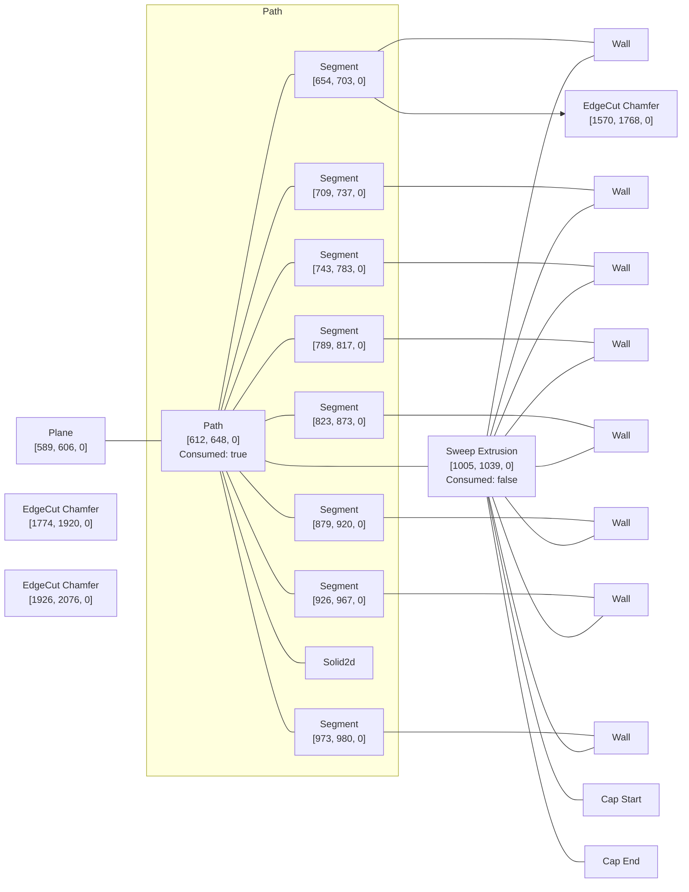

```mermaid
flowchart LR
  subgraph path2 [Path]
    2["Path<br>[612, 648, 0]<br>Consumed: true"]
      %% [ProgramBodyItem { index: 8 }, VariableDeclarationDeclaration, VariableDeclarationInit, PipeBodyItem { index: 1 }]
    3["Segment<br>[654, 703, 0]"]
      %% [ProgramBodyItem { index: 8 }, VariableDeclarationDeclaration, VariableDeclarationInit, PipeBodyItem { index: 2 }]
    4["Segment<br>[709, 737, 0]"]
      %% [ProgramBodyItem { index: 8 }, VariableDeclarationDeclaration, VariableDeclarationInit, PipeBodyItem { index: 3 }]
    5["Segment<br>[743, 783, 0]"]
      %% [ProgramBodyItem { index: 8 }, VariableDeclarationDeclaration, VariableDeclarationInit, PipeBodyItem { index: 4 }]
    6["Segment<br>[789, 817, 0]"]
      %% [ProgramBodyItem { index: 8 }, VariableDeclarationDeclaration, VariableDeclarationInit, PipeBodyItem { index: 5 }]
    7["Segment<br>[823, 873, 0]"]
      %% [ProgramBodyItem { index: 8 }, VariableDeclarationDeclaration, VariableDeclarationInit, PipeBodyItem { index: 6 }]
    8["Segment<br>[879, 920, 0]"]
      %% [ProgramBodyItem { index: 8 }, VariableDeclarationDeclaration, VariableDeclarationInit, PipeBodyItem { index: 7 }]
    9["Segment<br>[926, 967, 0]"]
      %% [ProgramBodyItem { index: 8 }, VariableDeclarationDeclaration, VariableDeclarationInit, PipeBodyItem { index: 8 }]
    10["Segment<br>[973, 980, 0]"]
      %% [ProgramBodyItem { index: 8 }, VariableDeclarationDeclaration, VariableDeclarationInit, PipeBodyItem { index: 9 }]
    11[Solid2d]
  end
  1["Plane<br>[589, 606, 0]"]
    %% [ProgramBodyItem { index: 8 }, VariableDeclarationDeclaration, VariableDeclarationInit, PipeBodyItem { index: 0 }]
  12["Sweep Extrusion<br>[1005, 1039, 0]<br>Consumed: false"]
    %% [ProgramBodyItem { index: 9 }, VariableDeclarationDeclaration, VariableDeclarationInit]
  13[Wall]
    %% face_code_ref=Missing NodePath
  14[Wall]
    %% face_code_ref=Missing NodePath
  15[Wall]
    %% face_code_ref=Missing NodePath
  16[Wall]
    %% face_code_ref=Missing NodePath
  17[Wall]
    %% face_code_ref=Missing NodePath
  18[Wall]
    %% face_code_ref=Missing NodePath
  19[Wall]
    %% face_code_ref=Missing NodePath
  20[Wall]
    %% face_code_ref=Missing NodePath
  21["Cap Start"]
    %% face_code_ref=Missing NodePath
  22["Cap End"]
    %% face_code_ref=Missing NodePath
  23["EdgeCut Chamfer<br>[1570, 1768, 0]"]
    %% [ProgramBodyItem { index: 16 }, VariableDeclarationDeclaration, VariableDeclarationInit, PipeBodyItem { index: 1 }]
  24["EdgeCut Chamfer<br>[1774, 1920, 0]"]
    %% [ProgramBodyItem { index: 16 }, VariableDeclarationDeclaration, VariableDeclarationInit, PipeBodyItem { index: 2 }]
  25["EdgeCut Chamfer<br>[1926, 2076, 0]"]
    %% [ProgramBodyItem { index: 16 }, VariableDeclarationDeclaration, VariableDeclarationInit, PipeBodyItem { index: 3 }]
  1 --- 2
  2 --- 3
  2 --- 4
  2 --- 5
  2 --- 6
  2 --- 7
  2 --- 8
  2 --- 9
  2 --- 10
  2 --- 11
  2 ---- 12
  3 --- 20
  3 x--> 23
  4 --- 19
  5 --- 18
  6 --- 17
  7 --- 16
  8 --- 15
  9 --- 14
  10 --- 13
  12 --- 13
  12 --- 14
  12 --- 15
  12 --- 16
  12 --- 17
  12 --- 18
  12 --- 19
  12 --- 20
  12 --- 21
  12 --- 22
```
