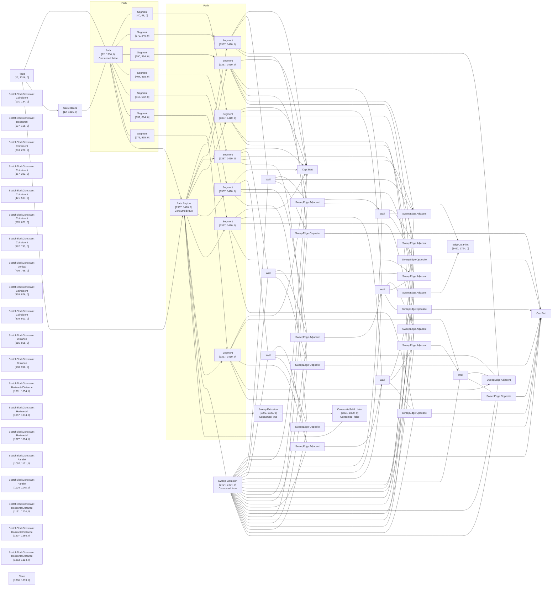

```mermaid
flowchart LR
  subgraph path10 [Path]
    10["Path<br>[12, 1316, 0]<br>Consumed: false"]
      %% [ProgramBodyItem { index: 0 }, VariableDeclarationDeclaration, VariableDeclarationInit]
    13["Segment<br>[40, 98, 0]"]
      %% [ProgramBodyItem { index: 0 }, VariableDeclarationDeclaration, VariableDeclarationInit, SketchBlockBody, SketchBlockBodyItem { index: 0 }, VariableDeclarationDeclaration, VariableDeclarationInit]
    16["Segment<br>[179, 240, 0]"]
      %% [ProgramBodyItem { index: 0 }, VariableDeclarationDeclaration, VariableDeclarationInit, SketchBlockBody, SketchBlockBodyItem { index: 3 }, VariableDeclarationDeclaration, VariableDeclarationInit]
    18["Segment<br>[290, 354, 0]"]
      %% [ProgramBodyItem { index: 0 }, VariableDeclarationDeclaration, VariableDeclarationInit, SketchBlockBody, SketchBlockBodyItem { index: 5 }, VariableDeclarationDeclaration, VariableDeclarationInit]
    20["Segment<br>[404, 468, 0]"]
      %% [ProgramBodyItem { index: 0 }, VariableDeclarationDeclaration, VariableDeclarationInit, SketchBlockBody, SketchBlockBodyItem { index: 7 }, VariableDeclarationDeclaration, VariableDeclarationInit]
    22["Segment<br>[518, 582, 0]"]
      %% [ProgramBodyItem { index: 0 }, VariableDeclarationDeclaration, VariableDeclarationInit, SketchBlockBody, SketchBlockBodyItem { index: 9 }, VariableDeclarationDeclaration, VariableDeclarationInit]
    24["Segment<br>[632, 694, 0]"]
      %% [ProgramBodyItem { index: 0 }, VariableDeclarationDeclaration, VariableDeclarationInit, SketchBlockBody, SketchBlockBodyItem { index: 11 }, VariableDeclarationDeclaration, VariableDeclarationInit]
    27["Segment<br>[776, 835, 0]"]
      %% [ProgramBodyItem { index: 0 }, VariableDeclarationDeclaration, VariableDeclarationInit, SketchBlockBody, SketchBlockBodyItem { index: 14 }, VariableDeclarationDeclaration, VariableDeclarationInit]
  end
  subgraph path40 [Path]
    40["Path Region<br>[1357, 1410, 0]<br>Consumed: true"]
      %% [ProgramBodyItem { index: 2 }, VariableDeclarationDeclaration, VariableDeclarationInit]
    41["Segment<br>[1357, 1410, 0]"]
      %% [ProgramBodyItem { index: 2 }, VariableDeclarationDeclaration, VariableDeclarationInit]
    42["Segment<br>[1357, 1410, 0]"]
      %% [ProgramBodyItem { index: 2 }, VariableDeclarationDeclaration, VariableDeclarationInit]
    43["Segment<br>[1357, 1410, 0]"]
      %% [ProgramBodyItem { index: 2 }, VariableDeclarationDeclaration, VariableDeclarationInit]
    44["Segment<br>[1357, 1410, 0]"]
      %% [ProgramBodyItem { index: 2 }, VariableDeclarationDeclaration, VariableDeclarationInit]
    45["Segment<br>[1357, 1410, 0]"]
      %% [ProgramBodyItem { index: 2 }, VariableDeclarationDeclaration, VariableDeclarationInit]
    46["Segment<br>[1357, 1410, 0]"]
      %% [ProgramBodyItem { index: 2 }, VariableDeclarationDeclaration, VariableDeclarationInit]
    47["Segment<br>[1357, 1410, 0]"]
      %% [ProgramBodyItem { index: 2 }, VariableDeclarationDeclaration, VariableDeclarationInit]
  end
  1["Cap End"]
    %% face_code_ref=Missing NodePath
  2["Cap Start"]
    %% face_code_ref=Missing NodePath
  3[Wall]
    %% face_code_ref=Missing NodePath
  4[Wall]
    %% face_code_ref=Missing NodePath
  5[Wall]
    %% face_code_ref=Missing NodePath
  6[Wall]
    %% face_code_ref=Missing NodePath
  7[Wall]
    %% face_code_ref=Missing NodePath
  8[Wall]
    %% face_code_ref=Missing NodePath
  9[Wall]
    %% face_code_ref=Missing NodePath
  11["Plane<br>[12, 1316, 0]"]
    %% [ProgramBodyItem { index: 0 }, VariableDeclarationDeclaration, VariableDeclarationInit]
  12["SketchBlock<br>[12, 1316, 0]"]
    %% [ProgramBodyItem { index: 0 }, VariableDeclarationDeclaration, VariableDeclarationInit]
  14["SketchBlockConstraint Coincident<br>[101, 134, 0]"]
    %% [ProgramBodyItem { index: 0 }, VariableDeclarationDeclaration, VariableDeclarationInit, SketchBlockBody, SketchBlockBodyItem { index: 1 }, ExpressionStatementExpr]
  15["SketchBlockConstraint Horizontal<br>[137, 168, 0]"]
    %% [ProgramBodyItem { index: 0 }, VariableDeclarationDeclaration, VariableDeclarationInit, SketchBlockBody, SketchBlockBodyItem { index: 2 }, ExpressionStatementExpr]
  17["SketchBlockConstraint Coincident<br>[243, 279, 0]"]
    %% [ProgramBodyItem { index: 0 }, VariableDeclarationDeclaration, VariableDeclarationInit, SketchBlockBody, SketchBlockBodyItem { index: 4 }, ExpressionStatementExpr]
  19["SketchBlockConstraint Coincident<br>[357, 393, 0]"]
    %% [ProgramBodyItem { index: 0 }, VariableDeclarationDeclaration, VariableDeclarationInit, SketchBlockBody, SketchBlockBodyItem { index: 6 }, ExpressionStatementExpr]
  21["SketchBlockConstraint Coincident<br>[471, 507, 0]"]
    %% [ProgramBodyItem { index: 0 }, VariableDeclarationDeclaration, VariableDeclarationInit, SketchBlockBody, SketchBlockBodyItem { index: 8 }, ExpressionStatementExpr]
  23["SketchBlockConstraint Coincident<br>[585, 621, 0]"]
    %% [ProgramBodyItem { index: 0 }, VariableDeclarationDeclaration, VariableDeclarationInit, SketchBlockBody, SketchBlockBodyItem { index: 10 }, ExpressionStatementExpr]
  25["SketchBlockConstraint Coincident<br>[697, 733, 0]"]
    %% [ProgramBodyItem { index: 0 }, VariableDeclarationDeclaration, VariableDeclarationInit, SketchBlockBody, SketchBlockBodyItem { index: 12 }, ExpressionStatementExpr]
  26["SketchBlockConstraint Vertical<br>[736, 765, 0]"]
    %% [ProgramBodyItem { index: 0 }, VariableDeclarationDeclaration, VariableDeclarationInit, SketchBlockBody, SketchBlockBodyItem { index: 13 }, ExpressionStatementExpr]
  28["SketchBlockConstraint Coincident<br>[838, 876, 0]"]
    %% [ProgramBodyItem { index: 0 }, VariableDeclarationDeclaration, VariableDeclarationInit, SketchBlockBody, SketchBlockBodyItem { index: 15 }, ExpressionStatementExpr]
  29["SketchBlockConstraint Coincident<br>[879, 913, 0]"]
    %% [ProgramBodyItem { index: 0 }, VariableDeclarationDeclaration, VariableDeclarationInit, SketchBlockBody, SketchBlockBodyItem { index: 16 }, ExpressionStatementExpr]
  30["SketchBlockConstraint Distance<br>[916, 955, 0]"]
    %% [ProgramBodyItem { index: 0 }, VariableDeclarationDeclaration, VariableDeclarationInit, SketchBlockBody, SketchBlockBodyItem { index: 17 }, ExpressionStatementExpr]
  31["SketchBlockConstraint Distance<br>[958, 998, 0]"]
    %% [ProgramBodyItem { index: 0 }, VariableDeclarationDeclaration, VariableDeclarationInit, SketchBlockBody, SketchBlockBodyItem { index: 18 }, ExpressionStatementExpr]
  32["SketchBlockConstraint HorizontalDistance<br>[1001, 1054, 0]"]
    %% [ProgramBodyItem { index: 0 }, VariableDeclarationDeclaration, VariableDeclarationInit, SketchBlockBody, SketchBlockBodyItem { index: 19 }, ExpressionStatementExpr]
  33["SketchBlockConstraint Horizontal<br>[1057, 1074, 0]"]
    %% [ProgramBodyItem { index: 0 }, VariableDeclarationDeclaration, VariableDeclarationInit, SketchBlockBody, SketchBlockBodyItem { index: 20 }, ExpressionStatementExpr]
  34["SketchBlockConstraint Horizontal<br>[1077, 1094, 0]"]
    %% [ProgramBodyItem { index: 0 }, VariableDeclarationDeclaration, VariableDeclarationInit, SketchBlockBody, SketchBlockBodyItem { index: 21 }, ExpressionStatementExpr]
  35["SketchBlockConstraint Parallel<br>[1097, 1121, 0]"]
    %% [ProgramBodyItem { index: 0 }, VariableDeclarationDeclaration, VariableDeclarationInit, SketchBlockBody, SketchBlockBodyItem { index: 22 }, ExpressionStatementExpr]
  36["SketchBlockConstraint Parallel<br>[1124, 1148, 0]"]
    %% [ProgramBodyItem { index: 0 }, VariableDeclarationDeclaration, VariableDeclarationInit, SketchBlockBody, SketchBlockBodyItem { index: 23 }, ExpressionStatementExpr]
  37["SketchBlockConstraint HorizontalDistance<br>[1151, 1204, 0]"]
    %% [ProgramBodyItem { index: 0 }, VariableDeclarationDeclaration, VariableDeclarationInit, SketchBlockBody, SketchBlockBodyItem { index: 24 }, ExpressionStatementExpr]
  38["SketchBlockConstraint HorizontalDistance<br>[1207, 1260, 0]"]
    %% [ProgramBodyItem { index: 0 }, VariableDeclarationDeclaration, VariableDeclarationInit, SketchBlockBody, SketchBlockBodyItem { index: 25 }, ExpressionStatementExpr]
  39["SketchBlockConstraint HorizontalDistance<br>[1263, 1314, 0]"]
    %% [ProgramBodyItem { index: 0 }, VariableDeclarationDeclaration, VariableDeclarationInit, SketchBlockBody, SketchBlockBodyItem { index: 26 }, ExpressionStatementExpr]
  48["Sweep Extrusion<br>[1424, 1454, 0]<br>Consumed: true"]
    %% [ProgramBodyItem { index: 3 }, VariableDeclarationDeclaration, VariableDeclarationInit]
  49["EdgeCut Fillet<br>[1467, 1794, 0]"]
    %% [ProgramBodyItem { index: 4 }, VariableDeclarationDeclaration, VariableDeclarationInit]
  50["Plane<br>[1806, 1839, 0]"]
    %% [ProgramBodyItem { index: 5 }, VariableDeclarationDeclaration, VariableDeclarationInit]
  51["Sweep Extrusion<br>[1806, 1839, 0]<br>Consumed: true"]
    %% [ProgramBodyItem { index: 5 }, VariableDeclarationDeclaration, VariableDeclarationInit]
  52["CompositeSolid Union<br>[1851, 1880, 0]<br>Consumed: false"]
    %% [ProgramBodyItem { index: 6 }, VariableDeclarationDeclaration, VariableDeclarationInit]
  53["SweepEdge Adjacent"]
  54["SweepEdge Adjacent"]
  55["SweepEdge Adjacent"]
  56["SweepEdge Adjacent"]
  57["SweepEdge Adjacent"]
  58["SweepEdge Adjacent"]
  59["SweepEdge Adjacent"]
  60["SweepEdge Adjacent"]
  61["SweepEdge Adjacent"]
  62["SweepEdge Adjacent"]
  63["SweepEdge Opposite"]
  64["SweepEdge Opposite"]
  65["SweepEdge Opposite"]
  66["SweepEdge Opposite"]
  67["SweepEdge Opposite"]
  68["SweepEdge Opposite"]
  69["SweepEdge Opposite"]
  48 --- 1
  63 <--x 1
  64 <--x 1
  65 <--x 1
  66 <--x 1
  67 <--x 1
  68 <--x 1
  69 <--x 1
  41 <--x 2
  42 <--x 2
  43 <--x 2
  44 <--x 2
  45 <--x 2
  46 <--x 2
  47 <--x 2
  48 --- 2
  41 --- 3
  48 --- 3
  3 --- 56
  3 --- 57
  3 --- 63
  42 --- 4
  48 --- 4
  4 --- 54
  56 <--x 4
  4 --- 57
  4 --- 64
  43 --- 5
  48 --- 5
  5 --- 58
  5 --- 59
  5 --- 65
  44 --- 6
  48 --- 6
  6 --- 55
  58 <--x 6
  6 --- 59
  6 --- 66
  45 --- 7
  48 --- 7
  7 --- 60
  7 --- 61
  7 --- 67
  46 --- 8
  48 --- 8
  8 --- 53
  60 <--x 8
  8 --- 62
  8 --- 68
  47 --- 9
  48 --- 9
  9 --- 61
  62 <--x 9
  9 --- 69
  11 --- 10
  12 --- 10
  10 --- 13
  10 --- 16
  10 --- 18
  10 --- 20
  10 --- 22
  10 --- 24
  10 --- 27
  10 <--x 40
  11 <--x 12
  11 <--x 40
  13 <--x 44
  16 <--x 41
  18 <--x 42
  20 <--x 43
  22 <--x 45
  24 <--x 46
  27 <--x 47
  40 <--x 41
  40 <--x 42
  40 <--x 43
  40 <--x 44
  40 <--x 45
  40 <--x 46
  40 <--x 47
  40 ---- 48
  40 <---x 51
  40 --- 52
  41 --- 61
  41 --- 63
  42 --- 56
  42 --- 57
  42 --- 64
  43 --- 54
  43 x--> 57
  43 --- 65
  44 --- 53
  44 --- 62
  44 --- 66
  45 --- 58
  45 --- 59
  45 --- 67
  46 --- 55
  46 x--> 59
  46 --- 68
  47 --- 60
  47 x--> 61
  47 --- 69
  48 --- 53
  48 --- 54
  48 --- 55
  48 --- 56
  48 --- 57
  48 --- 58
  48 --- 59
  48 --- 60
  48 --- 61
  48 --- 62
  48 --- 63
  48 --- 64
  48 --- 65
  48 --- 66
  48 --- 67
  48 --- 68
  48 --- 69
  53 <--x 49
  56 x--> 49
  51 <--x 52
```
