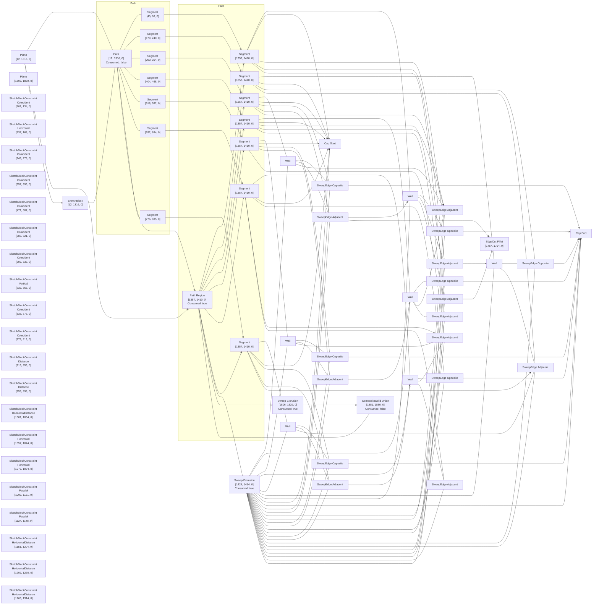

```mermaid
flowchart LR
  subgraph path2 [Path]
    2["Path<br>[12, 1316, 0]<br>Consumed: false"]
      %% [ProgramBodyItem { index: 0 }, VariableDeclarationDeclaration, VariableDeclarationInit]
    3["Segment<br>[40, 98, 0]"]
      %% [ProgramBodyItem { index: 0 }, VariableDeclarationDeclaration, VariableDeclarationInit, SketchBlockBody, SketchBlockBodyItem { index: 0 }, VariableDeclarationDeclaration, VariableDeclarationInit]
    4["Segment<br>[179, 240, 0]"]
      %% [ProgramBodyItem { index: 0 }, VariableDeclarationDeclaration, VariableDeclarationInit, SketchBlockBody, SketchBlockBodyItem { index: 3 }, VariableDeclarationDeclaration, VariableDeclarationInit]
    5["Segment<br>[290, 354, 0]"]
      %% [ProgramBodyItem { index: 0 }, VariableDeclarationDeclaration, VariableDeclarationInit, SketchBlockBody, SketchBlockBodyItem { index: 5 }, VariableDeclarationDeclaration, VariableDeclarationInit]
    6["Segment<br>[404, 468, 0]"]
      %% [ProgramBodyItem { index: 0 }, VariableDeclarationDeclaration, VariableDeclarationInit, SketchBlockBody, SketchBlockBodyItem { index: 7 }, VariableDeclarationDeclaration, VariableDeclarationInit]
    7["Segment<br>[518, 582, 0]"]
      %% [ProgramBodyItem { index: 0 }, VariableDeclarationDeclaration, VariableDeclarationInit, SketchBlockBody, SketchBlockBodyItem { index: 9 }, VariableDeclarationDeclaration, VariableDeclarationInit]
    8["Segment<br>[632, 694, 0]"]
      %% [ProgramBodyItem { index: 0 }, VariableDeclarationDeclaration, VariableDeclarationInit, SketchBlockBody, SketchBlockBodyItem { index: 11 }, VariableDeclarationDeclaration, VariableDeclarationInit]
    9["Segment<br>[776, 835, 0]"]
      %% [ProgramBodyItem { index: 0 }, VariableDeclarationDeclaration, VariableDeclarationInit, SketchBlockBody, SketchBlockBodyItem { index: 14 }, VariableDeclarationDeclaration, VariableDeclarationInit]
  end
  subgraph path10 [Path]
    10["Path Region<br>[1357, 1410, 0]<br>Consumed: true"]
      %% [ProgramBodyItem { index: 2 }, VariableDeclarationDeclaration, VariableDeclarationInit]
    11["Segment<br>[1357, 1410, 0]"]
      %% [ProgramBodyItem { index: 2 }, VariableDeclarationDeclaration, VariableDeclarationInit]
    12["Segment<br>[1357, 1410, 0]"]
      %% [ProgramBodyItem { index: 2 }, VariableDeclarationDeclaration, VariableDeclarationInit]
    13["Segment<br>[1357, 1410, 0]"]
      %% [ProgramBodyItem { index: 2 }, VariableDeclarationDeclaration, VariableDeclarationInit]
    14["Segment<br>[1357, 1410, 0]"]
      %% [ProgramBodyItem { index: 2 }, VariableDeclarationDeclaration, VariableDeclarationInit]
    15["Segment<br>[1357, 1410, 0]"]
      %% [ProgramBodyItem { index: 2 }, VariableDeclarationDeclaration, VariableDeclarationInit]
    16["Segment<br>[1357, 1410, 0]"]
      %% [ProgramBodyItem { index: 2 }, VariableDeclarationDeclaration, VariableDeclarationInit]
    17["Segment<br>[1357, 1410, 0]"]
      %% [ProgramBodyItem { index: 2 }, VariableDeclarationDeclaration, VariableDeclarationInit]
  end
  1["Plane<br>[12, 1316, 0]"]
    %% [ProgramBodyItem { index: 0 }, VariableDeclarationDeclaration, VariableDeclarationInit]
  18["Sweep Extrusion<br>[1424, 1454, 0]<br>Consumed: true"]
    %% [ProgramBodyItem { index: 3 }, VariableDeclarationDeclaration, VariableDeclarationInit]
  19[Wall]
    %% face_code_ref=Missing NodePath
  20[Wall]
    %% face_code_ref=Missing NodePath
  21[Wall]
    %% face_code_ref=Missing NodePath
  22[Wall]
    %% face_code_ref=Missing NodePath
  23[Wall]
    %% face_code_ref=Missing NodePath
  24[Wall]
    %% face_code_ref=Missing NodePath
  25[Wall]
    %% face_code_ref=Missing NodePath
  26["Cap Start"]
    %% face_code_ref=Missing NodePath
  27["Cap End"]
    %% face_code_ref=Missing NodePath
  28["SweepEdge Opposite"]
  29["SweepEdge Adjacent"]
  30["SweepEdge Opposite"]
  31["SweepEdge Adjacent"]
  32["SweepEdge Opposite"]
  33["SweepEdge Adjacent"]
  34["SweepEdge Opposite"]
  35["SweepEdge Adjacent"]
  36["SweepEdge Opposite"]
  37["SweepEdge Adjacent"]
  38["SweepEdge Opposite"]
  39["SweepEdge Adjacent"]
  40["SweepEdge Opposite"]
  41["SweepEdge Adjacent"]
  42["EdgeCut Fillet<br>[1467, 1794, 0]"]
    %% [ProgramBodyItem { index: 4 }, VariableDeclarationDeclaration, VariableDeclarationInit]
  43["Plane<br>[1806, 1839, 0]"]
    %% [ProgramBodyItem { index: 5 }, VariableDeclarationDeclaration, VariableDeclarationInit]
  44["Sweep Extrusion<br>[1806, 1839, 0]<br>Consumed: true"]
    %% [ProgramBodyItem { index: 5 }, VariableDeclarationDeclaration, VariableDeclarationInit]
  45["SweepEdge Adjacent"]
  46["SweepEdge Adjacent"]
  47["SweepEdge Adjacent"]
  48["CompositeSolid Union<br>[1851, 1880, 0]<br>Consumed: false"]
    %% [ProgramBodyItem { index: 6 }, VariableDeclarationDeclaration, VariableDeclarationInit]
  49["SketchBlock<br>[12, 1316, 0]"]
    %% [ProgramBodyItem { index: 0 }, VariableDeclarationDeclaration, VariableDeclarationInit]
  50["SketchBlockConstraint Coincident<br>[101, 134, 0]"]
    %% [ProgramBodyItem { index: 0 }, VariableDeclarationDeclaration, VariableDeclarationInit, SketchBlockBody, SketchBlockBodyItem { index: 1 }, ExpressionStatementExpr]
  51["SketchBlockConstraint Horizontal<br>[137, 168, 0]"]
    %% [ProgramBodyItem { index: 0 }, VariableDeclarationDeclaration, VariableDeclarationInit, SketchBlockBody, SketchBlockBodyItem { index: 2 }, ExpressionStatementExpr]
  52["SketchBlockConstraint Coincident<br>[243, 279, 0]"]
    %% [ProgramBodyItem { index: 0 }, VariableDeclarationDeclaration, VariableDeclarationInit, SketchBlockBody, SketchBlockBodyItem { index: 4 }, ExpressionStatementExpr]
  53["SketchBlockConstraint Coincident<br>[357, 393, 0]"]
    %% [ProgramBodyItem { index: 0 }, VariableDeclarationDeclaration, VariableDeclarationInit, SketchBlockBody, SketchBlockBodyItem { index: 6 }, ExpressionStatementExpr]
  54["SketchBlockConstraint Coincident<br>[471, 507, 0]"]
    %% [ProgramBodyItem { index: 0 }, VariableDeclarationDeclaration, VariableDeclarationInit, SketchBlockBody, SketchBlockBodyItem { index: 8 }, ExpressionStatementExpr]
  55["SketchBlockConstraint Coincident<br>[585, 621, 0]"]
    %% [ProgramBodyItem { index: 0 }, VariableDeclarationDeclaration, VariableDeclarationInit, SketchBlockBody, SketchBlockBodyItem { index: 10 }, ExpressionStatementExpr]
  56["SketchBlockConstraint Coincident<br>[697, 733, 0]"]
    %% [ProgramBodyItem { index: 0 }, VariableDeclarationDeclaration, VariableDeclarationInit, SketchBlockBody, SketchBlockBodyItem { index: 12 }, ExpressionStatementExpr]
  57["SketchBlockConstraint Vertical<br>[736, 765, 0]"]
    %% [ProgramBodyItem { index: 0 }, VariableDeclarationDeclaration, VariableDeclarationInit, SketchBlockBody, SketchBlockBodyItem { index: 13 }, ExpressionStatementExpr]
  58["SketchBlockConstraint Coincident<br>[838, 876, 0]"]
    %% [ProgramBodyItem { index: 0 }, VariableDeclarationDeclaration, VariableDeclarationInit, SketchBlockBody, SketchBlockBodyItem { index: 15 }, ExpressionStatementExpr]
  59["SketchBlockConstraint Coincident<br>[879, 913, 0]"]
    %% [ProgramBodyItem { index: 0 }, VariableDeclarationDeclaration, VariableDeclarationInit, SketchBlockBody, SketchBlockBodyItem { index: 16 }, ExpressionStatementExpr]
  60["SketchBlockConstraint Distance<br>[916, 955, 0]"]
    %% [ProgramBodyItem { index: 0 }, VariableDeclarationDeclaration, VariableDeclarationInit, SketchBlockBody, SketchBlockBodyItem { index: 17 }, ExpressionStatementExpr]
  61["SketchBlockConstraint Distance<br>[958, 998, 0]"]
    %% [ProgramBodyItem { index: 0 }, VariableDeclarationDeclaration, VariableDeclarationInit, SketchBlockBody, SketchBlockBodyItem { index: 18 }, ExpressionStatementExpr]
  62["SketchBlockConstraint HorizontalDistance<br>[1001, 1054, 0]"]
    %% [ProgramBodyItem { index: 0 }, VariableDeclarationDeclaration, VariableDeclarationInit, SketchBlockBody, SketchBlockBodyItem { index: 19 }, ExpressionStatementExpr]
  63["SketchBlockConstraint Horizontal<br>[1057, 1074, 0]"]
    %% [ProgramBodyItem { index: 0 }, VariableDeclarationDeclaration, VariableDeclarationInit, SketchBlockBody, SketchBlockBodyItem { index: 20 }, ExpressionStatementExpr]
  64["SketchBlockConstraint Horizontal<br>[1077, 1094, 0]"]
    %% [ProgramBodyItem { index: 0 }, VariableDeclarationDeclaration, VariableDeclarationInit, SketchBlockBody, SketchBlockBodyItem { index: 21 }, ExpressionStatementExpr]
  65["SketchBlockConstraint Parallel<br>[1097, 1121, 0]"]
    %% [ProgramBodyItem { index: 0 }, VariableDeclarationDeclaration, VariableDeclarationInit, SketchBlockBody, SketchBlockBodyItem { index: 22 }, ExpressionStatementExpr]
  66["SketchBlockConstraint Parallel<br>[1124, 1148, 0]"]
    %% [ProgramBodyItem { index: 0 }, VariableDeclarationDeclaration, VariableDeclarationInit, SketchBlockBody, SketchBlockBodyItem { index: 23 }, ExpressionStatementExpr]
  67["SketchBlockConstraint HorizontalDistance<br>[1151, 1204, 0]"]
    %% [ProgramBodyItem { index: 0 }, VariableDeclarationDeclaration, VariableDeclarationInit, SketchBlockBody, SketchBlockBodyItem { index: 24 }, ExpressionStatementExpr]
  68["SketchBlockConstraint HorizontalDistance<br>[1207, 1260, 0]"]
    %% [ProgramBodyItem { index: 0 }, VariableDeclarationDeclaration, VariableDeclarationInit, SketchBlockBody, SketchBlockBodyItem { index: 25 }, ExpressionStatementExpr]
  69["SketchBlockConstraint HorizontalDistance<br>[1263, 1314, 0]"]
    %% [ProgramBodyItem { index: 0 }, VariableDeclarationDeclaration, VariableDeclarationInit, SketchBlockBody, SketchBlockBodyItem { index: 26 }, ExpressionStatementExpr]
  1 --- 2
  1 <--x 10
  1 <--x 49
  2 --- 3
  2 --- 4
  2 --- 5
  2 --- 6
  2 --- 7
  2 --- 8
  2 --- 9
  2 <--x 10
  49 --- 2
  3 <--x 11
  4 <--x 12
  5 <--x 13
  6 <--x 14
  7 <--x 15
  8 <--x 16
  9 <--x 17
  10 <--x 11
  10 <--x 12
  10 <--x 13
  10 <--x 14
  10 <--x 15
  10 <--x 16
  10 <--x 17
  10 ---- 18
  10 <---x 44
  10 --- 48
  11 --- 25
  11 x--> 26
  11 --- 40
  11 --- 41
  11 --- 47
  12 --- 24
  12 x--> 26
  12 --- 38
  12 --- 39
  13 --- 19
  13 x--> 26
  13 --- 28
  13 --- 29
  13 --- 31
  14 --- 20
  14 x--> 26
  14 --- 30
  14 x--> 31
  14 --- 45
  15 --- 21
  15 x--> 26
  15 --- 32
  15 --- 33
  15 --- 35
  16 --- 22
  16 x--> 26
  16 --- 34
  16 x--> 35
  16 --- 46
  17 --- 23
  17 x--> 26
  17 --- 36
  17 --- 37
  17 x--> 39
  18 --- 19
  18 --- 20
  18 --- 21
  18 --- 22
  18 --- 23
  18 --- 24
  18 --- 25
  18 --- 26
  18 --- 27
  18 --- 28
  18 --- 29
  18 --- 30
  18 --- 31
  18 --- 32
  18 --- 33
  18 --- 34
  18 --- 35
  18 --- 36
  18 --- 37
  18 --- 38
  18 --- 39
  18 --- 40
  18 --- 41
  18 --- 45
  18 --- 46
  18 --- 47
  19 --- 28
  19 --- 29
  19 --- 31
  20 --- 30
  20 --- 31
  33 <--x 20
  20 --- 45
  21 --- 32
  21 --- 33
  21 --- 35
  22 --- 34
  22 --- 35
  37 <--x 22
  22 --- 46
  23 --- 36
  23 --- 37
  23 --- 39
  24 --- 38
  24 --- 39
  41 <--x 24
  29 <--x 25
  25 --- 40
  25 --- 41
  25 --- 47
  28 <--x 27
  30 <--x 27
  32 <--x 27
  34 <--x 27
  36 <--x 27
  38 <--x 27
  40 <--x 27
  29 <--x 42
  47 <--x 42
  44 <--x 48
```
