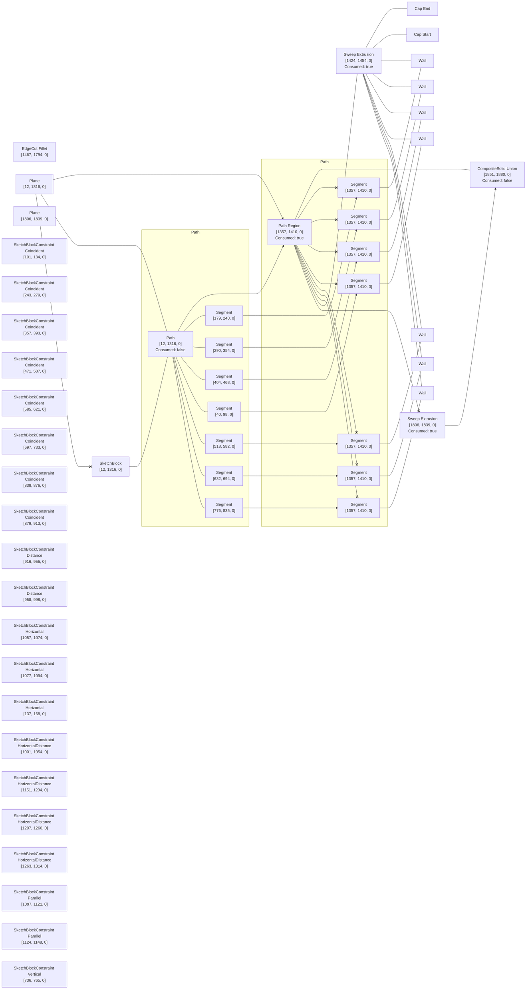

```mermaid
flowchart LR
  subgraph path5 [Path]
    5["Path Region<br>[1357, 1410, 0]<br>Consumed: true"]
      %% [ProgramBodyItem { index: 2 }, VariableDeclarationDeclaration, VariableDeclarationInit]
    9["Segment<br>[1357, 1410, 0]"]
      %% [ProgramBodyItem { index: 2 }, VariableDeclarationDeclaration, VariableDeclarationInit]
    10["Segment<br>[1357, 1410, 0]"]
      %% [ProgramBodyItem { index: 2 }, VariableDeclarationDeclaration, VariableDeclarationInit]
    11["Segment<br>[1357, 1410, 0]"]
      %% [ProgramBodyItem { index: 2 }, VariableDeclarationDeclaration, VariableDeclarationInit]
    12["Segment<br>[1357, 1410, 0]"]
      %% [ProgramBodyItem { index: 2 }, VariableDeclarationDeclaration, VariableDeclarationInit]
    13["Segment<br>[1357, 1410, 0]"]
      %% [ProgramBodyItem { index: 2 }, VariableDeclarationDeclaration, VariableDeclarationInit]
    14["Segment<br>[1357, 1410, 0]"]
      %% [ProgramBodyItem { index: 2 }, VariableDeclarationDeclaration, VariableDeclarationInit]
    15["Segment<br>[1357, 1410, 0]"]
      %% [ProgramBodyItem { index: 2 }, VariableDeclarationDeclaration, VariableDeclarationInit]
  end
  subgraph path6 [Path]
    6["Path<br>[12, 1316, 0]<br>Consumed: false"]
      %% [ProgramBodyItem { index: 0 }, VariableDeclarationDeclaration, VariableDeclarationInit]
    16["Segment<br>[179, 240, 0]"]
      %% [ProgramBodyItem { index: 0 }, VariableDeclarationDeclaration, VariableDeclarationInit, SketchBlockBody, SketchBlockBodyItem { index: 3 }, VariableDeclarationDeclaration, VariableDeclarationInit]
    17["Segment<br>[290, 354, 0]"]
      %% [ProgramBodyItem { index: 0 }, VariableDeclarationDeclaration, VariableDeclarationInit, SketchBlockBody, SketchBlockBodyItem { index: 5 }, VariableDeclarationDeclaration, VariableDeclarationInit]
    18["Segment<br>[404, 468, 0]"]
      %% [ProgramBodyItem { index: 0 }, VariableDeclarationDeclaration, VariableDeclarationInit, SketchBlockBody, SketchBlockBodyItem { index: 7 }, VariableDeclarationDeclaration, VariableDeclarationInit]
    19["Segment<br>[40, 98, 0]"]
      %% [ProgramBodyItem { index: 0 }, VariableDeclarationDeclaration, VariableDeclarationInit, SketchBlockBody, SketchBlockBodyItem { index: 0 }, VariableDeclarationDeclaration, VariableDeclarationInit]
    20["Segment<br>[518, 582, 0]"]
      %% [ProgramBodyItem { index: 0 }, VariableDeclarationDeclaration, VariableDeclarationInit, SketchBlockBody, SketchBlockBodyItem { index: 9 }, VariableDeclarationDeclaration, VariableDeclarationInit]
    21["Segment<br>[632, 694, 0]"]
      %% [ProgramBodyItem { index: 0 }, VariableDeclarationDeclaration, VariableDeclarationInit, SketchBlockBody, SketchBlockBodyItem { index: 11 }, VariableDeclarationDeclaration, VariableDeclarationInit]
    22["Segment<br>[776, 835, 0]"]
      %% [ProgramBodyItem { index: 0 }, VariableDeclarationDeclaration, VariableDeclarationInit, SketchBlockBody, SketchBlockBodyItem { index: 14 }, VariableDeclarationDeclaration, VariableDeclarationInit]
  end
  1["Cap End"]
    %% face_code_ref=Missing NodePath
  2["Cap Start"]
    %% face_code_ref=Missing NodePath
  3["CompositeSolid Union<br>[1851, 1880, 0]<br>Consumed: false"]
    %% [ProgramBodyItem { index: 6 }, VariableDeclarationDeclaration, VariableDeclarationInit]
  4["EdgeCut Fillet<br>[1467, 1794, 0]"]
    %% [ProgramBodyItem { index: 4 }, VariableDeclarationDeclaration, VariableDeclarationInit]
  7["Plane<br>[12, 1316, 0]"]
    %% [ProgramBodyItem { index: 0 }, VariableDeclarationDeclaration, VariableDeclarationInit]
  8["Plane<br>[1806, 1839, 0]"]
    %% [ProgramBodyItem { index: 5 }, VariableDeclarationDeclaration, VariableDeclarationInit]
  23["SketchBlock<br>[12, 1316, 0]"]
    %% [ProgramBodyItem { index: 0 }, VariableDeclarationDeclaration, VariableDeclarationInit]
  24["SketchBlockConstraint Coincident<br>[101, 134, 0]"]
    %% [ProgramBodyItem { index: 0 }, VariableDeclarationDeclaration, VariableDeclarationInit, SketchBlockBody, SketchBlockBodyItem { index: 1 }, ExpressionStatementExpr]
  25["SketchBlockConstraint Coincident<br>[243, 279, 0]"]
    %% [ProgramBodyItem { index: 0 }, VariableDeclarationDeclaration, VariableDeclarationInit, SketchBlockBody, SketchBlockBodyItem { index: 4 }, ExpressionStatementExpr]
  26["SketchBlockConstraint Coincident<br>[357, 393, 0]"]
    %% [ProgramBodyItem { index: 0 }, VariableDeclarationDeclaration, VariableDeclarationInit, SketchBlockBody, SketchBlockBodyItem { index: 6 }, ExpressionStatementExpr]
  27["SketchBlockConstraint Coincident<br>[471, 507, 0]"]
    %% [ProgramBodyItem { index: 0 }, VariableDeclarationDeclaration, VariableDeclarationInit, SketchBlockBody, SketchBlockBodyItem { index: 8 }, ExpressionStatementExpr]
  28["SketchBlockConstraint Coincident<br>[585, 621, 0]"]
    %% [ProgramBodyItem { index: 0 }, VariableDeclarationDeclaration, VariableDeclarationInit, SketchBlockBody, SketchBlockBodyItem { index: 10 }, ExpressionStatementExpr]
  29["SketchBlockConstraint Coincident<br>[697, 733, 0]"]
    %% [ProgramBodyItem { index: 0 }, VariableDeclarationDeclaration, VariableDeclarationInit, SketchBlockBody, SketchBlockBodyItem { index: 12 }, ExpressionStatementExpr]
  30["SketchBlockConstraint Coincident<br>[838, 876, 0]"]
    %% [ProgramBodyItem { index: 0 }, VariableDeclarationDeclaration, VariableDeclarationInit, SketchBlockBody, SketchBlockBodyItem { index: 15 }, ExpressionStatementExpr]
  31["SketchBlockConstraint Coincident<br>[879, 913, 0]"]
    %% [ProgramBodyItem { index: 0 }, VariableDeclarationDeclaration, VariableDeclarationInit, SketchBlockBody, SketchBlockBodyItem { index: 16 }, ExpressionStatementExpr]
  32["SketchBlockConstraint Distance<br>[916, 955, 0]"]
    %% [ProgramBodyItem { index: 0 }, VariableDeclarationDeclaration, VariableDeclarationInit, SketchBlockBody, SketchBlockBodyItem { index: 17 }, ExpressionStatementExpr]
  33["SketchBlockConstraint Distance<br>[958, 998, 0]"]
    %% [ProgramBodyItem { index: 0 }, VariableDeclarationDeclaration, VariableDeclarationInit, SketchBlockBody, SketchBlockBodyItem { index: 18 }, ExpressionStatementExpr]
  34["SketchBlockConstraint Horizontal<br>[1057, 1074, 0]"]
    %% [ProgramBodyItem { index: 0 }, VariableDeclarationDeclaration, VariableDeclarationInit, SketchBlockBody, SketchBlockBodyItem { index: 20 }, ExpressionStatementExpr]
  35["SketchBlockConstraint Horizontal<br>[1077, 1094, 0]"]
    %% [ProgramBodyItem { index: 0 }, VariableDeclarationDeclaration, VariableDeclarationInit, SketchBlockBody, SketchBlockBodyItem { index: 21 }, ExpressionStatementExpr]
  36["SketchBlockConstraint Horizontal<br>[137, 168, 0]"]
    %% [ProgramBodyItem { index: 0 }, VariableDeclarationDeclaration, VariableDeclarationInit, SketchBlockBody, SketchBlockBodyItem { index: 2 }, ExpressionStatementExpr]
  37["SketchBlockConstraint HorizontalDistance<br>[1001, 1054, 0]"]
    %% [ProgramBodyItem { index: 0 }, VariableDeclarationDeclaration, VariableDeclarationInit, SketchBlockBody, SketchBlockBodyItem { index: 19 }, ExpressionStatementExpr]
  38["SketchBlockConstraint HorizontalDistance<br>[1151, 1204, 0]"]
    %% [ProgramBodyItem { index: 0 }, VariableDeclarationDeclaration, VariableDeclarationInit, SketchBlockBody, SketchBlockBodyItem { index: 24 }, ExpressionStatementExpr]
  39["SketchBlockConstraint HorizontalDistance<br>[1207, 1260, 0]"]
    %% [ProgramBodyItem { index: 0 }, VariableDeclarationDeclaration, VariableDeclarationInit, SketchBlockBody, SketchBlockBodyItem { index: 25 }, ExpressionStatementExpr]
  40["SketchBlockConstraint HorizontalDistance<br>[1263, 1314, 0]"]
    %% [ProgramBodyItem { index: 0 }, VariableDeclarationDeclaration, VariableDeclarationInit, SketchBlockBody, SketchBlockBodyItem { index: 26 }, ExpressionStatementExpr]
  41["SketchBlockConstraint Parallel<br>[1097, 1121, 0]"]
    %% [ProgramBodyItem { index: 0 }, VariableDeclarationDeclaration, VariableDeclarationInit, SketchBlockBody, SketchBlockBodyItem { index: 22 }, ExpressionStatementExpr]
  42["SketchBlockConstraint Parallel<br>[1124, 1148, 0]"]
    %% [ProgramBodyItem { index: 0 }, VariableDeclarationDeclaration, VariableDeclarationInit, SketchBlockBody, SketchBlockBodyItem { index: 23 }, ExpressionStatementExpr]
  43["SketchBlockConstraint Vertical<br>[736, 765, 0]"]
    %% [ProgramBodyItem { index: 0 }, VariableDeclarationDeclaration, VariableDeclarationInit, SketchBlockBody, SketchBlockBodyItem { index: 13 }, ExpressionStatementExpr]
  44["Sweep Extrusion<br>[1424, 1454, 0]<br>Consumed: true"]
    %% [ProgramBodyItem { index: 3 }, VariableDeclarationDeclaration, VariableDeclarationInit]
  45["Sweep Extrusion<br>[1806, 1839, 0]<br>Consumed: true"]
    %% [ProgramBodyItem { index: 5 }, VariableDeclarationDeclaration, VariableDeclarationInit]
  46[Wall]
    %% face_code_ref=Missing NodePath
  47[Wall]
    %% face_code_ref=Missing NodePath
  48[Wall]
    %% face_code_ref=Missing NodePath
  49[Wall]
    %% face_code_ref=Missing NodePath
  50[Wall]
    %% face_code_ref=Missing NodePath
  51[Wall]
    %% face_code_ref=Missing NodePath
  52[Wall]
    %% face_code_ref=Missing NodePath
  44 --- 1
  44 --- 2
  5 --- 3
  45 x--> 3
  6 x--> 5
  7 x--> 5
  5 <--x 9
  5 <--x 10
  5 <--x 11
  5 <--x 12
  5 <--x 13
  5 <--x 14
  5 <--x 15
  5 ---- 44
  5 <---x 45
  7 --- 6
  6 --- 16
  6 --- 17
  6 --- 18
  6 --- 19
  6 --- 20
  6 --- 21
  6 --- 22
  23 --- 6
  7 <--x 23
  16 x--> 9
  9 --- 46
  17 x--> 10
  10 --- 47
  18 x--> 11
  11 --- 48
  19 x--> 12
  12 --- 49
  20 x--> 13
  13 --- 50
  21 x--> 14
  14 --- 51
  22 x--> 15
  15 --- 52
  44 --- 46
  44 --- 47
  44 --- 48
  44 --- 49
  44 --- 50
  44 --- 51
  44 --- 52
```
