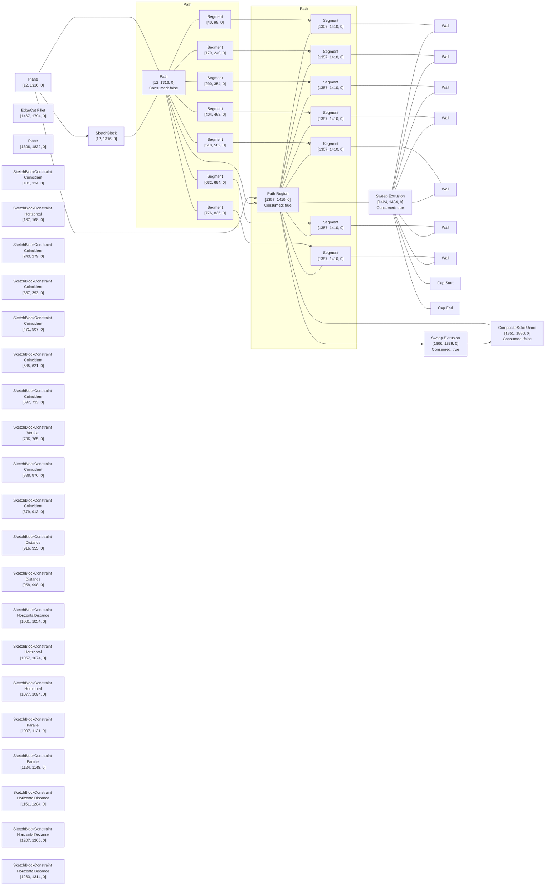

```mermaid
flowchart LR
  subgraph path2 [Path]
    2["Path<br>[12, 1316, 0]<br>Consumed: false"]
      %% [ProgramBodyItem { index: 0 }, VariableDeclarationDeclaration, VariableDeclarationInit]
    3["Segment<br>[40, 98, 0]"]
      %% [ProgramBodyItem { index: 0 }, VariableDeclarationDeclaration, VariableDeclarationInit, SketchBlockBody, SketchBlockBodyItem { index: 0 }, VariableDeclarationDeclaration, VariableDeclarationInit]
    4["Segment<br>[179, 240, 0]"]
      %% [ProgramBodyItem { index: 0 }, VariableDeclarationDeclaration, VariableDeclarationInit, SketchBlockBody, SketchBlockBodyItem { index: 3 }, VariableDeclarationDeclaration, VariableDeclarationInit]
    5["Segment<br>[290, 354, 0]"]
      %% [ProgramBodyItem { index: 0 }, VariableDeclarationDeclaration, VariableDeclarationInit, SketchBlockBody, SketchBlockBodyItem { index: 5 }, VariableDeclarationDeclaration, VariableDeclarationInit]
    6["Segment<br>[404, 468, 0]"]
      %% [ProgramBodyItem { index: 0 }, VariableDeclarationDeclaration, VariableDeclarationInit, SketchBlockBody, SketchBlockBodyItem { index: 7 }, VariableDeclarationDeclaration, VariableDeclarationInit]
    7["Segment<br>[518, 582, 0]"]
      %% [ProgramBodyItem { index: 0 }, VariableDeclarationDeclaration, VariableDeclarationInit, SketchBlockBody, SketchBlockBodyItem { index: 9 }, VariableDeclarationDeclaration, VariableDeclarationInit]
    8["Segment<br>[632, 694, 0]"]
      %% [ProgramBodyItem { index: 0 }, VariableDeclarationDeclaration, VariableDeclarationInit, SketchBlockBody, SketchBlockBodyItem { index: 11 }, VariableDeclarationDeclaration, VariableDeclarationInit]
    9["Segment<br>[776, 835, 0]"]
      %% [ProgramBodyItem { index: 0 }, VariableDeclarationDeclaration, VariableDeclarationInit, SketchBlockBody, SketchBlockBodyItem { index: 14 }, VariableDeclarationDeclaration, VariableDeclarationInit]
  end
  subgraph path10 [Path]
    10["Path Region<br>[1357, 1410, 0]<br>Consumed: true"]
      %% [ProgramBodyItem { index: 2 }, VariableDeclarationDeclaration, VariableDeclarationInit]
    11["Segment<br>[1357, 1410, 0]"]
      %% [ProgramBodyItem { index: 2 }, VariableDeclarationDeclaration, VariableDeclarationInit]
    12["Segment<br>[1357, 1410, 0]"]
      %% [ProgramBodyItem { index: 2 }, VariableDeclarationDeclaration, VariableDeclarationInit]
    13["Segment<br>[1357, 1410, 0]"]
      %% [ProgramBodyItem { index: 2 }, VariableDeclarationDeclaration, VariableDeclarationInit]
    14["Segment<br>[1357, 1410, 0]"]
      %% [ProgramBodyItem { index: 2 }, VariableDeclarationDeclaration, VariableDeclarationInit]
    15["Segment<br>[1357, 1410, 0]"]
      %% [ProgramBodyItem { index: 2 }, VariableDeclarationDeclaration, VariableDeclarationInit]
    16["Segment<br>[1357, 1410, 0]"]
      %% [ProgramBodyItem { index: 2 }, VariableDeclarationDeclaration, VariableDeclarationInit]
    17["Segment<br>[1357, 1410, 0]"]
      %% [ProgramBodyItem { index: 2 }, VariableDeclarationDeclaration, VariableDeclarationInit]
  end
  1["Plane<br>[12, 1316, 0]"]
    %% [ProgramBodyItem { index: 0 }, VariableDeclarationDeclaration, VariableDeclarationInit]
  18["Sweep Extrusion<br>[1424, 1454, 0]<br>Consumed: true"]
    %% [ProgramBodyItem { index: 3 }, VariableDeclarationDeclaration, VariableDeclarationInit]
  19[Wall]
    %% face_code_ref=Missing NodePath
  20[Wall]
    %% face_code_ref=Missing NodePath
  21[Wall]
    %% face_code_ref=Missing NodePath
  22[Wall]
    %% face_code_ref=Missing NodePath
  23[Wall]
    %% face_code_ref=Missing NodePath
  24[Wall]
    %% face_code_ref=Missing NodePath
  25[Wall]
    %% face_code_ref=Missing NodePath
  26["Cap Start"]
    %% face_code_ref=Missing NodePath
  27["Cap End"]
    %% face_code_ref=Missing NodePath
  28["EdgeCut Fillet<br>[1467, 1794, 0]"]
    %% [ProgramBodyItem { index: 4 }, VariableDeclarationDeclaration, VariableDeclarationInit]
  29["Plane<br>[1806, 1839, 0]"]
    %% [ProgramBodyItem { index: 5 }, VariableDeclarationDeclaration, VariableDeclarationInit]
  30["Sweep Extrusion<br>[1806, 1839, 0]<br>Consumed: true"]
    %% [ProgramBodyItem { index: 5 }, VariableDeclarationDeclaration, VariableDeclarationInit]
  31["CompositeSolid Union<br>[1851, 1880, 0]<br>Consumed: false"]
    %% [ProgramBodyItem { index: 6 }, VariableDeclarationDeclaration, VariableDeclarationInit]
  32["SketchBlock<br>[12, 1316, 0]"]
    %% [ProgramBodyItem { index: 0 }, VariableDeclarationDeclaration, VariableDeclarationInit]
  33["SketchBlockConstraint Coincident<br>[101, 134, 0]"]
    %% [ProgramBodyItem { index: 0 }, VariableDeclarationDeclaration, VariableDeclarationInit, SketchBlockBody, SketchBlockBodyItem { index: 1 }, ExpressionStatementExpr]
  34["SketchBlockConstraint Horizontal<br>[137, 168, 0]"]
    %% [ProgramBodyItem { index: 0 }, VariableDeclarationDeclaration, VariableDeclarationInit, SketchBlockBody, SketchBlockBodyItem { index: 2 }, ExpressionStatementExpr]
  35["SketchBlockConstraint Coincident<br>[243, 279, 0]"]
    %% [ProgramBodyItem { index: 0 }, VariableDeclarationDeclaration, VariableDeclarationInit, SketchBlockBody, SketchBlockBodyItem { index: 4 }, ExpressionStatementExpr]
  36["SketchBlockConstraint Coincident<br>[357, 393, 0]"]
    %% [ProgramBodyItem { index: 0 }, VariableDeclarationDeclaration, VariableDeclarationInit, SketchBlockBody, SketchBlockBodyItem { index: 6 }, ExpressionStatementExpr]
  37["SketchBlockConstraint Coincident<br>[471, 507, 0]"]
    %% [ProgramBodyItem { index: 0 }, VariableDeclarationDeclaration, VariableDeclarationInit, SketchBlockBody, SketchBlockBodyItem { index: 8 }, ExpressionStatementExpr]
  38["SketchBlockConstraint Coincident<br>[585, 621, 0]"]
    %% [ProgramBodyItem { index: 0 }, VariableDeclarationDeclaration, VariableDeclarationInit, SketchBlockBody, SketchBlockBodyItem { index: 10 }, ExpressionStatementExpr]
  39["SketchBlockConstraint Coincident<br>[697, 733, 0]"]
    %% [ProgramBodyItem { index: 0 }, VariableDeclarationDeclaration, VariableDeclarationInit, SketchBlockBody, SketchBlockBodyItem { index: 12 }, ExpressionStatementExpr]
  40["SketchBlockConstraint Vertical<br>[736, 765, 0]"]
    %% [ProgramBodyItem { index: 0 }, VariableDeclarationDeclaration, VariableDeclarationInit, SketchBlockBody, SketchBlockBodyItem { index: 13 }, ExpressionStatementExpr]
  41["SketchBlockConstraint Coincident<br>[838, 876, 0]"]
    %% [ProgramBodyItem { index: 0 }, VariableDeclarationDeclaration, VariableDeclarationInit, SketchBlockBody, SketchBlockBodyItem { index: 15 }, ExpressionStatementExpr]
  42["SketchBlockConstraint Coincident<br>[879, 913, 0]"]
    %% [ProgramBodyItem { index: 0 }, VariableDeclarationDeclaration, VariableDeclarationInit, SketchBlockBody, SketchBlockBodyItem { index: 16 }, ExpressionStatementExpr]
  43["SketchBlockConstraint Distance<br>[916, 955, 0]"]
    %% [ProgramBodyItem { index: 0 }, VariableDeclarationDeclaration, VariableDeclarationInit, SketchBlockBody, SketchBlockBodyItem { index: 17 }, ExpressionStatementExpr]
  44["SketchBlockConstraint Distance<br>[958, 998, 0]"]
    %% [ProgramBodyItem { index: 0 }, VariableDeclarationDeclaration, VariableDeclarationInit, SketchBlockBody, SketchBlockBodyItem { index: 18 }, ExpressionStatementExpr]
  45["SketchBlockConstraint HorizontalDistance<br>[1001, 1054, 0]"]
    %% [ProgramBodyItem { index: 0 }, VariableDeclarationDeclaration, VariableDeclarationInit, SketchBlockBody, SketchBlockBodyItem { index: 19 }, ExpressionStatementExpr]
  46["SketchBlockConstraint Horizontal<br>[1057, 1074, 0]"]
    %% [ProgramBodyItem { index: 0 }, VariableDeclarationDeclaration, VariableDeclarationInit, SketchBlockBody, SketchBlockBodyItem { index: 20 }, ExpressionStatementExpr]
  47["SketchBlockConstraint Horizontal<br>[1077, 1094, 0]"]
    %% [ProgramBodyItem { index: 0 }, VariableDeclarationDeclaration, VariableDeclarationInit, SketchBlockBody, SketchBlockBodyItem { index: 21 }, ExpressionStatementExpr]
  48["SketchBlockConstraint Parallel<br>[1097, 1121, 0]"]
    %% [ProgramBodyItem { index: 0 }, VariableDeclarationDeclaration, VariableDeclarationInit, SketchBlockBody, SketchBlockBodyItem { index: 22 }, ExpressionStatementExpr]
  49["SketchBlockConstraint Parallel<br>[1124, 1148, 0]"]
    %% [ProgramBodyItem { index: 0 }, VariableDeclarationDeclaration, VariableDeclarationInit, SketchBlockBody, SketchBlockBodyItem { index: 23 }, ExpressionStatementExpr]
  50["SketchBlockConstraint HorizontalDistance<br>[1151, 1204, 0]"]
    %% [ProgramBodyItem { index: 0 }, VariableDeclarationDeclaration, VariableDeclarationInit, SketchBlockBody, SketchBlockBodyItem { index: 24 }, ExpressionStatementExpr]
  51["SketchBlockConstraint HorizontalDistance<br>[1207, 1260, 0]"]
    %% [ProgramBodyItem { index: 0 }, VariableDeclarationDeclaration, VariableDeclarationInit, SketchBlockBody, SketchBlockBodyItem { index: 25 }, ExpressionStatementExpr]
  52["SketchBlockConstraint HorizontalDistance<br>[1263, 1314, 0]"]
    %% [ProgramBodyItem { index: 0 }, VariableDeclarationDeclaration, VariableDeclarationInit, SketchBlockBody, SketchBlockBodyItem { index: 26 }, ExpressionStatementExpr]
  1 --- 2
  1 <--x 10
  1 <--x 32
  2 --- 3
  2 --- 4
  2 --- 5
  2 --- 6
  2 --- 7
  2 --- 8
  2 --- 9
  2 <--x 10
  32 --- 2
  3 <--x 11
  4 <--x 12
  5 <--x 13
  6 <--x 14
  7 <--x 15
  8 <--x 16
  9 <--x 17
  10 --- 11
  10 --- 12
  10 --- 13
  10 --- 14
  10 --- 15
  10 --- 16
  10 --- 17
  10 ---- 18
  10 <---x 30
  10 --- 31
  11 --- 19
  12 --- 20
  13 --- 21
  14 --- 22
  15 --- 23
  16 --- 24
  17 --- 25
  18 --- 19
  18 --- 20
  18 --- 21
  18 --- 22
  18 --- 23
  18 --- 24
  18 --- 25
  18 --- 26
  18 --- 27
  30 <--x 31
```
