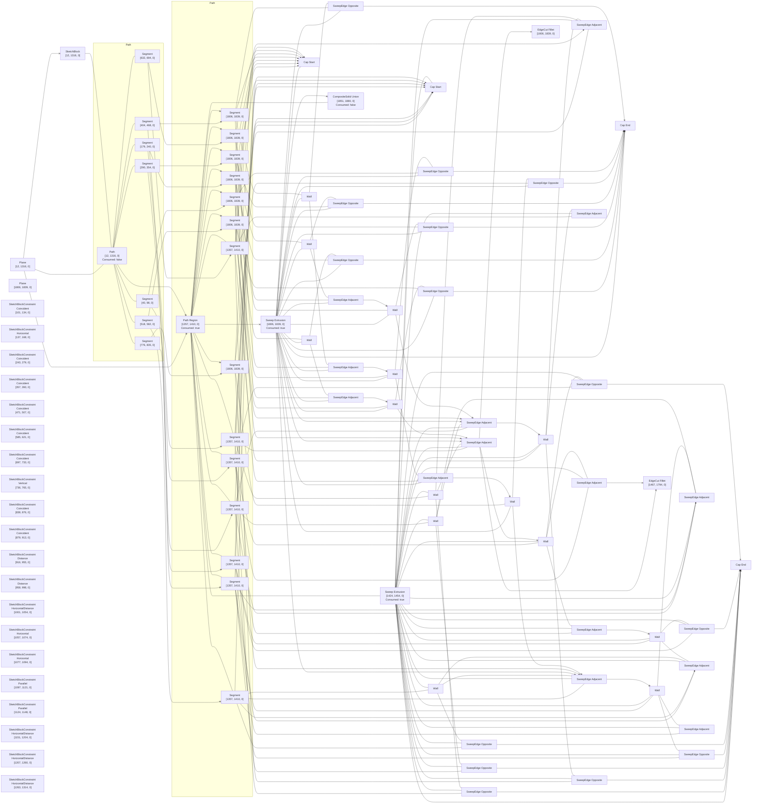

```mermaid
flowchart LR
  subgraph path2 [Path]
    2["Path<br>[12, 1316, 0]<br>Consumed: false"]
      %% [ProgramBodyItem { index: 0 }, VariableDeclarationDeclaration, VariableDeclarationInit]
    3["Segment<br>[40, 98, 0]"]
      %% [ProgramBodyItem { index: 0 }, VariableDeclarationDeclaration, VariableDeclarationInit, SketchBlockBody, SketchBlockBodyItem { index: 0 }, VariableDeclarationDeclaration, VariableDeclarationInit]
    4["Segment<br>[179, 240, 0]"]
      %% [ProgramBodyItem { index: 0 }, VariableDeclarationDeclaration, VariableDeclarationInit, SketchBlockBody, SketchBlockBodyItem { index: 3 }, VariableDeclarationDeclaration, VariableDeclarationInit]
    5["Segment<br>[290, 354, 0]"]
      %% [ProgramBodyItem { index: 0 }, VariableDeclarationDeclaration, VariableDeclarationInit, SketchBlockBody, SketchBlockBodyItem { index: 5 }, VariableDeclarationDeclaration, VariableDeclarationInit]
    6["Segment<br>[404, 468, 0]"]
      %% [ProgramBodyItem { index: 0 }, VariableDeclarationDeclaration, VariableDeclarationInit, SketchBlockBody, SketchBlockBodyItem { index: 7 }, VariableDeclarationDeclaration, VariableDeclarationInit]
    7["Segment<br>[518, 582, 0]"]
      %% [ProgramBodyItem { index: 0 }, VariableDeclarationDeclaration, VariableDeclarationInit, SketchBlockBody, SketchBlockBodyItem { index: 9 }, VariableDeclarationDeclaration, VariableDeclarationInit]
    8["Segment<br>[632, 694, 0]"]
      %% [ProgramBodyItem { index: 0 }, VariableDeclarationDeclaration, VariableDeclarationInit, SketchBlockBody, SketchBlockBodyItem { index: 11 }, VariableDeclarationDeclaration, VariableDeclarationInit]
    9["Segment<br>[776, 835, 0]"]
      %% [ProgramBodyItem { index: 0 }, VariableDeclarationDeclaration, VariableDeclarationInit, SketchBlockBody, SketchBlockBodyItem { index: 14 }, VariableDeclarationDeclaration, VariableDeclarationInit]
  end
  subgraph path10 [Path]
    10["Path Region<br>[1357, 1410, 0]<br>Consumed: true"]
      %% [ProgramBodyItem { index: 2 }, VariableDeclarationDeclaration, VariableDeclarationInit]
    11["Segment<br>[1357, 1410, 0]"]
      %% [ProgramBodyItem { index: 2 }, VariableDeclarationDeclaration, VariableDeclarationInit]
    12["Segment<br>[1357, 1410, 0]"]
      %% [ProgramBodyItem { index: 2 }, VariableDeclarationDeclaration, VariableDeclarationInit]
    13["Segment<br>[1357, 1410, 0]"]
      %% [ProgramBodyItem { index: 2 }, VariableDeclarationDeclaration, VariableDeclarationInit]
    14["Segment<br>[1357, 1410, 0]"]
      %% [ProgramBodyItem { index: 2 }, VariableDeclarationDeclaration, VariableDeclarationInit]
    15["Segment<br>[1357, 1410, 0]"]
      %% [ProgramBodyItem { index: 2 }, VariableDeclarationDeclaration, VariableDeclarationInit]
    16["Segment<br>[1357, 1410, 0]"]
      %% [ProgramBodyItem { index: 2 }, VariableDeclarationDeclaration, VariableDeclarationInit]
    17["Segment<br>[1357, 1410, 0]"]
      %% [ProgramBodyItem { index: 2 }, VariableDeclarationDeclaration, VariableDeclarationInit]
    45["Segment<br>[1806, 1839, 0]"]
      %% [ProgramBodyItem { index: 5 }, VariableDeclarationDeclaration, VariableDeclarationInit]
    46["Segment<br>[1806, 1839, 0]"]
      %% [ProgramBodyItem { index: 5 }, VariableDeclarationDeclaration, VariableDeclarationInit]
    47["Segment<br>[1806, 1839, 0]"]
      %% [ProgramBodyItem { index: 5 }, VariableDeclarationDeclaration, VariableDeclarationInit]
    48["Segment<br>[1806, 1839, 0]"]
      %% [ProgramBodyItem { index: 5 }, VariableDeclarationDeclaration, VariableDeclarationInit]
    49["Segment<br>[1806, 1839, 0]"]
      %% [ProgramBodyItem { index: 5 }, VariableDeclarationDeclaration, VariableDeclarationInit]
    50["Segment<br>[1806, 1839, 0]"]
      %% [ProgramBodyItem { index: 5 }, VariableDeclarationDeclaration, VariableDeclarationInit]
    51["Segment<br>[1806, 1839, 0]"]
      %% [ProgramBodyItem { index: 5 }, VariableDeclarationDeclaration, VariableDeclarationInit]
  end
  1["Plane<br>[12, 1316, 0]"]
    %% [ProgramBodyItem { index: 0 }, VariableDeclarationDeclaration, VariableDeclarationInit]
  18["Sweep Extrusion<br>[1424, 1454, 0]<br>Consumed: true"]
    %% [ProgramBodyItem { index: 3 }, VariableDeclarationDeclaration, VariableDeclarationInit]
  19[Wall]
    %% face_code_ref=Missing NodePath
  20[Wall]
    %% face_code_ref=Missing NodePath
  21[Wall]
    %% face_code_ref=Missing NodePath
  22[Wall]
    %% face_code_ref=Missing NodePath
  23[Wall]
    %% face_code_ref=Missing NodePath
  24[Wall]
    %% face_code_ref=Missing NodePath
  25[Wall]
    %% face_code_ref=Missing NodePath
  26["Cap Start"]
    %% face_code_ref=Missing NodePath
  27["Cap End"]
    %% face_code_ref=Missing NodePath
  28["SweepEdge Opposite"]
  29["SweepEdge Adjacent"]
  30["SweepEdge Opposite"]
  31["SweepEdge Adjacent"]
  32["SweepEdge Opposite"]
  33["SweepEdge Adjacent"]
  34["SweepEdge Opposite"]
  35["SweepEdge Adjacent"]
  36["SweepEdge Opposite"]
  37["SweepEdge Adjacent"]
  38["SweepEdge Opposite"]
  39["SweepEdge Adjacent"]
  40["SweepEdge Opposite"]
  41["SweepEdge Adjacent"]
  42["EdgeCut Fillet<br>[1467, 1794, 0]"]
    %% [ProgramBodyItem { index: 4 }, VariableDeclarationDeclaration, VariableDeclarationInit]
  43["Plane<br>[1806, 1839, 0]"]
    %% [ProgramBodyItem { index: 5 }, VariableDeclarationDeclaration, VariableDeclarationInit]
  44["Sweep Extrusion<br>[1806, 1839, 0]<br>Consumed: true"]
    %% [ProgramBodyItem { index: 5 }, VariableDeclarationDeclaration, VariableDeclarationInit]
  52[Wall]
    %% face_code_ref=Missing NodePath
  53[Wall]
    %% face_code_ref=Missing NodePath
  54[Wall]
    %% face_code_ref=Missing NodePath
  55[Wall]
    %% face_code_ref=Missing NodePath
  56[Wall]
    %% face_code_ref=Missing NodePath
  57[Wall]
    %% face_code_ref=Missing NodePath
  58[Wall]
    %% face_code_ref=Missing NodePath
  59["Cap Start"]
    %% face_code_ref=Missing NodePath
  60["Cap End"]
    %% face_code_ref=Missing NodePath
  61["SweepEdge Opposite"]
  62["SweepEdge Opposite"]
  63["SweepEdge Adjacent"]
  64["SweepEdge Opposite"]
  65["SweepEdge Opposite"]
  66["SweepEdge Adjacent"]
  67["SweepEdge Opposite"]
  68["SweepEdge Opposite"]
  69["SweepEdge Adjacent"]
  70["SweepEdge Opposite"]
  71["SweepEdge Adjacent"]
  72["EdgeCut Fillet<br>[1806, 1839, 0]"]
    %% [ProgramBodyItem { index: 5 }, VariableDeclarationDeclaration, VariableDeclarationInit]
  73["SweepEdge Adjacent"]
  74["SweepEdge Adjacent"]
  75["SweepEdge Adjacent"]
  76["CompositeSolid Union<br>[1851, 1880, 0]<br>Consumed: false"]
    %% [ProgramBodyItem { index: 6 }, VariableDeclarationDeclaration, VariableDeclarationInit]
  77["SketchBlock<br>[12, 1316, 0]"]
    %% [ProgramBodyItem { index: 0 }, VariableDeclarationDeclaration, VariableDeclarationInit]
  78["SketchBlockConstraint Coincident<br>[101, 134, 0]"]
    %% [ProgramBodyItem { index: 0 }, VariableDeclarationDeclaration, VariableDeclarationInit, SketchBlockBody, SketchBlockBodyItem { index: 1 }, ExpressionStatementExpr]
  79["SketchBlockConstraint Horizontal<br>[137, 168, 0]"]
    %% [ProgramBodyItem { index: 0 }, VariableDeclarationDeclaration, VariableDeclarationInit, SketchBlockBody, SketchBlockBodyItem { index: 2 }, ExpressionStatementExpr]
  80["SketchBlockConstraint Coincident<br>[243, 279, 0]"]
    %% [ProgramBodyItem { index: 0 }, VariableDeclarationDeclaration, VariableDeclarationInit, SketchBlockBody, SketchBlockBodyItem { index: 4 }, ExpressionStatementExpr]
  81["SketchBlockConstraint Coincident<br>[357, 393, 0]"]
    %% [ProgramBodyItem { index: 0 }, VariableDeclarationDeclaration, VariableDeclarationInit, SketchBlockBody, SketchBlockBodyItem { index: 6 }, ExpressionStatementExpr]
  82["SketchBlockConstraint Coincident<br>[471, 507, 0]"]
    %% [ProgramBodyItem { index: 0 }, VariableDeclarationDeclaration, VariableDeclarationInit, SketchBlockBody, SketchBlockBodyItem { index: 8 }, ExpressionStatementExpr]
  83["SketchBlockConstraint Coincident<br>[585, 621, 0]"]
    %% [ProgramBodyItem { index: 0 }, VariableDeclarationDeclaration, VariableDeclarationInit, SketchBlockBody, SketchBlockBodyItem { index: 10 }, ExpressionStatementExpr]
  84["SketchBlockConstraint Coincident<br>[697, 733, 0]"]
    %% [ProgramBodyItem { index: 0 }, VariableDeclarationDeclaration, VariableDeclarationInit, SketchBlockBody, SketchBlockBodyItem { index: 12 }, ExpressionStatementExpr]
  85["SketchBlockConstraint Vertical<br>[736, 765, 0]"]
    %% [ProgramBodyItem { index: 0 }, VariableDeclarationDeclaration, VariableDeclarationInit, SketchBlockBody, SketchBlockBodyItem { index: 13 }, ExpressionStatementExpr]
  86["SketchBlockConstraint Coincident<br>[838, 876, 0]"]
    %% [ProgramBodyItem { index: 0 }, VariableDeclarationDeclaration, VariableDeclarationInit, SketchBlockBody, SketchBlockBodyItem { index: 15 }, ExpressionStatementExpr]
  87["SketchBlockConstraint Coincident<br>[879, 913, 0]"]
    %% [ProgramBodyItem { index: 0 }, VariableDeclarationDeclaration, VariableDeclarationInit, SketchBlockBody, SketchBlockBodyItem { index: 16 }, ExpressionStatementExpr]
  88["SketchBlockConstraint Distance<br>[916, 955, 0]"]
    %% [ProgramBodyItem { index: 0 }, VariableDeclarationDeclaration, VariableDeclarationInit, SketchBlockBody, SketchBlockBodyItem { index: 17 }, ExpressionStatementExpr]
  89["SketchBlockConstraint Distance<br>[958, 998, 0]"]
    %% [ProgramBodyItem { index: 0 }, VariableDeclarationDeclaration, VariableDeclarationInit, SketchBlockBody, SketchBlockBodyItem { index: 18 }, ExpressionStatementExpr]
  90["SketchBlockConstraint HorizontalDistance<br>[1001, 1054, 0]"]
    %% [ProgramBodyItem { index: 0 }, VariableDeclarationDeclaration, VariableDeclarationInit, SketchBlockBody, SketchBlockBodyItem { index: 19 }, ExpressionStatementExpr]
  91["SketchBlockConstraint Horizontal<br>[1057, 1074, 0]"]
    %% [ProgramBodyItem { index: 0 }, VariableDeclarationDeclaration, VariableDeclarationInit, SketchBlockBody, SketchBlockBodyItem { index: 20 }, ExpressionStatementExpr]
  92["SketchBlockConstraint Horizontal<br>[1077, 1094, 0]"]
    %% [ProgramBodyItem { index: 0 }, VariableDeclarationDeclaration, VariableDeclarationInit, SketchBlockBody, SketchBlockBodyItem { index: 21 }, ExpressionStatementExpr]
  93["SketchBlockConstraint Parallel<br>[1097, 1121, 0]"]
    %% [ProgramBodyItem { index: 0 }, VariableDeclarationDeclaration, VariableDeclarationInit, SketchBlockBody, SketchBlockBodyItem { index: 22 }, ExpressionStatementExpr]
  94["SketchBlockConstraint Parallel<br>[1124, 1148, 0]"]
    %% [ProgramBodyItem { index: 0 }, VariableDeclarationDeclaration, VariableDeclarationInit, SketchBlockBody, SketchBlockBodyItem { index: 23 }, ExpressionStatementExpr]
  95["SketchBlockConstraint HorizontalDistance<br>[1151, 1204, 0]"]
    %% [ProgramBodyItem { index: 0 }, VariableDeclarationDeclaration, VariableDeclarationInit, SketchBlockBody, SketchBlockBodyItem { index: 24 }, ExpressionStatementExpr]
  96["SketchBlockConstraint HorizontalDistance<br>[1207, 1260, 0]"]
    %% [ProgramBodyItem { index: 0 }, VariableDeclarationDeclaration, VariableDeclarationInit, SketchBlockBody, SketchBlockBodyItem { index: 25 }, ExpressionStatementExpr]
  97["SketchBlockConstraint HorizontalDistance<br>[1263, 1314, 0]"]
    %% [ProgramBodyItem { index: 0 }, VariableDeclarationDeclaration, VariableDeclarationInit, SketchBlockBody, SketchBlockBodyItem { index: 26 }, ExpressionStatementExpr]
  1 --- 2
  1 <--x 10
  1 <--x 77
  2 --- 3
  2 --- 4
  2 --- 5
  2 --- 6
  2 --- 7
  2 --- 8
  2 --- 9
  2 <--x 10
  77 --- 2
  3 <--x 11
  3 <--x 45
  4 <--x 12
  4 <--x 46
  5 <--x 13
  5 <--x 47
  6 <--x 14
  6 <--x 48
  7 <--x 15
  7 <--x 49
  8 <--x 16
  8 <--x 50
  9 <--x 17
  9 <--x 51
  10 --- 11
  10 --- 12
  10 --- 13
  10 --- 14
  10 --- 15
  10 --- 16
  10 --- 17
  10 ---- 18
  10 <---x 44
  10 <--x 45
  10 <--x 46
  10 <--x 47
  10 <--x 48
  10 <--x 49
  10 <--x 50
  10 <--x 51
  10 --- 76
  11 --- 25
  11 x--> 26
  11 --- 40
  11 --- 41
  11 --- 75
  12 --- 19
  12 x--> 26
  12 --- 28
  12 --- 29
  12 --- 31
  13 --- 21
  13 x--> 26
  13 --- 32
  13 --- 33
  13 --- 35
  14 --- 24
  14 x--> 26
  14 --- 38
  14 --- 39
  15 --- 23
  15 x--> 26
  15 --- 36
  15 --- 37
  15 x--> 39
  16 --- 20
  16 x--> 26
  16 --- 30
  16 x--> 31
  16 --- 73
  17 --- 22
  17 x--> 26
  17 --- 34
  17 x--> 35
  17 --- 74
  18 --- 19
  18 --- 20
  18 --- 21
  18 --- 22
  18 --- 23
  18 --- 24
  18 --- 25
  18 --- 26
  18 --- 27
  18 --- 28
  18 --- 29
  18 --- 30
  18 --- 31
  18 --- 32
  18 --- 33
  18 --- 34
  18 --- 35
  18 --- 36
  18 --- 37
  18 --- 38
  18 --- 39
  18 --- 40
  18 --- 41
  18 --- 73
  18 --- 74
  18 --- 75
  19 --- 28
  19 --- 29
  19 --- 31
  20 --- 30
  20 --- 31
  33 <--x 20
  20 --- 73
  21 --- 32
  21 --- 33
  21 --- 35
  22 --- 34
  22 --- 35
  37 <--x 22
  22 --- 74
  23 --- 36
  23 --- 37
  23 --- 39
  24 --- 38
  24 --- 39
  41 <--x 24
  29 <--x 25
  25 --- 40
  25 --- 41
  25 --- 75
  28 <--x 27
  30 <--x 27
  32 <--x 27
  34 <--x 27
  36 <--x 27
  38 <--x 27
  40 <--x 27
  29 <--x 42
  44 <--x 29
  47 <--x 29
  52 <--x 29
  29 <--x 72
  44 <--x 33
  49 <--x 33
  54 <--x 33
  44 <--x 37
  51 <--x 37
  56 <--x 37
  75 <--x 42
  44 --- 52
  44 --- 53
  44 --- 54
  44 --- 55
  44 --- 56
  44 --- 57
  44 --- 58
  44 --- 59
  44 --- 60
  44 --- 61
  44 --- 62
  44 --- 63
  44 --- 64
  44 --- 65
  44 --- 66
  44 --- 67
  44 --- 68
  44 --- 69
  44 --- 70
  44 --- 71
  44 <--x 76
  45 --- 57
  45 x--> 59
  45 --- 68
  45 --- 69
  46 --- 53
  46 x--> 59
  46 --- 62
  46 --- 63
  47 --- 55
  47 x--> 59
  47 --- 65
  47 --- 66
  48 --- 58
  48 x--> 59
  48 --- 70
  48 --- 71
  49 --- 52
  49 x--> 59
  49 --- 61
  50 --- 54
  50 x--> 59
  50 --- 64
  51 --- 56
  51 x--> 59
  51 --- 67
  52 --- 61
  63 <--x 52
  53 --- 62
  53 --- 63
  54 --- 64
  66 <--x 54
  55 --- 65
  55 --- 66
  56 --- 67
  69 <--x 56
  57 --- 68
  57 --- 69
  71 <--x 57
  58 --- 70
  58 --- 71
  61 <--x 60
  62 <--x 60
  64 <--x 60
  65 <--x 60
  67 <--x 60
  68 <--x 60
  70 <--x 60
```
