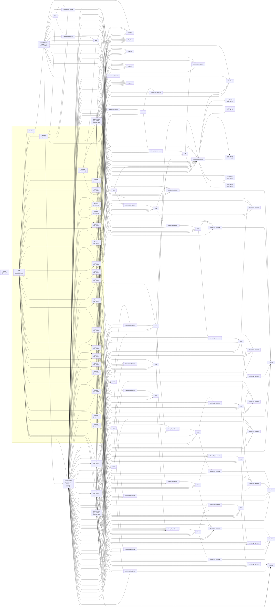

```mermaid
flowchart LR
  subgraph path2 [Path]
    2["Path<br>[54, 76, 0]<br>Consumed: true"]
      %% [ProgramBodyItem { index: 0 }, VariableDeclarationDeclaration, VariableDeclarationInit, FunctionExpressionBody, FunctionExpressionBodyItem { index: 0 }, VariableDeclarationDeclaration, VariableDeclarationInit, PipeBodyItem { index: 1 }]
    3["Segment<br>[84, 106, 0]"]
      %% [ProgramBodyItem { index: 0 }, VariableDeclarationDeclaration, VariableDeclarationInit, FunctionExpressionBody, FunctionExpressionBodyItem { index: 0 }, VariableDeclarationDeclaration, VariableDeclarationInit, PipeBodyItem { index: 2 }]
    4["Segment<br>[114, 136, 0]"]
      %% [ProgramBodyItem { index: 0 }, VariableDeclarationDeclaration, VariableDeclarationInit, FunctionExpressionBody, FunctionExpressionBodyItem { index: 0 }, VariableDeclarationDeclaration, VariableDeclarationInit, PipeBodyItem { index: 3 }]
    5["Segment<br>[144, 167, 0]"]
      %% [ProgramBodyItem { index: 0 }, VariableDeclarationDeclaration, VariableDeclarationInit, FunctionExpressionBody, FunctionExpressionBodyItem { index: 0 }, VariableDeclarationDeclaration, VariableDeclarationInit, PipeBodyItem { index: 4 }]
    6["Segment<br>[229, 248, 0]"]
      %% [ProgramBodyItem { index: 1 }, VariableDeclarationDeclaration, VariableDeclarationInit, PipeBodyItem { index: 1 }]
    7[Solid2d]
    26["Segment<br>[343, 487, 0]"]
      %% [ProgramBodyItem { index: 2 }, VariableDeclarationDeclaration, VariableDeclarationInit]
    27["Segment<br>[343, 487, 0]"]
      %% [ProgramBodyItem { index: 2 }, VariableDeclarationDeclaration, VariableDeclarationInit]
    28["Segment<br>[343, 487, 0]"]
      %% [ProgramBodyItem { index: 2 }, VariableDeclarationDeclaration, VariableDeclarationInit]
    29["Segment<br>[343, 487, 0]"]
      %% [ProgramBodyItem { index: 2 }, VariableDeclarationDeclaration, VariableDeclarationInit]
    45["Segment<br>[343, 487, 0]"]
      %% [ProgramBodyItem { index: 2 }, VariableDeclarationDeclaration, VariableDeclarationInit]
    46["Segment<br>[343, 487, 0]"]
      %% [ProgramBodyItem { index: 2 }, VariableDeclarationDeclaration, VariableDeclarationInit]
    47["Segment<br>[343, 487, 0]"]
      %% [ProgramBodyItem { index: 2 }, VariableDeclarationDeclaration, VariableDeclarationInit]
    48["Segment<br>[343, 487, 0]"]
      %% [ProgramBodyItem { index: 2 }, VariableDeclarationDeclaration, VariableDeclarationInit]
    64["Segment<br>[343, 487, 0]"]
      %% [ProgramBodyItem { index: 2 }, VariableDeclarationDeclaration, VariableDeclarationInit]
    65["Segment<br>[343, 487, 0]"]
      %% [ProgramBodyItem { index: 2 }, VariableDeclarationDeclaration, VariableDeclarationInit]
    66["Segment<br>[343, 487, 0]"]
      %% [ProgramBodyItem { index: 2 }, VariableDeclarationDeclaration, VariableDeclarationInit]
    67["Segment<br>[343, 487, 0]"]
      %% [ProgramBodyItem { index: 2 }, VariableDeclarationDeclaration, VariableDeclarationInit]
    83["Segment<br>[343, 487, 0]"]
      %% [ProgramBodyItem { index: 2 }, VariableDeclarationDeclaration, VariableDeclarationInit]
    84["Segment<br>[343, 487, 0]"]
      %% [ProgramBodyItem { index: 2 }, VariableDeclarationDeclaration, VariableDeclarationInit]
    85["Segment<br>[343, 487, 0]"]
      %% [ProgramBodyItem { index: 2 }, VariableDeclarationDeclaration, VariableDeclarationInit]
    86["Segment<br>[343, 487, 0]"]
      %% [ProgramBodyItem { index: 2 }, VariableDeclarationDeclaration, VariableDeclarationInit]
  end
  1["Plane<br>[29, 46, 0]"]
    %% [ProgramBodyItem { index: 0 }, VariableDeclarationDeclaration, VariableDeclarationInit, FunctionExpressionBody, FunctionExpressionBodyItem { index: 0 }, VariableDeclarationDeclaration, VariableDeclarationInit, PipeBodyItem { index: 0 }]
  8["Sweep Extrusion<br>[254, 274, 0]<br>Consumed: false"]
    %% [ProgramBodyItem { index: 1 }, VariableDeclarationDeclaration, VariableDeclarationInit, PipeBodyItem { index: 2 }]
  9[Wall]
    %% face_code_ref=Missing NodePath
  10[Wall]
    %% face_code_ref=Missing NodePath
  11[Wall]
    %% face_code_ref=Missing NodePath
  12[Wall]
    %% face_code_ref=Missing NodePath
  13["Cap Start"]
    %% face_code_ref=Missing NodePath
  14["Cap End"]
    %% face_code_ref=Missing NodePath
  15["SweepEdge Opposite"]
  16["SweepEdge Adjacent"]
  17["SweepEdge Opposite"]
  18["SweepEdge Adjacent"]
  19["SweepEdge Opposite"]
  20["SweepEdge Adjacent"]
  21["SweepEdge Opposite"]
  22["SweepEdge Adjacent"]
  23["EdgeCut Fillet<br>[280, 332, 0]"]
    %% [ProgramBodyItem { index: 1 }, VariableDeclarationDeclaration, VariableDeclarationInit, PipeBodyItem { index: 3 }]
  24["Pattern Circular<br>[343, 487, 0]<br>Copies: 4<br>Faces: 28<br>Edges: 60"]
    %% [ProgramBodyItem { index: 2 }, VariableDeclarationDeclaration, VariableDeclarationInit]
  25["Sweep Extrusion<br>[343, 487, 0]<br>Consumed: false"]
    %% [ProgramBodyItem { index: 2 }, VariableDeclarationDeclaration, VariableDeclarationInit]
  30[Wall]
    %% face_code_ref=Missing NodePath
  31[Wall]
    %% face_code_ref=Missing NodePath
  32[Wall]
    %% face_code_ref=Missing NodePath
  33[Wall]
    %% face_code_ref=Missing NodePath
  34["Cap Start"]
    %% face_code_ref=Missing NodePath
  35["Cap End"]
    %% face_code_ref=Missing NodePath
  36["SweepEdge Adjacent"]
  37["SweepEdge Opposite"]
  38["SweepEdge Adjacent"]
  39["SweepEdge Opposite"]
  40["SweepEdge Adjacent"]
  41["SweepEdge Opposite"]
  42["SweepEdge Adjacent"]
  43["EdgeCut Fillet<br>[343, 487, 0]"]
    %% [ProgramBodyItem { index: 2 }, VariableDeclarationDeclaration, VariableDeclarationInit]
  44["Sweep Extrusion<br>[343, 487, 0]<br>Consumed: false"]
    %% [ProgramBodyItem { index: 2 }, VariableDeclarationDeclaration, VariableDeclarationInit]
  49[Wall]
    %% face_code_ref=Missing NodePath
  50[Wall]
    %% face_code_ref=Missing NodePath
  51[Wall]
    %% face_code_ref=Missing NodePath
  52[Wall]
    %% face_code_ref=Missing NodePath
  53["Cap Start"]
    %% face_code_ref=Missing NodePath
  54["Cap End"]
    %% face_code_ref=Missing NodePath
  55["SweepEdge Adjacent"]
  56["SweepEdge Opposite"]
  57["SweepEdge Adjacent"]
  58["SweepEdge Opposite"]
  59["SweepEdge Adjacent"]
  60["SweepEdge Opposite"]
  61["SweepEdge Adjacent"]
  62["EdgeCut Fillet<br>[343, 487, 0]"]
    %% [ProgramBodyItem { index: 2 }, VariableDeclarationDeclaration, VariableDeclarationInit]
  63["Sweep Extrusion<br>[343, 487, 0]<br>Consumed: false"]
    %% [ProgramBodyItem { index: 2 }, VariableDeclarationDeclaration, VariableDeclarationInit]
  68[Wall]
    %% face_code_ref=Missing NodePath
  69[Wall]
    %% face_code_ref=Missing NodePath
  70[Wall]
    %% face_code_ref=Missing NodePath
  71[Wall]
    %% face_code_ref=Missing NodePath
  72["Cap Start"]
    %% face_code_ref=Missing NodePath
  73["Cap End"]
    %% face_code_ref=Missing NodePath
  74["SweepEdge Adjacent"]
  75["SweepEdge Opposite"]
  76["SweepEdge Adjacent"]
  77["SweepEdge Opposite"]
  78["SweepEdge Adjacent"]
  79["SweepEdge Opposite"]
  80["SweepEdge Adjacent"]
  81["EdgeCut Fillet<br>[343, 487, 0]"]
    %% [ProgramBodyItem { index: 2 }, VariableDeclarationDeclaration, VariableDeclarationInit]
  82["Sweep Extrusion<br>[343, 487, 0]<br>Consumed: false"]
    %% [ProgramBodyItem { index: 2 }, VariableDeclarationDeclaration, VariableDeclarationInit]
  87[Wall]
    %% face_code_ref=Missing NodePath
  88[Wall]
    %% face_code_ref=Missing NodePath
  89[Wall]
    %% face_code_ref=Missing NodePath
  90[Wall]
    %% face_code_ref=Missing NodePath
  91["Cap Start"]
    %% face_code_ref=Missing NodePath
  92["Cap End"]
    %% face_code_ref=Missing NodePath
  93["SweepEdge Adjacent"]
  94["SweepEdge Opposite"]
  95["SweepEdge Adjacent"]
  96["SweepEdge Opposite"]
  97["SweepEdge Adjacent"]
  98["SweepEdge Opposite"]
  99["SweepEdge Adjacent"]
  100["EdgeCut Fillet<br>[343, 487, 0]"]
    %% [ProgramBodyItem { index: 2 }, VariableDeclarationDeclaration, VariableDeclarationInit]
  1 --- 2
  2 --- 3
  2 --- 4
  2 --- 5
  2 --- 6
  2 --- 7
  2 ---- 8
  2 --- 24
  2 <---x 25
  2 <--x 26
  2 <--x 27
  2 <--x 28
  2 <--x 29
  2 <---x 44
  2 <--x 45
  2 <--x 46
  2 <--x 47
  2 <--x 48
  2 <---x 63
  2 <--x 64
  2 <--x 65
  2 <--x 66
  2 <--x 67
  2 <---x 82
  2 <--x 83
  2 <--x 84
  2 <--x 85
  2 <--x 86
  3 --- 12
  3 x--> 13
  3 --- 21
  3 --- 22
  4 --- 11
  4 x--> 13
  4 --- 19
  4 --- 20
  5 --- 10
  5 x--> 13
  5 --- 17
  5 --- 18
  6 --- 9
  6 x--> 13
  6 --- 15
  6 --- 16
  8 --- 9
  8 --- 10
  8 --- 11
  8 --- 12
  8 --- 13
  8 --- 14
  8 --- 15
  8 --- 16
  8 --- 17
  8 --- 18
  8 --- 19
  8 --- 20
  8 --- 21
  8 --- 22
  8 x--> 24
  9 --- 15
  9 --- 16
  18 <--x 9
  10 --- 17
  10 --- 18
  20 <--x 10
  11 --- 19
  11 --- 20
  22 <--x 11
  16 <--x 12
  12 --- 21
  12 --- 22
  15 <--x 14
  17 <--x 14
  19 <--x 14
  21 <--x 14
  15 <--x 23
  25 <--x 15
  29 <--x 15
  30 <--x 15
  15 <--x 43
  44 <--x 15
  48 <--x 15
  49 <--x 15
  15 <--x 62
  63 <--x 15
  67 <--x 15
  68 <--x 15
  15 <--x 81
  82 <--x 15
  86 <--x 15
  87 <--x 15
  15 <--x 100
  24 x--> 25
  24 x--> 26
  24 x--> 27
  24 x--> 28
  24 x--> 29
  24 x--> 30
  24 x--> 31
  24 x--> 32
  24 x--> 33
  24 x--> 34
  24 x--> 35
  24 x--> 36
  24 x--> 37
  24 x--> 38
  24 x--> 39
  24 x--> 40
  24 x--> 41
  24 x--> 42
  24 x--> 43
  24 x--> 44
  24 x--> 45
  24 x--> 46
  24 x--> 47
  24 x--> 48
  24 x--> 49
  24 x--> 50
  24 x--> 51
  24 x--> 52
  24 x--> 53
  24 x--> 54
  24 x--> 55
  24 x--> 56
  24 x--> 57
  24 x--> 58
  24 x--> 59
  24 x--> 60
  24 x--> 61
  24 x--> 62
  24 x--> 63
  24 x--> 64
  24 x--> 65
  24 x--> 66
  24 x--> 67
  24 x--> 68
  24 x--> 69
  24 x--> 70
  24 x--> 71
  24 x--> 72
  24 x--> 73
  24 x--> 74
  24 x--> 75
  24 x--> 76
  24 x--> 77
  24 x--> 78
  24 x--> 79
  24 x--> 80
  24 x--> 81
  24 x--> 82
  24 x--> 83
  24 x--> 84
  24 x--> 85
  24 x--> 86
  24 x--> 87
  24 x--> 88
  24 x--> 89
  24 x--> 90
  24 x--> 91
  24 x--> 92
  24 x--> 93
  24 x--> 94
  24 x--> 95
  24 x--> 96
  24 x--> 97
  24 x--> 98
  24 x--> 99
  24 x--> 100
  25 --- 30
  25 --- 31
  25 --- 32
  25 --- 33
  25 --- 34
  25 --- 35
  25 --- 36
  25 --- 37
  25 --- 38
  25 --- 39
  25 --- 40
  25 --- 41
  25 --- 42
  26 --- 31
  26 x--> 34
  26 --- 37
  26 --- 38
  27 --- 32
  27 x--> 34
  27 --- 39
  27 --- 40
  28 --- 33
  28 x--> 34
  28 --- 41
  28 --- 42
  29 --- 50
  29 x--> 53
  29 --- 56
  29 --- 57
  30 --- 36
  38 <--x 30
  31 --- 37
  31 --- 38
  40 <--x 31
  32 --- 39
  32 --- 40
  42 <--x 32
  36 <--x 33
  33 --- 41
  33 --- 42
  37 <--x 35
  39 <--x 35
  41 <--x 35
  44 --- 49
  44 --- 50
  44 --- 51
  44 --- 52
  44 --- 53
  44 --- 54
  44 --- 55
  44 --- 56
  44 --- 57
  44 --- 58
  44 --- 59
  44 --- 60
  44 --- 61
  45 --- 51
  45 x--> 53
  45 --- 58
  45 --- 59
  46 --- 52
  46 x--> 53
  46 --- 60
  46 --- 61
  47 --- 69
  47 x--> 72
  47 --- 75
  47 --- 76
  48 --- 70
  48 x--> 72
  48 --- 77
  48 --- 78
  49 --- 55
  57 <--x 49
  50 --- 56
  50 --- 57
  59 <--x 50
  51 --- 58
  51 --- 59
  61 <--x 51
  55 <--x 52
  52 --- 60
  52 --- 61
  56 <--x 54
  58 <--x 54
  60 <--x 54
  63 --- 68
  63 --- 69
  63 --- 70
  63 --- 71
  63 --- 72
  63 --- 73
  63 --- 74
  63 --- 75
  63 --- 76
  63 --- 77
  63 --- 78
  63 --- 79
  63 --- 80
  64 --- 71
  64 x--> 72
  64 --- 79
  64 --- 80
  65 --- 88
  65 x--> 91
  65 --- 94
  65 --- 95
  66 --- 89
  66 x--> 91
  66 --- 96
  66 --- 97
  67 --- 90
  67 x--> 91
  67 --- 98
  67 --- 99
  68 --- 74
  76 <--x 68
  69 --- 75
  69 --- 76
  78 <--x 69
  70 --- 77
  70 --- 78
  80 <--x 70
  74 <--x 71
  71 --- 79
  71 --- 80
  75 <--x 73
  77 <--x 73
  79 <--x 73
  82 --- 87
  82 --- 88
  82 --- 89
  82 --- 90
  82 --- 91
  82 --- 92
  82 --- 93
  82 --- 94
  82 --- 95
  82 --- 96
  82 --- 97
  82 --- 98
  82 --- 99
  83 --- 30
  83 x--> 34
  83 --- 36
  84 --- 49
  84 x--> 53
  84 --- 55
  85 --- 68
  85 x--> 72
  85 --- 74
  86 --- 87
  86 x--> 91
  86 --- 93
  87 --- 93
  95 <--x 87
  88 --- 94
  88 --- 95
  97 <--x 88
  89 --- 96
  89 --- 97
  99 <--x 89
  93 <--x 90
  90 --- 98
  90 --- 99
  94 <--x 92
  96 <--x 92
  98 <--x 92
```
