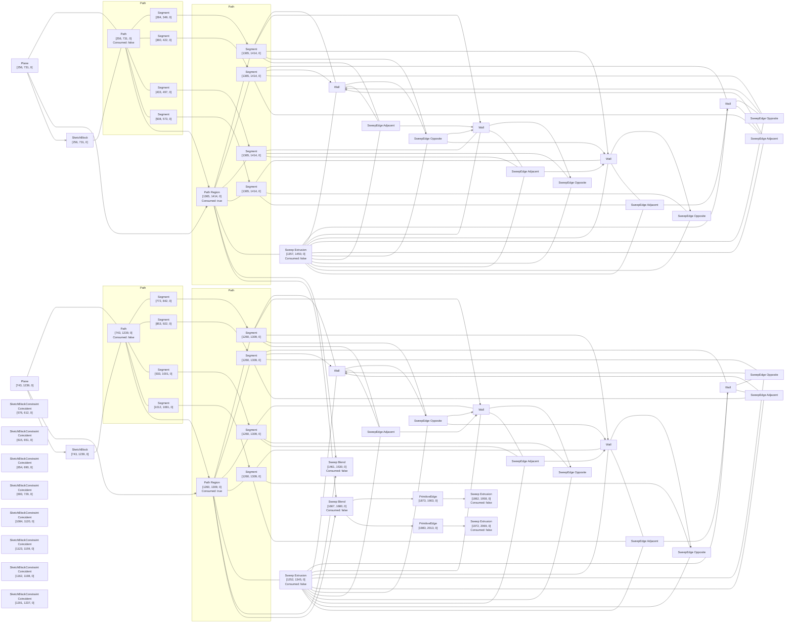

```mermaid
flowchart LR
  subgraph path2 [Path]
    2["Path<br>[256, 731, 0]<br>Consumed: false"]
      %% [ProgramBodyItem { index: 0 }, VariableDeclarationDeclaration, VariableDeclarationInit]
    3["Segment<br>[284, 349, 0]"]
      %% [ProgramBodyItem { index: 0 }, VariableDeclarationDeclaration, VariableDeclarationInit, SketchBlockBody, SketchBlockBodyItem { index: 0 }, VariableDeclarationDeclaration, VariableDeclarationInit]
    4["Segment<br>[360, 422, 0]"]
      %% [ProgramBodyItem { index: 0 }, VariableDeclarationDeclaration, VariableDeclarationInit, SketchBlockBody, SketchBlockBodyItem { index: 1 }, VariableDeclarationDeclaration, VariableDeclarationInit]
    5["Segment<br>[433, 497, 0]"]
      %% [ProgramBodyItem { index: 0 }, VariableDeclarationDeclaration, VariableDeclarationInit, SketchBlockBody, SketchBlockBodyItem { index: 2 }, VariableDeclarationDeclaration, VariableDeclarationInit]
    6["Segment<br>[508, 573, 0]"]
      %% [ProgramBodyItem { index: 0 }, VariableDeclarationDeclaration, VariableDeclarationInit, SketchBlockBody, SketchBlockBodyItem { index: 3 }, VariableDeclarationDeclaration, VariableDeclarationInit]
  end
  subgraph path8 [Path]
    8["Path<br>[743, 1239, 0]<br>Consumed: false"]
      %% [ProgramBodyItem { index: 1 }, VariableDeclarationDeclaration, VariableDeclarationInit]
    9["Segment<br>[772, 842, 0]"]
      %% [ProgramBodyItem { index: 1 }, VariableDeclarationDeclaration, VariableDeclarationInit, SketchBlockBody, SketchBlockBodyItem { index: 0 }, VariableDeclarationDeclaration, VariableDeclarationInit]
    10["Segment<br>[853, 922, 0]"]
      %% [ProgramBodyItem { index: 1 }, VariableDeclarationDeclaration, VariableDeclarationInit, SketchBlockBody, SketchBlockBodyItem { index: 1 }, VariableDeclarationDeclaration, VariableDeclarationInit]
    11["Segment<br>[933, 1001, 0]"]
      %% [ProgramBodyItem { index: 1 }, VariableDeclarationDeclaration, VariableDeclarationInit, SketchBlockBody, SketchBlockBodyItem { index: 2 }, VariableDeclarationDeclaration, VariableDeclarationInit]
    12["Segment<br>[1012, 1081, 0]"]
      %% [ProgramBodyItem { index: 1 }, VariableDeclarationDeclaration, VariableDeclarationInit, SketchBlockBody, SketchBlockBodyItem { index: 3 }, VariableDeclarationDeclaration, VariableDeclarationInit]
  end
  subgraph path13 [Path]
    13["Path Region<br>[1260, 1309, 0]<br>Consumed: true"]
      %% [ProgramBodyItem { index: 2 }, VariableDeclarationDeclaration, VariableDeclarationInit, CallKwUnlabeledArg]
    14["Segment<br>[1260, 1309, 0]"]
      %% [ProgramBodyItem { index: 2 }, VariableDeclarationDeclaration, VariableDeclarationInit, CallKwUnlabeledArg]
    15["Segment<br>[1260, 1309, 0]"]
      %% [ProgramBodyItem { index: 2 }, VariableDeclarationDeclaration, VariableDeclarationInit, CallKwUnlabeledArg]
    16["Segment<br>[1260, 1309, 0]"]
      %% [ProgramBodyItem { index: 2 }, VariableDeclarationDeclaration, VariableDeclarationInit, CallKwUnlabeledArg]
    17["Segment<br>[1260, 1309, 0]"]
      %% [ProgramBodyItem { index: 2 }, VariableDeclarationDeclaration, VariableDeclarationInit, CallKwUnlabeledArg]
  end
  subgraph path31 [Path]
    31["Path Region<br>[1365, 1414, 0]<br>Consumed: true"]
      %% [ProgramBodyItem { index: 3 }, VariableDeclarationDeclaration, VariableDeclarationInit, CallKwUnlabeledArg]
    32["Segment<br>[1365, 1414, 0]"]
      %% [ProgramBodyItem { index: 3 }, VariableDeclarationDeclaration, VariableDeclarationInit, CallKwUnlabeledArg]
    33["Segment<br>[1365, 1414, 0]"]
      %% [ProgramBodyItem { index: 3 }, VariableDeclarationDeclaration, VariableDeclarationInit, CallKwUnlabeledArg]
    34["Segment<br>[1365, 1414, 0]"]
      %% [ProgramBodyItem { index: 3 }, VariableDeclarationDeclaration, VariableDeclarationInit, CallKwUnlabeledArg]
    35["Segment<br>[1365, 1414, 0]"]
      %% [ProgramBodyItem { index: 3 }, VariableDeclarationDeclaration, VariableDeclarationInit, CallKwUnlabeledArg]
  end
  1["Plane<br>[256, 731, 0]"]
    %% [ProgramBodyItem { index: 0 }, VariableDeclarationDeclaration, VariableDeclarationInit]
  7["Plane<br>[743, 1239, 0]"]
    %% [ProgramBodyItem { index: 1 }, VariableDeclarationDeclaration, VariableDeclarationInit]
  18["Sweep Extrusion<br>[1252, 1345, 0]<br>Consumed: false"]
    %% [ProgramBodyItem { index: 2 }, VariableDeclarationDeclaration, VariableDeclarationInit]
  19[Wall]
    %% face_code_ref=Missing NodePath
  20[Wall]
    %% face_code_ref=Missing NodePath
  21[Wall]
    %% face_code_ref=Missing NodePath
  22[Wall]
    %% face_code_ref=Missing NodePath
  23["SweepEdge Opposite"]
  24["SweepEdge Adjacent"]
  25["SweepEdge Opposite"]
  26["SweepEdge Adjacent"]
  27["SweepEdge Opposite"]
  28["SweepEdge Adjacent"]
  29["SweepEdge Opposite"]
  30["SweepEdge Adjacent"]
  36["Sweep Extrusion<br>[1357, 1450, 0]<br>Consumed: false"]
    %% [ProgramBodyItem { index: 3 }, VariableDeclarationDeclaration, VariableDeclarationInit]
  37[Wall]
    %% face_code_ref=Missing NodePath
  38[Wall]
    %% face_code_ref=Missing NodePath
  39[Wall]
    %% face_code_ref=Missing NodePath
  40[Wall]
    %% face_code_ref=Missing NodePath
  41["SweepEdge Opposite"]
  42["SweepEdge Adjacent"]
  43["SweepEdge Opposite"]
  44["SweepEdge Adjacent"]
  45["SweepEdge Opposite"]
  46["SweepEdge Adjacent"]
  47["SweepEdge Opposite"]
  48["SweepEdge Adjacent"]
  49["Sweep Blend<br>[1461, 1530, 0]<br>Consumed: false"]
    %% [ProgramBodyItem { index: 4 }, VariableDeclarationDeclaration, VariableDeclarationInit]
  50["Sweep Blend<br>[1667, 1680, 0]<br>Consumed: false"]
    %% [ProgramBodyItem { index: 5 }, VariableDeclarationDeclaration, VariableDeclarationInit, PipeBodyItem { index: 0 }]
  51["PrimitiveEdge<br>[1873, 1903, 0]"]
    %% [ProgramBodyItem { index: 6 }, VariableDeclarationDeclaration, VariableDeclarationInit, CallKwUnlabeledArg]
  52["Sweep Extrusion<br>[1862, 1958, 0]<br>Consumed: false"]
    %% [ProgramBodyItem { index: 6 }, VariableDeclarationDeclaration, VariableDeclarationInit]
  53["PrimitiveEdge<br>[1983, 2013, 0]"]
    %% [ProgramBodyItem { index: 7 }, VariableDeclarationDeclaration, VariableDeclarationInit, CallKwUnlabeledArg]
  54["Sweep Extrusion<br>[1972, 2069, 0]<br>Consumed: false"]
    %% [ProgramBodyItem { index: 7 }, VariableDeclarationDeclaration, VariableDeclarationInit]
  55["SketchBlock<br>[256, 731, 0]"]
    %% [ProgramBodyItem { index: 0 }, VariableDeclarationDeclaration, VariableDeclarationInit]
  56["SketchBlockConstraint Coincident<br>[576, 612, 0]"]
    %% [ProgramBodyItem { index: 0 }, VariableDeclarationDeclaration, VariableDeclarationInit, SketchBlockBody, SketchBlockBodyItem { index: 4 }, ExpressionStatementExpr]
  57["SketchBlockConstraint Coincident<br>[615, 651, 0]"]
    %% [ProgramBodyItem { index: 0 }, VariableDeclarationDeclaration, VariableDeclarationInit, SketchBlockBody, SketchBlockBodyItem { index: 5 }, ExpressionStatementExpr]
  58["SketchBlockConstraint Coincident<br>[654, 690, 0]"]
    %% [ProgramBodyItem { index: 0 }, VariableDeclarationDeclaration, VariableDeclarationInit, SketchBlockBody, SketchBlockBodyItem { index: 6 }, ExpressionStatementExpr]
  59["SketchBlockConstraint Coincident<br>[693, 729, 0]"]
    %% [ProgramBodyItem { index: 0 }, VariableDeclarationDeclaration, VariableDeclarationInit, SketchBlockBody, SketchBlockBodyItem { index: 7 }, ExpressionStatementExpr]
  60["SketchBlock<br>[743, 1239, 0]"]
    %% [ProgramBodyItem { index: 1 }, VariableDeclarationDeclaration, VariableDeclarationInit]
  61["SketchBlockConstraint Coincident<br>[1084, 1120, 0]"]
    %% [ProgramBodyItem { index: 1 }, VariableDeclarationDeclaration, VariableDeclarationInit, SketchBlockBody, SketchBlockBodyItem { index: 4 }, ExpressionStatementExpr]
  62["SketchBlockConstraint Coincident<br>[1123, 1159, 0]"]
    %% [ProgramBodyItem { index: 1 }, VariableDeclarationDeclaration, VariableDeclarationInit, SketchBlockBody, SketchBlockBodyItem { index: 5 }, ExpressionStatementExpr]
  63["SketchBlockConstraint Coincident<br>[1162, 1198, 0]"]
    %% [ProgramBodyItem { index: 1 }, VariableDeclarationDeclaration, VariableDeclarationInit, SketchBlockBody, SketchBlockBodyItem { index: 6 }, ExpressionStatementExpr]
  64["SketchBlockConstraint Coincident<br>[1201, 1237, 0]"]
    %% [ProgramBodyItem { index: 1 }, VariableDeclarationDeclaration, VariableDeclarationInit, SketchBlockBody, SketchBlockBodyItem { index: 7 }, ExpressionStatementExpr]
  1 --- 2
  1 <--x 31
  1 <--x 55
  2 --- 3
  2 --- 4
  2 --- 5
  2 --- 6
  2 <--x 31
  55 --- 2
  3 <--x 32
  4 <--x 33
  5 <--x 34
  6 <--x 35
  7 --- 8
  7 <--x 13
  7 <--x 60
  8 --- 9
  8 --- 10
  8 --- 11
  8 --- 12
  8 <--x 13
  60 --- 8
  9 <--x 14
  10 <--x 15
  11 <--x 16
  12 <--x 17
  13 --- 14
  13 --- 15
  13 --- 16
  13 --- 17
  13 ---- 18
  13 <---x 49
  13 <---x 50
  14 --- 20
  14 x--> 21
  14 x--> 22
  14 --- 25
  14 --- 26
  15 --- 19
  15 x--> 20
  15 --- 23
  15 --- 24
  16 --- 21
  16 --- 27
  16 --- 28
  17 --- 22
  17 --- 29
  17 --- 30
  18 --- 19
  18 --- 20
  18 --- 21
  18 --- 22
  18 --- 23
  18 --- 24
  18 --- 25
  18 --- 26
  18 --- 27
  18 --- 28
  18 --- 29
  18 --- 30
  19 --- 23
  19 --- 24
  30 <--x 19
  23 <--x 20
  24 <--x 20
  20 x--> 25
  20 --- 26
  25 <--x 21
  26 <--x 21
  21 x--> 27
  21 --- 28
  25 <--x 22
  28 <--x 22
  22 x--> 29
  22 --- 30
  31 --- 32
  31 --- 33
  31 --- 34
  31 --- 35
  31 ---- 36
  31 <---x 49
  31 <---x 50
  32 --- 38
  32 x--> 39
  32 x--> 40
  32 --- 43
  32 --- 44
  33 --- 37
  33 x--> 38
  33 --- 41
  33 --- 42
  34 --- 39
  34 --- 45
  34 --- 46
  35 --- 40
  35 --- 47
  35 --- 48
  36 --- 37
  36 --- 38
  36 --- 39
  36 --- 40
  36 --- 41
  36 --- 42
  36 --- 43
  36 --- 44
  36 --- 45
  36 --- 46
  36 --- 47
  36 --- 48
  37 --- 41
  37 --- 42
  48 <--x 37
  41 <--x 38
  42 <--x 38
  38 x--> 43
  38 --- 44
  43 <--x 39
  44 <--x 39
  39 x--> 45
  39 --- 46
  43 <--x 40
  46 <--x 40
  40 x--> 47
  40 --- 48
  50 <--x 51
  50 <--x 53
  51 <--x 52
  53 <--x 54
```
