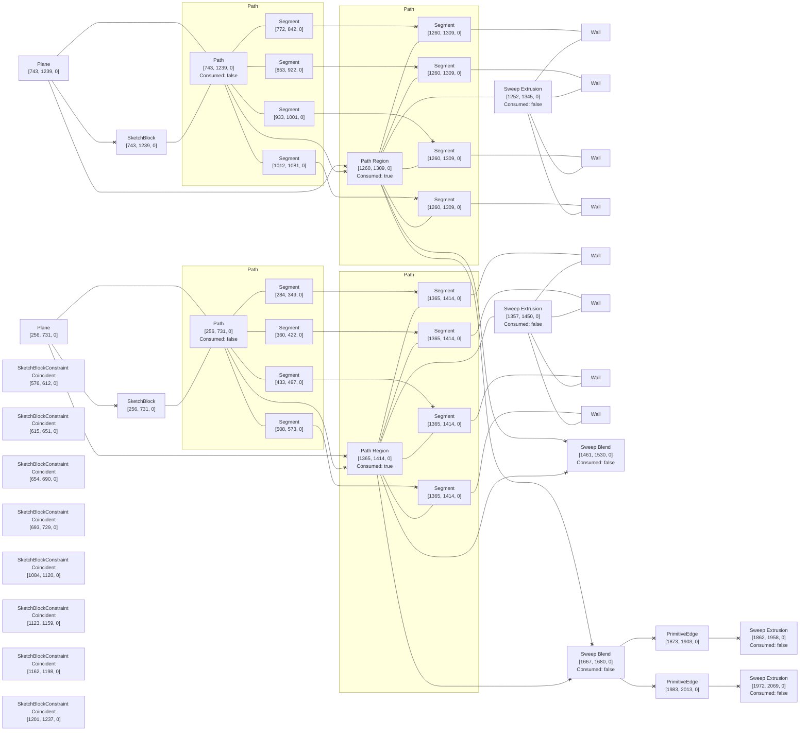

```mermaid
flowchart LR
  subgraph path2 [Path]
    2["Path<br>[256, 731, 0]<br>Consumed: false"]
      %% [ProgramBodyItem { index: 0 }, VariableDeclarationDeclaration, VariableDeclarationInit]
    3["Segment<br>[284, 349, 0]"]
      %% [ProgramBodyItem { index: 0 }, VariableDeclarationDeclaration, VariableDeclarationInit, SketchBlockBody, SketchBlockBodyItem { index: 0 }, VariableDeclarationDeclaration, VariableDeclarationInit]
    4["Segment<br>[360, 422, 0]"]
      %% [ProgramBodyItem { index: 0 }, VariableDeclarationDeclaration, VariableDeclarationInit, SketchBlockBody, SketchBlockBodyItem { index: 1 }, VariableDeclarationDeclaration, VariableDeclarationInit]
    5["Segment<br>[433, 497, 0]"]
      %% [ProgramBodyItem { index: 0 }, VariableDeclarationDeclaration, VariableDeclarationInit, SketchBlockBody, SketchBlockBodyItem { index: 2 }, VariableDeclarationDeclaration, VariableDeclarationInit]
    6["Segment<br>[508, 573, 0]"]
      %% [ProgramBodyItem { index: 0 }, VariableDeclarationDeclaration, VariableDeclarationInit, SketchBlockBody, SketchBlockBodyItem { index: 3 }, VariableDeclarationDeclaration, VariableDeclarationInit]
  end
  subgraph path8 [Path]
    8["Path<br>[743, 1239, 0]<br>Consumed: false"]
      %% [ProgramBodyItem { index: 1 }, VariableDeclarationDeclaration, VariableDeclarationInit]
    9["Segment<br>[772, 842, 0]"]
      %% [ProgramBodyItem { index: 1 }, VariableDeclarationDeclaration, VariableDeclarationInit, SketchBlockBody, SketchBlockBodyItem { index: 0 }, VariableDeclarationDeclaration, VariableDeclarationInit]
    10["Segment<br>[853, 922, 0]"]
      %% [ProgramBodyItem { index: 1 }, VariableDeclarationDeclaration, VariableDeclarationInit, SketchBlockBody, SketchBlockBodyItem { index: 1 }, VariableDeclarationDeclaration, VariableDeclarationInit]
    11["Segment<br>[933, 1001, 0]"]
      %% [ProgramBodyItem { index: 1 }, VariableDeclarationDeclaration, VariableDeclarationInit, SketchBlockBody, SketchBlockBodyItem { index: 2 }, VariableDeclarationDeclaration, VariableDeclarationInit]
    12["Segment<br>[1012, 1081, 0]"]
      %% [ProgramBodyItem { index: 1 }, VariableDeclarationDeclaration, VariableDeclarationInit, SketchBlockBody, SketchBlockBodyItem { index: 3 }, VariableDeclarationDeclaration, VariableDeclarationInit]
  end
  subgraph path13 [Path]
    13["Path Region<br>[1260, 1309, 0]<br>Consumed: true"]
      %% [ProgramBodyItem { index: 2 }, VariableDeclarationDeclaration, VariableDeclarationInit, CallKwUnlabeledArg]
    14["Segment<br>[1260, 1309, 0]"]
      %% [ProgramBodyItem { index: 2 }, VariableDeclarationDeclaration, VariableDeclarationInit, CallKwUnlabeledArg]
    15["Segment<br>[1260, 1309, 0]"]
      %% [ProgramBodyItem { index: 2 }, VariableDeclarationDeclaration, VariableDeclarationInit, CallKwUnlabeledArg]
    16["Segment<br>[1260, 1309, 0]"]
      %% [ProgramBodyItem { index: 2 }, VariableDeclarationDeclaration, VariableDeclarationInit, CallKwUnlabeledArg]
    17["Segment<br>[1260, 1309, 0]"]
      %% [ProgramBodyItem { index: 2 }, VariableDeclarationDeclaration, VariableDeclarationInit, CallKwUnlabeledArg]
  end
  subgraph path23 [Path]
    23["Path Region<br>[1365, 1414, 0]<br>Consumed: true"]
      %% [ProgramBodyItem { index: 3 }, VariableDeclarationDeclaration, VariableDeclarationInit, CallKwUnlabeledArg]
    24["Segment<br>[1365, 1414, 0]"]
      %% [ProgramBodyItem { index: 3 }, VariableDeclarationDeclaration, VariableDeclarationInit, CallKwUnlabeledArg]
    25["Segment<br>[1365, 1414, 0]"]
      %% [ProgramBodyItem { index: 3 }, VariableDeclarationDeclaration, VariableDeclarationInit, CallKwUnlabeledArg]
    26["Segment<br>[1365, 1414, 0]"]
      %% [ProgramBodyItem { index: 3 }, VariableDeclarationDeclaration, VariableDeclarationInit, CallKwUnlabeledArg]
    27["Segment<br>[1365, 1414, 0]"]
      %% [ProgramBodyItem { index: 3 }, VariableDeclarationDeclaration, VariableDeclarationInit, CallKwUnlabeledArg]
  end
  1["Plane<br>[256, 731, 0]"]
    %% [ProgramBodyItem { index: 0 }, VariableDeclarationDeclaration, VariableDeclarationInit]
  7["Plane<br>[743, 1239, 0]"]
    %% [ProgramBodyItem { index: 1 }, VariableDeclarationDeclaration, VariableDeclarationInit]
  18["Sweep Extrusion<br>[1252, 1345, 0]<br>Consumed: false"]
    %% [ProgramBodyItem { index: 2 }, VariableDeclarationDeclaration, VariableDeclarationInit]
  19[Wall]
    %% face_code_ref=Missing NodePath
  20[Wall]
    %% face_code_ref=Missing NodePath
  21[Wall]
    %% face_code_ref=Missing NodePath
  22[Wall]
    %% face_code_ref=Missing NodePath
  28["Sweep Extrusion<br>[1357, 1450, 0]<br>Consumed: false"]
    %% [ProgramBodyItem { index: 3 }, VariableDeclarationDeclaration, VariableDeclarationInit]
  29[Wall]
    %% face_code_ref=Missing NodePath
  30[Wall]
    %% face_code_ref=Missing NodePath
  31[Wall]
    %% face_code_ref=Missing NodePath
  32[Wall]
    %% face_code_ref=Missing NodePath
  33["Sweep Blend<br>[1461, 1530, 0]<br>Consumed: false"]
    %% [ProgramBodyItem { index: 4 }, VariableDeclarationDeclaration, VariableDeclarationInit]
  34["Sweep Blend<br>[1667, 1680, 0]<br>Consumed: false"]
    %% [ProgramBodyItem { index: 5 }, VariableDeclarationDeclaration, VariableDeclarationInit, PipeBodyItem { index: 0 }]
  35["PrimitiveEdge<br>[1873, 1903, 0]"]
    %% [ProgramBodyItem { index: 6 }, VariableDeclarationDeclaration, VariableDeclarationInit, CallKwUnlabeledArg]
  36["Sweep Extrusion<br>[1862, 1958, 0]<br>Consumed: false"]
    %% [ProgramBodyItem { index: 6 }, VariableDeclarationDeclaration, VariableDeclarationInit]
  37["PrimitiveEdge<br>[1983, 2013, 0]"]
    %% [ProgramBodyItem { index: 7 }, VariableDeclarationDeclaration, VariableDeclarationInit, CallKwUnlabeledArg]
  38["Sweep Extrusion<br>[1972, 2069, 0]<br>Consumed: false"]
    %% [ProgramBodyItem { index: 7 }, VariableDeclarationDeclaration, VariableDeclarationInit]
  39["SketchBlock<br>[256, 731, 0]"]
    %% [ProgramBodyItem { index: 0 }, VariableDeclarationDeclaration, VariableDeclarationInit]
  40["SketchBlockConstraint Coincident<br>[576, 612, 0]"]
    %% [ProgramBodyItem { index: 0 }, VariableDeclarationDeclaration, VariableDeclarationInit, SketchBlockBody, SketchBlockBodyItem { index: 4 }, ExpressionStatementExpr]
  41["SketchBlockConstraint Coincident<br>[615, 651, 0]"]
    %% [ProgramBodyItem { index: 0 }, VariableDeclarationDeclaration, VariableDeclarationInit, SketchBlockBody, SketchBlockBodyItem { index: 5 }, ExpressionStatementExpr]
  42["SketchBlockConstraint Coincident<br>[654, 690, 0]"]
    %% [ProgramBodyItem { index: 0 }, VariableDeclarationDeclaration, VariableDeclarationInit, SketchBlockBody, SketchBlockBodyItem { index: 6 }, ExpressionStatementExpr]
  43["SketchBlockConstraint Coincident<br>[693, 729, 0]"]
    %% [ProgramBodyItem { index: 0 }, VariableDeclarationDeclaration, VariableDeclarationInit, SketchBlockBody, SketchBlockBodyItem { index: 7 }, ExpressionStatementExpr]
  44["SketchBlock<br>[743, 1239, 0]"]
    %% [ProgramBodyItem { index: 1 }, VariableDeclarationDeclaration, VariableDeclarationInit]
  45["SketchBlockConstraint Coincident<br>[1084, 1120, 0]"]
    %% [ProgramBodyItem { index: 1 }, VariableDeclarationDeclaration, VariableDeclarationInit, SketchBlockBody, SketchBlockBodyItem { index: 4 }, ExpressionStatementExpr]
  46["SketchBlockConstraint Coincident<br>[1123, 1159, 0]"]
    %% [ProgramBodyItem { index: 1 }, VariableDeclarationDeclaration, VariableDeclarationInit, SketchBlockBody, SketchBlockBodyItem { index: 5 }, ExpressionStatementExpr]
  47["SketchBlockConstraint Coincident<br>[1162, 1198, 0]"]
    %% [ProgramBodyItem { index: 1 }, VariableDeclarationDeclaration, VariableDeclarationInit, SketchBlockBody, SketchBlockBodyItem { index: 6 }, ExpressionStatementExpr]
  48["SketchBlockConstraint Coincident<br>[1201, 1237, 0]"]
    %% [ProgramBodyItem { index: 1 }, VariableDeclarationDeclaration, VariableDeclarationInit, SketchBlockBody, SketchBlockBodyItem { index: 7 }, ExpressionStatementExpr]
  1 --- 2
  1 <--x 23
  1 <--x 39
  2 --- 3
  2 --- 4
  2 --- 5
  2 --- 6
  2 <--x 23
  39 --- 2
  3 <--x 24
  4 <--x 25
  5 <--x 26
  6 <--x 27
  7 --- 8
  7 <--x 13
  7 <--x 44
  8 --- 9
  8 --- 10
  8 --- 11
  8 --- 12
  8 <--x 13
  44 --- 8
  9 <--x 14
  10 <--x 15
  11 <--x 16
  12 <--x 17
  13 --- 14
  13 --- 15
  13 --- 16
  13 --- 17
  13 ---- 18
  13 <---x 33
  13 <---x 34
  14 --- 19
  15 --- 20
  16 --- 21
  17 --- 22
  18 --- 19
  18 --- 20
  18 --- 21
  18 --- 22
  23 --- 24
  23 --- 25
  23 --- 26
  23 --- 27
  23 ---- 28
  23 <---x 33
  23 <---x 34
  24 --- 29
  25 --- 30
  26 --- 31
  27 --- 32
  28 --- 29
  28 --- 30
  28 --- 31
  28 --- 32
  34 <--x 35
  34 <--x 37
  35 <--x 36
  37 <--x 38
```
