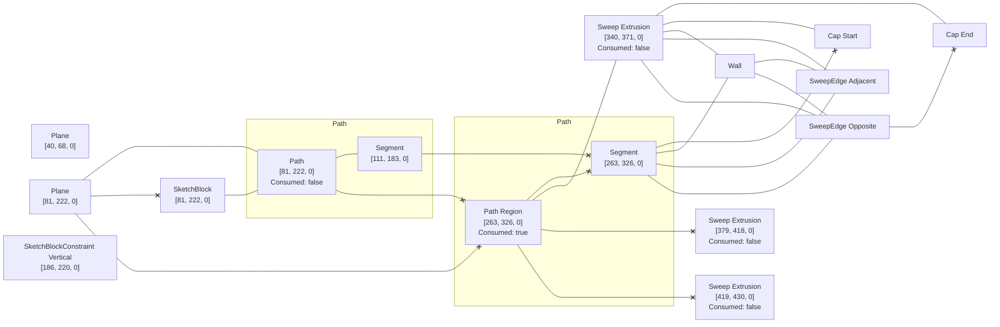

```mermaid
flowchart LR
  subgraph path5 [Path]
    5["Path<br>[81, 222, 0]<br>Consumed: false"]
      %% [ProgramBodyItem { index: 1 }, VariableDeclarationDeclaration, VariableDeclarationInit]
    8["Segment<br>[111, 183, 0]"]
      %% [ProgramBodyItem { index: 1 }, VariableDeclarationDeclaration, VariableDeclarationInit, SketchBlockBody, SketchBlockBodyItem { index: 0 }, VariableDeclarationDeclaration, VariableDeclarationInit]
  end
  subgraph path10 [Path]
    10["Path Region<br>[263, 326, 0]<br>Consumed: true"]
      %% [ProgramBodyItem { index: 3 }, VariableDeclarationDeclaration, VariableDeclarationInit]
    11["Segment<br>[263, 326, 0]"]
      %% [ProgramBodyItem { index: 3 }, VariableDeclarationDeclaration, VariableDeclarationInit]
  end
  1["Cap End"]
    %% face_code_ref=Missing NodePath
  2["Cap Start"]
    %% face_code_ref=Missing NodePath
  3[Wall]
    %% face_code_ref=Missing NodePath
  4["Plane<br>[40, 68, 0]"]
    %% [ProgramBodyItem { index: 0 }, VariableDeclarationDeclaration, VariableDeclarationInit]
  6["Plane<br>[81, 222, 0]"]
    %% [ProgramBodyItem { index: 1 }, VariableDeclarationDeclaration, VariableDeclarationInit]
  7["SketchBlock<br>[81, 222, 0]"]
    %% [ProgramBodyItem { index: 1 }, VariableDeclarationDeclaration, VariableDeclarationInit]
  9["SketchBlockConstraint Vertical<br>[186, 220, 0]"]
    %% [ProgramBodyItem { index: 1 }, VariableDeclarationDeclaration, VariableDeclarationInit, SketchBlockBody, SketchBlockBodyItem { index: 1 }, ExpressionStatementExpr]
  12["Sweep Extrusion<br>[340, 371, 0]<br>Consumed: false"]
    %% [ProgramBodyItem { index: 4 }, VariableDeclarationDeclaration, VariableDeclarationInit]
  13["Sweep Extrusion<br>[379, 418, 0]<br>Consumed: false"]
    %% [ProgramBodyItem { index: 5 }, VariableDeclarationDeclaration, VariableDeclarationInit]
  14["Sweep Extrusion<br>[419, 430, 0]<br>Consumed: false"]
    %% [ProgramBodyItem { index: 6 }, ExpressionStatementExpr, PipeBodyItem { index: 0 }]
  15["SweepEdge Adjacent"]
  16["SweepEdge Opposite"]
  12 --- 1
  16 <--x 1
  11 <--x 2
  12 --- 2
  11 --- 3
  12 --- 3
  3 --- 15
  3 --- 16
  6 --- 5
  7 --- 5
  5 --- 8
  5 <--x 10
  6 <--x 7
  6 <--x 10
  8 <--x 11
  10 <--x 11
  10 ---- 12
  10 <---x 13
  10 <---x 14
  11 --- 15
  11 --- 16
  12 --- 15
  12 --- 16
```
