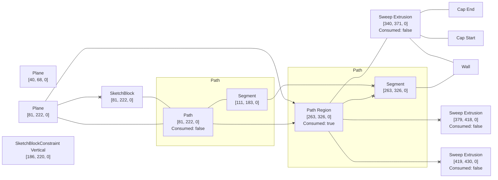

```mermaid
flowchart LR
  subgraph path3 [Path]
    3["Path Region<br>[263, 326, 0]<br>Consumed: true"]
      %% [ProgramBodyItem { index: 3 }, VariableDeclarationDeclaration, VariableDeclarationInit]
    8["Segment<br>[263, 326, 0]"]
      %% [ProgramBodyItem { index: 3 }, VariableDeclarationDeclaration, VariableDeclarationInit]
  end
  subgraph path4 [Path]
    4["Path<br>[81, 222, 0]<br>Consumed: false"]
      %% [ProgramBodyItem { index: 1 }, VariableDeclarationDeclaration, VariableDeclarationInit]
    7["Segment<br>[111, 183, 0]"]
      %% [ProgramBodyItem { index: 1 }, VariableDeclarationDeclaration, VariableDeclarationInit, SketchBlockBody, SketchBlockBodyItem { index: 0 }, VariableDeclarationDeclaration, VariableDeclarationInit]
  end
  1["Cap End"]
    %% face_code_ref=Missing NodePath
  2["Cap Start"]
    %% face_code_ref=Missing NodePath
  5["Plane<br>[40, 68, 0]"]
    %% [ProgramBodyItem { index: 0 }, VariableDeclarationDeclaration, VariableDeclarationInit]
  6["Plane<br>[81, 222, 0]"]
    %% [ProgramBodyItem { index: 1 }, VariableDeclarationDeclaration, VariableDeclarationInit]
  9["SketchBlock<br>[81, 222, 0]"]
    %% [ProgramBodyItem { index: 1 }, VariableDeclarationDeclaration, VariableDeclarationInit]
  10["SketchBlockConstraint Vertical<br>[186, 220, 0]"]
    %% [ProgramBodyItem { index: 1 }, VariableDeclarationDeclaration, VariableDeclarationInit, SketchBlockBody, SketchBlockBodyItem { index: 1 }, ExpressionStatementExpr]
  11["Sweep Extrusion<br>[340, 371, 0]<br>Consumed: false"]
    %% [ProgramBodyItem { index: 4 }, VariableDeclarationDeclaration, VariableDeclarationInit]
  12["Sweep Extrusion<br>[379, 418, 0]<br>Consumed: false"]
    %% [ProgramBodyItem { index: 5 }, VariableDeclarationDeclaration, VariableDeclarationInit]
  13["Sweep Extrusion<br>[419, 430, 0]<br>Consumed: false"]
    %% [ProgramBodyItem { index: 6 }, ExpressionStatementExpr, PipeBodyItem { index: 0 }]
  14[Wall]
    %% face_code_ref=Missing NodePath
  11 --- 1
  11 --- 2
  4 x--> 3
  6 x--> 3
  3 <--x 8
  3 ---- 11
  3 <---x 12
  3 <---x 13
  6 --- 4
  4 --- 7
  9 --- 4
  6 <--x 9
  7 <--x 8
  8 --- 14
  11 --- 14
```
