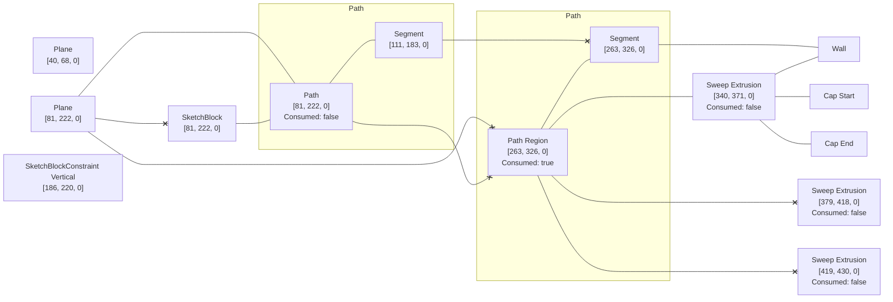

```mermaid
flowchart LR
  subgraph path3 [Path]
    3["Path<br>[81, 222, 0]<br>Consumed: false"]
      %% [ProgramBodyItem { index: 1 }, VariableDeclarationDeclaration, VariableDeclarationInit]
    4["Segment<br>[111, 183, 0]"]
      %% [ProgramBodyItem { index: 1 }, VariableDeclarationDeclaration, VariableDeclarationInit, SketchBlockBody, SketchBlockBodyItem { index: 0 }, VariableDeclarationDeclaration, VariableDeclarationInit]
  end
  subgraph path5 [Path]
    5["Path Region<br>[263, 326, 0]<br>Consumed: true"]
      %% [ProgramBodyItem { index: 3 }, VariableDeclarationDeclaration, VariableDeclarationInit]
    6["Segment<br>[263, 326, 0]"]
      %% [ProgramBodyItem { index: 3 }, VariableDeclarationDeclaration, VariableDeclarationInit]
  end
  1["Plane<br>[40, 68, 0]"]
    %% [ProgramBodyItem { index: 0 }, VariableDeclarationDeclaration, VariableDeclarationInit]
  2["Plane<br>[81, 222, 0]"]
    %% [ProgramBodyItem { index: 1 }, VariableDeclarationDeclaration, VariableDeclarationInit]
  7["Sweep Extrusion<br>[340, 371, 0]<br>Consumed: false"]
    %% [ProgramBodyItem { index: 4 }, VariableDeclarationDeclaration, VariableDeclarationInit]
  8[Wall]
    %% face_code_ref=Missing NodePath
  9["Cap Start"]
    %% face_code_ref=Missing NodePath
  10["Cap End"]
    %% face_code_ref=Missing NodePath
  11["Sweep Extrusion<br>[379, 418, 0]<br>Consumed: false"]
    %% [ProgramBodyItem { index: 5 }, VariableDeclarationDeclaration, VariableDeclarationInit]
  12["Sweep Extrusion<br>[419, 430, 0]<br>Consumed: false"]
    %% [ProgramBodyItem { index: 6 }, ExpressionStatementExpr, PipeBodyItem { index: 0 }]
  13["SketchBlock<br>[81, 222, 0]"]
    %% [ProgramBodyItem { index: 1 }, VariableDeclarationDeclaration, VariableDeclarationInit]
  14["SketchBlockConstraint Vertical<br>[186, 220, 0]"]
    %% [ProgramBodyItem { index: 1 }, VariableDeclarationDeclaration, VariableDeclarationInit, SketchBlockBody, SketchBlockBodyItem { index: 1 }, ExpressionStatementExpr]
  2 --- 3
  2 <--x 5
  2 <--x 13
  3 --- 4
  3 <--x 5
  13 --- 3
  4 <--x 6
  5 --- 6
  5 ---- 7
  5 <---x 11
  5 <---x 12
  6 --- 8
  7 --- 8
  7 --- 9
  7 --- 10
```
