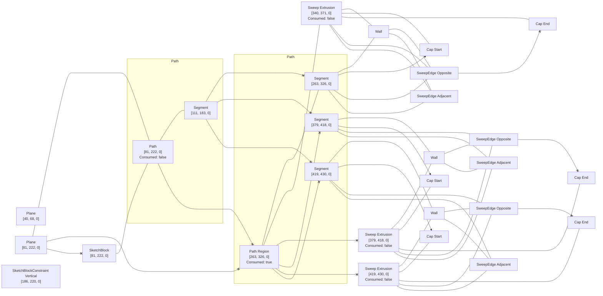

```mermaid
flowchart LR
  subgraph path3 [Path]
    3["Path<br>[81, 222, 0]<br>Consumed: false"]
      %% [ProgramBodyItem { index: 1 }, VariableDeclarationDeclaration, VariableDeclarationInit]
    4["Segment<br>[111, 183, 0]"]
      %% [ProgramBodyItem { index: 1 }, VariableDeclarationDeclaration, VariableDeclarationInit, SketchBlockBody, SketchBlockBodyItem { index: 0 }, VariableDeclarationDeclaration, VariableDeclarationInit]
  end
  subgraph path5 [Path]
    5["Path Region<br>[263, 326, 0]<br>Consumed: true"]
      %% [ProgramBodyItem { index: 3 }, VariableDeclarationDeclaration, VariableDeclarationInit]
    6["Segment<br>[263, 326, 0]"]
      %% [ProgramBodyItem { index: 3 }, VariableDeclarationDeclaration, VariableDeclarationInit]
    14["Segment<br>[379, 418, 0]"]
      %% [ProgramBodyItem { index: 5 }, VariableDeclarationDeclaration, VariableDeclarationInit]
    21["Segment<br>[419, 430, 0]"]
      %% [ProgramBodyItem { index: 6 }, ExpressionStatementExpr, PipeBodyItem { index: 0 }]
  end
  1["Plane<br>[40, 68, 0]"]
    %% [ProgramBodyItem { index: 0 }, VariableDeclarationDeclaration, VariableDeclarationInit]
  2["Plane<br>[81, 222, 0]"]
    %% [ProgramBodyItem { index: 1 }, VariableDeclarationDeclaration, VariableDeclarationInit]
  7["Sweep Extrusion<br>[340, 371, 0]<br>Consumed: false"]
    %% [ProgramBodyItem { index: 4 }, VariableDeclarationDeclaration, VariableDeclarationInit]
  8[Wall]
    %% face_code_ref=Missing NodePath
  9["Cap Start"]
    %% face_code_ref=Missing NodePath
  10["Cap End"]
    %% face_code_ref=Missing NodePath
  11["SweepEdge Opposite"]
  12["SweepEdge Adjacent"]
  13["Sweep Extrusion<br>[379, 418, 0]<br>Consumed: false"]
    %% [ProgramBodyItem { index: 5 }, VariableDeclarationDeclaration, VariableDeclarationInit]
  15[Wall]
    %% face_code_ref=Missing NodePath
  16["Cap Start"]
    %% face_code_ref=Missing NodePath
  17["Cap End"]
    %% face_code_ref=Missing NodePath
  18["SweepEdge Opposite"]
  19["SweepEdge Adjacent"]
  20["Sweep Extrusion<br>[419, 430, 0]<br>Consumed: false"]
    %% [ProgramBodyItem { index: 6 }, ExpressionStatementExpr, PipeBodyItem { index: 0 }]
  22[Wall]
    %% face_code_ref=Missing NodePath
  23["Cap Start"]
    %% face_code_ref=Missing NodePath
  24["Cap End"]
    %% face_code_ref=Missing NodePath
  25["SweepEdge Opposite"]
  26["SweepEdge Adjacent"]
  27["SketchBlock<br>[81, 222, 0]"]
    %% [ProgramBodyItem { index: 1 }, VariableDeclarationDeclaration, VariableDeclarationInit]
  28["SketchBlockConstraint Vertical<br>[186, 220, 0]"]
    %% [ProgramBodyItem { index: 1 }, VariableDeclarationDeclaration, VariableDeclarationInit, SketchBlockBody, SketchBlockBodyItem { index: 1 }, ExpressionStatementExpr]
  2 --- 3
  2 <--x 5
  2 <--x 27
  3 --- 4
  3 <--x 5
  27 --- 3
  4 <--x 6
  4 <--x 14
  4 <--x 21
  5 --- 6
  5 ---- 7
  5 <---x 13
  5 <--x 14
  5 <---x 20
  5 <--x 21
  6 --- 8
  6 x--> 9
  6 --- 11
  6 --- 12
  7 --- 8
  7 --- 9
  7 --- 10
  7 --- 11
  7 --- 12
  8 --- 11
  8 --- 12
  11 <--x 10
  13 --- 15
  13 --- 16
  13 --- 17
  13 --- 18
  13 --- 19
  14 --- 15
  14 x--> 16
  14 --- 18
  14 --- 19
  15 --- 18
  15 --- 19
  18 <--x 17
  20 --- 22
  20 --- 23
  20 --- 24
  20 --- 25
  20 --- 26
  21 --- 22
  21 x--> 23
  21 --- 25
  21 --- 26
  22 --- 25
  22 --- 26
  25 <--x 24
```
