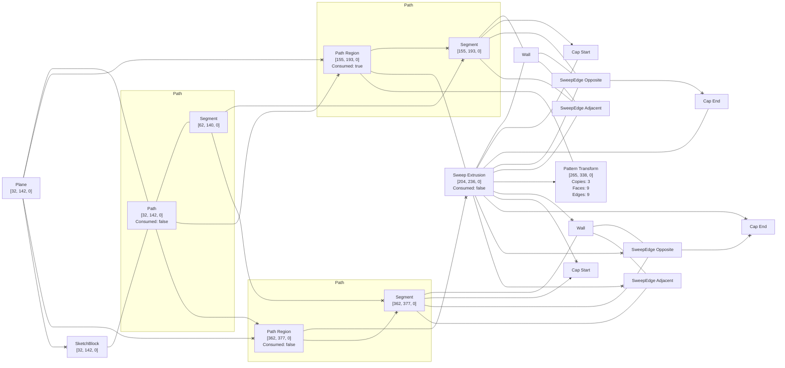

```mermaid
flowchart LR
  subgraph path2 [Path]
    2["Path<br>[32, 142, 0]<br>Consumed: false"]
      %% [ProgramBodyItem { index: 0 }, VariableDeclarationDeclaration, VariableDeclarationInit]
    3["Segment<br>[62, 140, 0]"]
      %% [ProgramBodyItem { index: 0 }, VariableDeclarationDeclaration, VariableDeclarationInit, SketchBlockBody, SketchBlockBodyItem { index: 0 }, VariableDeclarationDeclaration, VariableDeclarationInit]
  end
  subgraph path4 [Path]
    4["Path Region<br>[155, 193, 0]<br>Consumed: true"]
      %% [ProgramBodyItem { index: 1 }, VariableDeclarationDeclaration, VariableDeclarationInit]
    5["Segment<br>[155, 193, 0]"]
      %% [ProgramBodyItem { index: 1 }, VariableDeclarationDeclaration, VariableDeclarationInit]
  end
  subgraph path13 [Path]
    13["Path Region<br>[362, 377, 0]<br>Consumed: false"]
      %% [ProgramBodyItem { index: 4 }, ExpressionStatementExpr, PipeBodyItem { index: 0 }]
    14["Segment<br>[362, 377, 0]"]
      %% [ProgramBodyItem { index: 4 }, ExpressionStatementExpr, PipeBodyItem { index: 0 }]
  end
  1["Plane<br>[32, 142, 0]"]
    %% [ProgramBodyItem { index: 0 }, VariableDeclarationDeclaration, VariableDeclarationInit]
  6["Sweep Extrusion<br>[204, 236, 0]<br>Consumed: false"]
    %% [ProgramBodyItem { index: 2 }, VariableDeclarationDeclaration, VariableDeclarationInit]
  7[Wall]
    %% face_code_ref=Missing NodePath
  8["Cap Start"]
    %% face_code_ref=Missing NodePath
  9["Cap End"]
    %% face_code_ref=Missing NodePath
  10["SweepEdge Opposite"]
  11["SweepEdge Adjacent"]
  12["Pattern Transform<br>[265, 338, 0]<br>Copies: 3<br>Faces: 9<br>Edges: 9"]
    %% [ProgramBodyItem { index: 3 }, VariableDeclarationDeclaration, VariableDeclarationInit]
  15[Wall]
    %% face_code_ref=Missing NodePath
  16["Cap Start"]
    %% face_code_ref=Missing NodePath
  17["Cap End"]
    %% face_code_ref=Missing NodePath
  18["SweepEdge Opposite"]
  19["SweepEdge Adjacent"]
  20["SketchBlock<br>[32, 142, 0]"]
    %% [ProgramBodyItem { index: 0 }, VariableDeclarationDeclaration, VariableDeclarationInit]
  1 --- 2
  1 <--x 4
  1 <--x 13
  1 <--x 20
  2 --- 3
  2 <--x 4
  2 <--x 13
  20 --- 2
  3 <--x 5
  3 <--x 14
  4 <--x 5
  4 ---- 6
  4 --- 12
  5 --- 7
  5 x--> 8
  5 --- 10
  5 --- 11
  6 --- 7
  6 --- 8
  6 --- 9
  6 --- 10
  6 --- 11
  6 x--> 12
  13 <---x 6
  6 <--x 15
  6 <--x 16
  6 <--x 17
  6 <--x 18
  6 <--x 19
  7 --- 10
  7 --- 11
  10 <--x 9
  13 <--x 14
  14 --- 15
  14 x--> 16
  14 --- 18
  14 --- 19
  15 --- 18
  15 --- 19
  18 <--x 17
```
