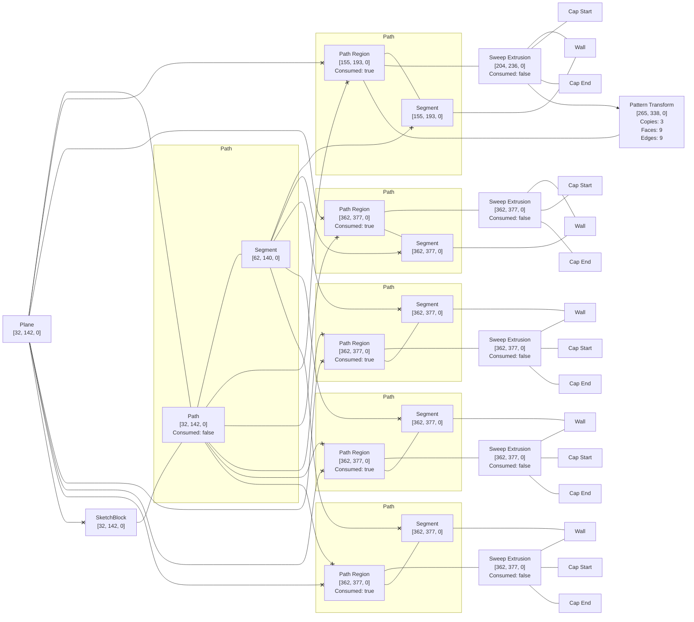

```mermaid
flowchart LR
  subgraph path2 [Path]
    2["Path<br>[32, 142, 0]<br>Consumed: false"]
      %% [ProgramBodyItem { index: 0 }, VariableDeclarationDeclaration, VariableDeclarationInit]
    3["Segment<br>[62, 140, 0]"]
      %% [ProgramBodyItem { index: 0 }, VariableDeclarationDeclaration, VariableDeclarationInit, SketchBlockBody, SketchBlockBodyItem { index: 0 }, VariableDeclarationDeclaration, VariableDeclarationInit]
  end
  subgraph path4 [Path]
    4["Path Region<br>[155, 193, 0]<br>Consumed: true"]
      %% [ProgramBodyItem { index: 1 }, VariableDeclarationDeclaration, VariableDeclarationInit]
    5["Segment<br>[155, 193, 0]"]
      %% [ProgramBodyItem { index: 1 }, VariableDeclarationDeclaration, VariableDeclarationInit]
  end
  subgraph path12 [Path]
    12["Path Region<br>[362, 377, 0]<br>Consumed: true"]
      %% [ProgramBodyItem { index: 4 }, ExpressionStatementExpr, PipeBodyItem { index: 0 }]
    13["Segment<br>[362, 377, 0]"]
      %% [ProgramBodyItem { index: 4 }, ExpressionStatementExpr, PipeBodyItem { index: 0 }]
  end
  subgraph path18 [Path]
    18["Path Region<br>[362, 377, 0]<br>Consumed: true"]
      %% [ProgramBodyItem { index: 4 }, ExpressionStatementExpr, PipeBodyItem { index: 0 }]
    19["Segment<br>[362, 377, 0]"]
      %% [ProgramBodyItem { index: 4 }, ExpressionStatementExpr, PipeBodyItem { index: 0 }]
  end
  subgraph path24 [Path]
    24["Path Region<br>[362, 377, 0]<br>Consumed: true"]
      %% [ProgramBodyItem { index: 4 }, ExpressionStatementExpr, PipeBodyItem { index: 0 }]
    25["Segment<br>[362, 377, 0]"]
      %% [ProgramBodyItem { index: 4 }, ExpressionStatementExpr, PipeBodyItem { index: 0 }]
  end
  subgraph path30 [Path]
    30["Path Region<br>[362, 377, 0]<br>Consumed: true"]
      %% [ProgramBodyItem { index: 4 }, ExpressionStatementExpr, PipeBodyItem { index: 0 }]
    31["Segment<br>[362, 377, 0]"]
      %% [ProgramBodyItem { index: 4 }, ExpressionStatementExpr, PipeBodyItem { index: 0 }]
  end
  1["Plane<br>[32, 142, 0]"]
    %% [ProgramBodyItem { index: 0 }, VariableDeclarationDeclaration, VariableDeclarationInit]
  6["Sweep Extrusion<br>[204, 236, 0]<br>Consumed: false"]
    %% [ProgramBodyItem { index: 2 }, VariableDeclarationDeclaration, VariableDeclarationInit]
  7[Wall]
    %% face_code_ref=Missing NodePath
  8["Cap Start"]
    %% face_code_ref=Missing NodePath
  9["Cap End"]
    %% face_code_ref=Missing NodePath
  10["Pattern Transform<br>[265, 338, 0]<br>Copies: 3<br>Faces: 9<br>Edges: 9"]
    %% [ProgramBodyItem { index: 3 }, VariableDeclarationDeclaration, VariableDeclarationInit]
  11["Sweep Extrusion<br>[362, 377, 0]<br>Consumed: false"]
    %% [ProgramBodyItem { index: 4 }, ExpressionStatementExpr, PipeBodyItem { index: 0 }]
  14[Wall]
    %% face_code_ref=Missing NodePath
  15["Cap Start"]
    %% face_code_ref=Missing NodePath
  16["Cap End"]
    %% face_code_ref=Missing NodePath
  17["Sweep Extrusion<br>[362, 377, 0]<br>Consumed: false"]
    %% [ProgramBodyItem { index: 4 }, ExpressionStatementExpr, PipeBodyItem { index: 0 }]
  20[Wall]
    %% face_code_ref=Missing NodePath
  21["Cap Start"]
    %% face_code_ref=Missing NodePath
  22["Cap End"]
    %% face_code_ref=Missing NodePath
  23["Sweep Extrusion<br>[362, 377, 0]<br>Consumed: false"]
    %% [ProgramBodyItem { index: 4 }, ExpressionStatementExpr, PipeBodyItem { index: 0 }]
  26[Wall]
    %% face_code_ref=Missing NodePath
  27["Cap Start"]
    %% face_code_ref=Missing NodePath
  28["Cap End"]
    %% face_code_ref=Missing NodePath
  29["Sweep Extrusion<br>[362, 377, 0]<br>Consumed: false"]
    %% [ProgramBodyItem { index: 4 }, ExpressionStatementExpr, PipeBodyItem { index: 0 }]
  32[Wall]
    %% face_code_ref=Missing NodePath
  33["Cap Start"]
    %% face_code_ref=Missing NodePath
  34["Cap End"]
    %% face_code_ref=Missing NodePath
  35["SketchBlock<br>[32, 142, 0]"]
    %% [ProgramBodyItem { index: 0 }, VariableDeclarationDeclaration, VariableDeclarationInit]
  1 --- 2
  1 <--x 4
  1 <--x 12
  1 <--x 18
  1 <--x 24
  1 <--x 30
  1 <--x 35
  2 --- 3
  2 <--x 4
  2 <--x 12
  2 <--x 18
  2 <--x 24
  2 <--x 30
  35 --- 2
  3 <--x 5
  3 <--x 13
  3 <--x 19
  3 <--x 25
  3 <--x 31
  4 --- 5
  4 ---- 6
  4 --- 10
  5 --- 7
  6 --- 7
  6 --- 8
  6 --- 9
  6 x--> 10
  12 ---- 11
  11 --- 14
  11 --- 15
  11 --- 16
  12 --- 13
  13 --- 14
  18 ---- 17
  17 --- 20
  17 --- 21
  17 --- 22
  18 --- 19
  19 --- 20
  24 ---- 23
  23 --- 26
  23 --- 27
  23 --- 28
  24 --- 25
  25 --- 26
  30 ---- 29
  29 --- 32
  29 --- 33
  29 --- 34
  30 --- 31
  31 --- 32
```
