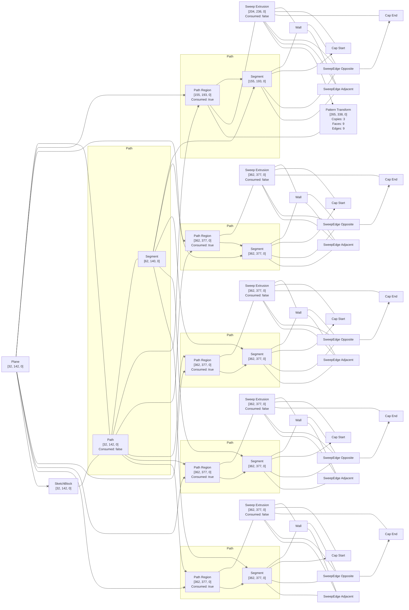

```mermaid
flowchart LR
  subgraph path2 [Path]
    2["Path<br>[32, 142, 0]<br>Consumed: false"]
      %% [ProgramBodyItem { index: 0 }, VariableDeclarationDeclaration, VariableDeclarationInit]
    3["Segment<br>[62, 140, 0]"]
      %% [ProgramBodyItem { index: 0 }, VariableDeclarationDeclaration, VariableDeclarationInit, SketchBlockBody, SketchBlockBodyItem { index: 0 }, VariableDeclarationDeclaration, VariableDeclarationInit]
  end
  subgraph path4 [Path]
    4["Path Region<br>[155, 193, 0]<br>Consumed: true"]
      %% [ProgramBodyItem { index: 1 }, VariableDeclarationDeclaration, VariableDeclarationInit]
    5["Segment<br>[155, 193, 0]"]
      %% [ProgramBodyItem { index: 1 }, VariableDeclarationDeclaration, VariableDeclarationInit]
  end
  subgraph path14 [Path]
    14["Path Region<br>[362, 377, 0]<br>Consumed: true"]
      %% [ProgramBodyItem { index: 4 }, ExpressionStatementExpr, PipeBodyItem { index: 0 }]
    15["Segment<br>[362, 377, 0]"]
      %% [ProgramBodyItem { index: 4 }, ExpressionStatementExpr, PipeBodyItem { index: 0 }]
  end
  subgraph path22 [Path]
    22["Path Region<br>[362, 377, 0]<br>Consumed: true"]
      %% [ProgramBodyItem { index: 4 }, ExpressionStatementExpr, PipeBodyItem { index: 0 }]
    23["Segment<br>[362, 377, 0]"]
      %% [ProgramBodyItem { index: 4 }, ExpressionStatementExpr, PipeBodyItem { index: 0 }]
  end
  subgraph path30 [Path]
    30["Path Region<br>[362, 377, 0]<br>Consumed: true"]
      %% [ProgramBodyItem { index: 4 }, ExpressionStatementExpr, PipeBodyItem { index: 0 }]
    31["Segment<br>[362, 377, 0]"]
      %% [ProgramBodyItem { index: 4 }, ExpressionStatementExpr, PipeBodyItem { index: 0 }]
  end
  subgraph path38 [Path]
    38["Path Region<br>[362, 377, 0]<br>Consumed: true"]
      %% [ProgramBodyItem { index: 4 }, ExpressionStatementExpr, PipeBodyItem { index: 0 }]
    39["Segment<br>[362, 377, 0]"]
      %% [ProgramBodyItem { index: 4 }, ExpressionStatementExpr, PipeBodyItem { index: 0 }]
  end
  1["Plane<br>[32, 142, 0]"]
    %% [ProgramBodyItem { index: 0 }, VariableDeclarationDeclaration, VariableDeclarationInit]
  6["Sweep Extrusion<br>[204, 236, 0]<br>Consumed: false"]
    %% [ProgramBodyItem { index: 2 }, VariableDeclarationDeclaration, VariableDeclarationInit]
  7[Wall]
    %% face_code_ref=Missing NodePath
  8["Cap Start"]
    %% face_code_ref=Missing NodePath
  9["Cap End"]
    %% face_code_ref=Missing NodePath
  10["SweepEdge Opposite"]
  11["SweepEdge Adjacent"]
  12["Pattern Transform<br>[265, 338, 0]<br>Copies: 3<br>Faces: 9<br>Edges: 9"]
    %% [ProgramBodyItem { index: 3 }, VariableDeclarationDeclaration, VariableDeclarationInit]
  13["Sweep Extrusion<br>[362, 377, 0]<br>Consumed: false"]
    %% [ProgramBodyItem { index: 4 }, ExpressionStatementExpr, PipeBodyItem { index: 0 }]
  16[Wall]
    %% face_code_ref=Missing NodePath
  17["Cap Start"]
    %% face_code_ref=Missing NodePath
  18["Cap End"]
    %% face_code_ref=Missing NodePath
  19["SweepEdge Opposite"]
  20["SweepEdge Adjacent"]
  21["Sweep Extrusion<br>[362, 377, 0]<br>Consumed: false"]
    %% [ProgramBodyItem { index: 4 }, ExpressionStatementExpr, PipeBodyItem { index: 0 }]
  24[Wall]
    %% face_code_ref=Missing NodePath
  25["Cap Start"]
    %% face_code_ref=Missing NodePath
  26["Cap End"]
    %% face_code_ref=Missing NodePath
  27["SweepEdge Opposite"]
  28["SweepEdge Adjacent"]
  29["Sweep Extrusion<br>[362, 377, 0]<br>Consumed: false"]
    %% [ProgramBodyItem { index: 4 }, ExpressionStatementExpr, PipeBodyItem { index: 0 }]
  32[Wall]
    %% face_code_ref=Missing NodePath
  33["Cap Start"]
    %% face_code_ref=Missing NodePath
  34["Cap End"]
    %% face_code_ref=Missing NodePath
  35["SweepEdge Opposite"]
  36["SweepEdge Adjacent"]
  37["Sweep Extrusion<br>[362, 377, 0]<br>Consumed: false"]
    %% [ProgramBodyItem { index: 4 }, ExpressionStatementExpr, PipeBodyItem { index: 0 }]
  40[Wall]
    %% face_code_ref=Missing NodePath
  41["Cap Start"]
    %% face_code_ref=Missing NodePath
  42["Cap End"]
    %% face_code_ref=Missing NodePath
  43["SweepEdge Opposite"]
  44["SweepEdge Adjacent"]
  45["SketchBlock<br>[32, 142, 0]"]
    %% [ProgramBodyItem { index: 0 }, VariableDeclarationDeclaration, VariableDeclarationInit]
  1 --- 2
  1 <--x 4
  1 <--x 14
  1 <--x 22
  1 <--x 30
  1 <--x 38
  1 <--x 45
  2 --- 3
  2 <--x 4
  2 <--x 14
  2 <--x 22
  2 <--x 30
  2 <--x 38
  45 --- 2
  3 <--x 5
  3 <--x 15
  3 <--x 23
  3 <--x 31
  3 <--x 39
  4 <--x 5
  4 ---- 6
  4 --- 12
  5 --- 7
  5 x--> 8
  5 --- 10
  5 --- 11
  6 --- 7
  6 --- 8
  6 --- 9
  6 --- 10
  6 --- 11
  6 x--> 12
  7 --- 10
  7 --- 11
  10 <--x 9
  14 ---- 13
  13 --- 16
  13 --- 17
  13 --- 18
  13 --- 19
  13 --- 20
  14 <--x 15
  15 --- 16
  15 x--> 17
  15 --- 19
  15 --- 20
  16 --- 19
  16 --- 20
  19 <--x 18
  22 ---- 21
  21 --- 24
  21 --- 25
  21 --- 26
  21 --- 27
  21 --- 28
  22 <--x 23
  23 --- 24
  23 x--> 25
  23 --- 27
  23 --- 28
  24 --- 27
  24 --- 28
  27 <--x 26
  30 ---- 29
  29 --- 32
  29 --- 33
  29 --- 34
  29 --- 35
  29 --- 36
  30 <--x 31
  31 --- 32
  31 x--> 33
  31 --- 35
  31 --- 36
  32 --- 35
  32 --- 36
  35 <--x 34
  38 ---- 37
  37 --- 40
  37 --- 41
  37 --- 42
  37 --- 43
  37 --- 44
  38 <--x 39
  39 --- 40
  39 x--> 41
  39 --- 43
  39 --- 44
  40 --- 43
  40 --- 44
  43 <--x 42
```
