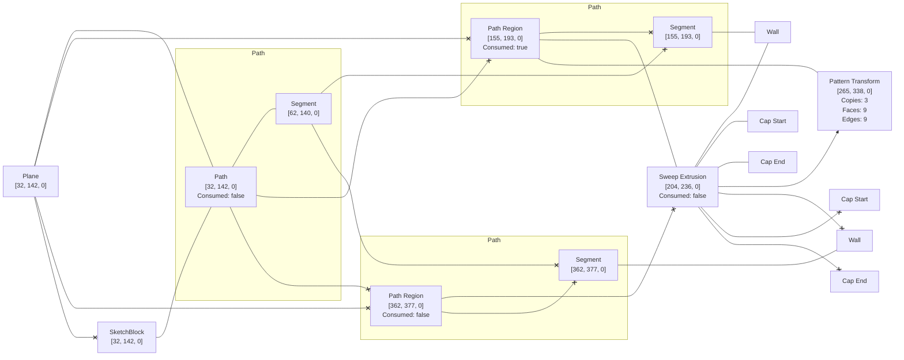

```mermaid
flowchart LR
  subgraph path2 [Path]
    2["Path<br>[32, 142, 0]<br>Consumed: false"]
      %% [ProgramBodyItem { index: 0 }, VariableDeclarationDeclaration, VariableDeclarationInit]
    3["Segment<br>[62, 140, 0]"]
      %% [ProgramBodyItem { index: 0 }, VariableDeclarationDeclaration, VariableDeclarationInit, SketchBlockBody, SketchBlockBodyItem { index: 0 }, VariableDeclarationDeclaration, VariableDeclarationInit]
  end
  subgraph path4 [Path]
    4["Path Region<br>[155, 193, 0]<br>Consumed: true"]
      %% [ProgramBodyItem { index: 1 }, VariableDeclarationDeclaration, VariableDeclarationInit]
    5["Segment<br>[155, 193, 0]"]
      %% [ProgramBodyItem { index: 1 }, VariableDeclarationDeclaration, VariableDeclarationInit]
  end
  subgraph path11 [Path]
    11["Path Region<br>[362, 377, 0]<br>Consumed: false"]
      %% [ProgramBodyItem { index: 4 }, ExpressionStatementExpr, PipeBodyItem { index: 0 }]
    12["Segment<br>[362, 377, 0]"]
      %% [ProgramBodyItem { index: 4 }, ExpressionStatementExpr, PipeBodyItem { index: 0 }]
  end
  1["Plane<br>[32, 142, 0]"]
    %% [ProgramBodyItem { index: 0 }, VariableDeclarationDeclaration, VariableDeclarationInit]
  6["Sweep Extrusion<br>[204, 236, 0]<br>Consumed: false"]
    %% [ProgramBodyItem { index: 2 }, VariableDeclarationDeclaration, VariableDeclarationInit]
  7[Wall]
    %% face_code_ref=Missing NodePath
  8["Cap Start"]
    %% face_code_ref=Missing NodePath
  9["Cap End"]
    %% face_code_ref=Missing NodePath
  10["Pattern Transform<br>[265, 338, 0]<br>Copies: 3<br>Faces: 9<br>Edges: 9"]
    %% [ProgramBodyItem { index: 3 }, VariableDeclarationDeclaration, VariableDeclarationInit]
  13[Wall]
    %% face_code_ref=Missing NodePath
  14["Cap Start"]
    %% face_code_ref=Missing NodePath
  15["Cap End"]
    %% face_code_ref=Missing NodePath
  16["SketchBlock<br>[32, 142, 0]"]
    %% [ProgramBodyItem { index: 0 }, VariableDeclarationDeclaration, VariableDeclarationInit]
  1 --- 2
  1 <--x 4
  1 <--x 11
  1 <--x 16
  2 --- 3
  2 <--x 4
  2 <--x 11
  16 --- 2
  3 <--x 5
  3 <--x 12
  4 <--x 5
  4 ---- 6
  4 --- 10
  5 --- 7
  6 --- 7
  6 --- 8
  6 --- 9
  6 x--> 10
  11 <---x 6
  6 <--x 13
  6 <--x 14
  6 <--x 15
  11 <--x 12
  12 --- 13
```
