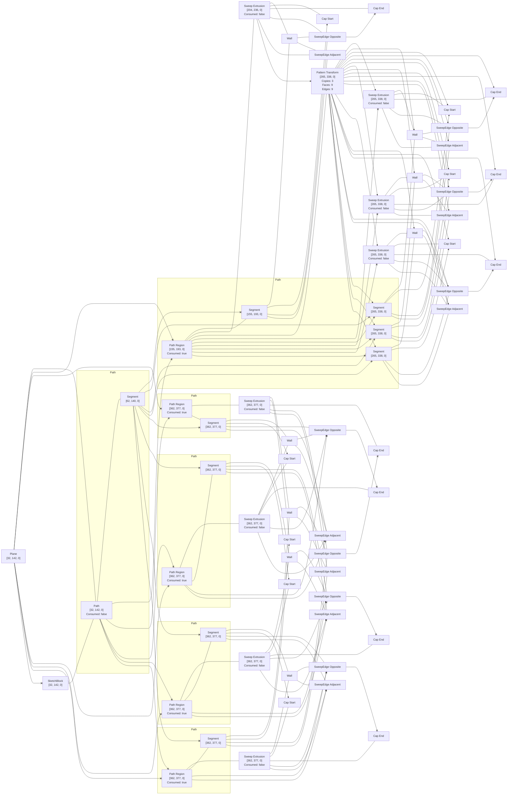

```mermaid
flowchart LR
  subgraph path2 [Path]
    2["Path<br>[32, 142, 0]<br>Consumed: false"]
      %% [ProgramBodyItem { index: 0 }, VariableDeclarationDeclaration, VariableDeclarationInit]
    3["Segment<br>[62, 140, 0]"]
      %% [ProgramBodyItem { index: 0 }, VariableDeclarationDeclaration, VariableDeclarationInit, SketchBlockBody, SketchBlockBodyItem { index: 0 }, VariableDeclarationDeclaration, VariableDeclarationInit]
  end
  subgraph path4 [Path]
    4["Path Region<br>[155, 193, 0]<br>Consumed: true"]
      %% [ProgramBodyItem { index: 1 }, VariableDeclarationDeclaration, VariableDeclarationInit]
    5["Segment<br>[155, 193, 0]"]
      %% [ProgramBodyItem { index: 1 }, VariableDeclarationDeclaration, VariableDeclarationInit]
    14["Segment<br>[265, 338, 0]"]
      %% [ProgramBodyItem { index: 3 }, VariableDeclarationDeclaration, VariableDeclarationInit]
    21["Segment<br>[265, 338, 0]"]
      %% [ProgramBodyItem { index: 3 }, VariableDeclarationDeclaration, VariableDeclarationInit]
    28["Segment<br>[265, 338, 0]"]
      %% [ProgramBodyItem { index: 3 }, VariableDeclarationDeclaration, VariableDeclarationInit]
  end
  subgraph path35 [Path]
    35["Path Region<br>[362, 377, 0]<br>Consumed: true"]
      %% [ProgramBodyItem { index: 4 }, ExpressionStatementExpr, PipeBodyItem { index: 0 }]
    36["Segment<br>[362, 377, 0]"]
      %% [ProgramBodyItem { index: 4 }, ExpressionStatementExpr, PipeBodyItem { index: 0 }]
  end
  subgraph path43 [Path]
    43["Path Region<br>[362, 377, 0]<br>Consumed: true"]
      %% [ProgramBodyItem { index: 4 }, ExpressionStatementExpr, PipeBodyItem { index: 0 }]
    44["Segment<br>[362, 377, 0]"]
      %% [ProgramBodyItem { index: 4 }, ExpressionStatementExpr, PipeBodyItem { index: 0 }]
  end
  subgraph path51 [Path]
    51["Path Region<br>[362, 377, 0]<br>Consumed: true"]
      %% [ProgramBodyItem { index: 4 }, ExpressionStatementExpr, PipeBodyItem { index: 0 }]
    52["Segment<br>[362, 377, 0]"]
      %% [ProgramBodyItem { index: 4 }, ExpressionStatementExpr, PipeBodyItem { index: 0 }]
  end
  subgraph path59 [Path]
    59["Path Region<br>[362, 377, 0]<br>Consumed: true"]
      %% [ProgramBodyItem { index: 4 }, ExpressionStatementExpr, PipeBodyItem { index: 0 }]
    60["Segment<br>[362, 377, 0]"]
      %% [ProgramBodyItem { index: 4 }, ExpressionStatementExpr, PipeBodyItem { index: 0 }]
  end
  1["Plane<br>[32, 142, 0]"]
    %% [ProgramBodyItem { index: 0 }, VariableDeclarationDeclaration, VariableDeclarationInit]
  6["Sweep Extrusion<br>[204, 236, 0]<br>Consumed: false"]
    %% [ProgramBodyItem { index: 2 }, VariableDeclarationDeclaration, VariableDeclarationInit]
  7[Wall]
    %% face_code_ref=Missing NodePath
  8["Cap Start"]
    %% face_code_ref=Missing NodePath
  9["Cap End"]
    %% face_code_ref=Missing NodePath
  10["SweepEdge Opposite"]
  11["SweepEdge Adjacent"]
  12["Pattern Transform<br>[265, 338, 0]<br>Copies: 3<br>Faces: 9<br>Edges: 9"]
    %% [ProgramBodyItem { index: 3 }, VariableDeclarationDeclaration, VariableDeclarationInit]
  13["Sweep Extrusion<br>[265, 338, 0]<br>Consumed: false"]
    %% [ProgramBodyItem { index: 3 }, VariableDeclarationDeclaration, VariableDeclarationInit]
  15[Wall]
    %% face_code_ref=Missing NodePath
  16["Cap Start"]
    %% face_code_ref=Missing NodePath
  17["Cap End"]
    %% face_code_ref=Missing NodePath
  18["SweepEdge Opposite"]
  19["SweepEdge Adjacent"]
  20["Sweep Extrusion<br>[265, 338, 0]<br>Consumed: false"]
    %% [ProgramBodyItem { index: 3 }, VariableDeclarationDeclaration, VariableDeclarationInit]
  22[Wall]
    %% face_code_ref=Missing NodePath
  23["Cap Start"]
    %% face_code_ref=Missing NodePath
  24["Cap End"]
    %% face_code_ref=Missing NodePath
  25["SweepEdge Opposite"]
  26["SweepEdge Adjacent"]
  27["Sweep Extrusion<br>[265, 338, 0]<br>Consumed: false"]
    %% [ProgramBodyItem { index: 3 }, VariableDeclarationDeclaration, VariableDeclarationInit]
  29[Wall]
    %% face_code_ref=Missing NodePath
  30["Cap Start"]
    %% face_code_ref=Missing NodePath
  31["Cap End"]
    %% face_code_ref=Missing NodePath
  32["SweepEdge Opposite"]
  33["SweepEdge Adjacent"]
  34["Sweep Extrusion<br>[362, 377, 0]<br>Consumed: false"]
    %% [ProgramBodyItem { index: 4 }, ExpressionStatementExpr, PipeBodyItem { index: 0 }]
  37[Wall]
    %% face_code_ref=Missing NodePath
  38["Cap Start"]
    %% face_code_ref=Missing NodePath
  39["Cap End"]
    %% face_code_ref=Missing NodePath
  40["SweepEdge Opposite"]
  41["SweepEdge Adjacent"]
  42["Sweep Extrusion<br>[362, 377, 0]<br>Consumed: false"]
    %% [ProgramBodyItem { index: 4 }, ExpressionStatementExpr, PipeBodyItem { index: 0 }]
  45[Wall]
    %% face_code_ref=Missing NodePath
  46["Cap Start"]
    %% face_code_ref=Missing NodePath
  47["Cap End"]
    %% face_code_ref=Missing NodePath
  48["SweepEdge Opposite"]
  49["SweepEdge Adjacent"]
  50["Sweep Extrusion<br>[362, 377, 0]<br>Consumed: false"]
    %% [ProgramBodyItem { index: 4 }, ExpressionStatementExpr, PipeBodyItem { index: 0 }]
  53[Wall]
    %% face_code_ref=Missing NodePath
  54["Cap Start"]
    %% face_code_ref=Missing NodePath
  55["Cap End"]
    %% face_code_ref=Missing NodePath
  56["SweepEdge Opposite"]
  57["SweepEdge Adjacent"]
  58["Sweep Extrusion<br>[362, 377, 0]<br>Consumed: false"]
    %% [ProgramBodyItem { index: 4 }, ExpressionStatementExpr, PipeBodyItem { index: 0 }]
  61[Wall]
    %% face_code_ref=Missing NodePath
  62["Cap Start"]
    %% face_code_ref=Missing NodePath
  63["Cap End"]
    %% face_code_ref=Missing NodePath
  64["SweepEdge Opposite"]
  65["SweepEdge Adjacent"]
  66["SketchBlock<br>[32, 142, 0]"]
    %% [ProgramBodyItem { index: 0 }, VariableDeclarationDeclaration, VariableDeclarationInit]
  1 --- 2
  1 <--x 4
  1 <--x 35
  1 <--x 43
  1 <--x 51
  1 <--x 59
  1 <--x 66
  2 --- 3
  2 <--x 4
  2 <--x 35
  2 <--x 43
  2 <--x 51
  2 <--x 59
  66 --- 2
  3 <--x 5
  3 <--x 14
  3 <--x 21
  3 <--x 28
  3 <--x 36
  3 <--x 44
  3 <--x 52
  3 <--x 60
  4 --- 5
  4 ---- 6
  4 --- 12
  4 <---x 13
  4 <--x 14
  4 <---x 20
  4 <--x 21
  4 <---x 27
  4 <--x 28
  5 --- 7
  5 x--> 8
  5 --- 10
  5 --- 11
  6 --- 7
  6 --- 8
  6 --- 9
  6 --- 10
  6 --- 11
  6 x--> 12
  7 --- 10
  7 --- 11
  10 <--x 9
  12 x--> 13
  12 x--> 14
  12 x--> 15
  12 x--> 16
  12 x--> 17
  12 x--> 18
  12 x--> 19
  12 x--> 20
  12 x--> 21
  12 x--> 22
  12 x--> 23
  12 x--> 24
  12 x--> 25
  12 x--> 26
  12 x--> 27
  12 x--> 28
  12 x--> 29
  12 x--> 30
  12 x--> 31
  12 x--> 32
  12 x--> 33
  13 --- 15
  13 --- 16
  13 --- 17
  13 --- 18
  13 --- 19
  14 --- 15
  14 x--> 16
  14 --- 18
  14 --- 19
  15 --- 18
  15 --- 19
  18 <--x 17
  20 --- 22
  20 --- 23
  20 --- 24
  20 --- 25
  20 --- 26
  21 --- 22
  21 x--> 23
  21 --- 25
  21 --- 26
  22 --- 25
  22 --- 26
  25 <--x 24
  27 --- 29
  27 --- 30
  27 --- 31
  27 --- 32
  27 --- 33
  28 --- 29
  28 x--> 30
  28 --- 32
  28 --- 33
  29 --- 32
  29 --- 33
  32 <--x 31
  35 ---- 34
  34 --- 37
  34 --- 38
  34 --- 39
  34 --- 40
  34 --- 41
  35 --- 36
  36 --- 45
  36 x--> 46
  36 --- 48
  36 --- 49
  37 --- 40
  37 --- 41
  40 <--x 39
  43 ---- 42
  42 --- 45
  42 --- 46
  42 --- 47
  42 x--> 48
  42 x--> 49
  43 --- 44
  43 <--x 48
  43 <--x 49
  44 --- 53
  44 x--> 54
  44 --- 56
  44 --- 57
  45 --- 48
  45 --- 49
  48 <--x 47
  51 ---- 50
  50 --- 53
  50 --- 54
  50 --- 55
  50 x--> 56
  50 x--> 57
  51 --- 52
  51 <--x 56
  51 <--x 57
  52 --- 61
  52 x--> 62
  52 --- 64
  52 --- 65
  53 --- 56
  53 --- 57
  56 <--x 55
  59 ---- 58
  58 --- 61
  58 --- 62
  58 --- 63
  58 x--> 64
  58 x--> 65
  59 --- 60
  59 <--x 64
  59 <--x 65
  60 --- 37
  60 x--> 38
  60 --- 40
  60 --- 41
  61 --- 64
  61 --- 65
  64 <--x 63
```
