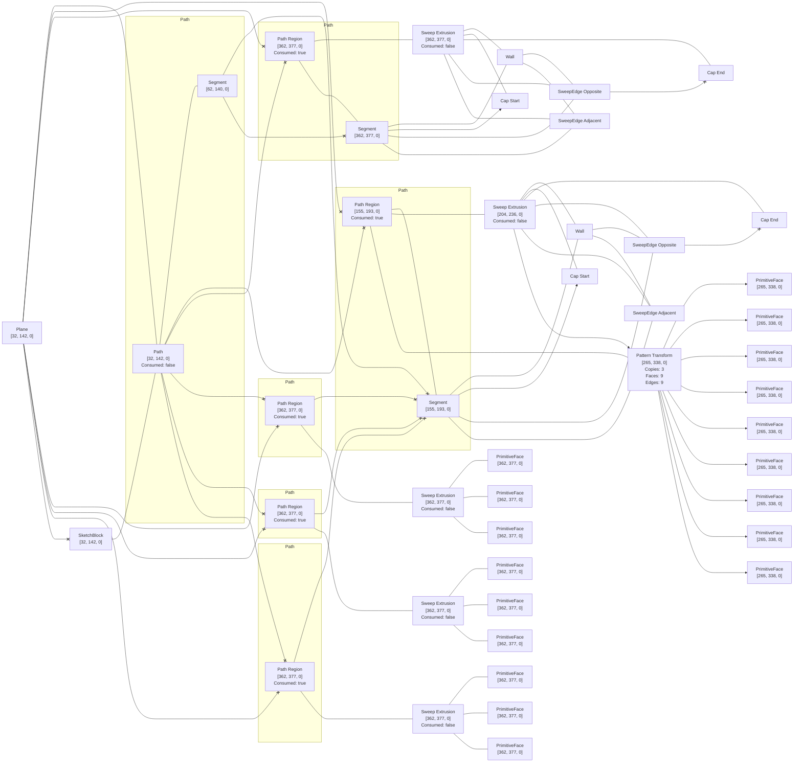

```mermaid
flowchart LR
  subgraph path2 [Path]
    2["Path<br>[32, 142, 0]<br>Consumed: false"]
      %% [ProgramBodyItem { index: 0 }, VariableDeclarationDeclaration, VariableDeclarationInit]
    3["Segment<br>[62, 140, 0]"]
      %% [ProgramBodyItem { index: 0 }, VariableDeclarationDeclaration, VariableDeclarationInit, SketchBlockBody, SketchBlockBodyItem { index: 0 }, VariableDeclarationDeclaration, VariableDeclarationInit]
  end
  subgraph path4 [Path]
    4["Path Region<br>[155, 193, 0]<br>Consumed: true"]
      %% [ProgramBodyItem { index: 1 }, VariableDeclarationDeclaration, VariableDeclarationInit]
    5["Segment<br>[155, 193, 0]"]
      %% [ProgramBodyItem { index: 1 }, VariableDeclarationDeclaration, VariableDeclarationInit]
  end
  subgraph path23 [Path]
    23["Path Region<br>[362, 377, 0]<br>Consumed: true"]
      %% [ProgramBodyItem { index: 4 }, ExpressionStatementExpr, PipeBodyItem { index: 0 }]
    24["Segment<br>[362, 377, 0]"]
      %% [ProgramBodyItem { index: 4 }, ExpressionStatementExpr, PipeBodyItem { index: 0 }]
  end
  subgraph path31 [Path]
    31["Path Region<br>[362, 377, 0]<br>Consumed: true"]
      %% [ProgramBodyItem { index: 4 }, ExpressionStatementExpr, PipeBodyItem { index: 0 }]
  end
  subgraph path36 [Path]
    36["Path Region<br>[362, 377, 0]<br>Consumed: true"]
      %% [ProgramBodyItem { index: 4 }, ExpressionStatementExpr, PipeBodyItem { index: 0 }]
  end
  subgraph path41 [Path]
    41["Path Region<br>[362, 377, 0]<br>Consumed: true"]
      %% [ProgramBodyItem { index: 4 }, ExpressionStatementExpr, PipeBodyItem { index: 0 }]
  end
  1["Plane<br>[32, 142, 0]"]
    %% [ProgramBodyItem { index: 0 }, VariableDeclarationDeclaration, VariableDeclarationInit]
  6["Sweep Extrusion<br>[204, 236, 0]<br>Consumed: false"]
    %% [ProgramBodyItem { index: 2 }, VariableDeclarationDeclaration, VariableDeclarationInit]
  7[Wall]
    %% face_code_ref=Missing NodePath
  8["Cap Start"]
    %% face_code_ref=Missing NodePath
  9["Cap End"]
    %% face_code_ref=Missing NodePath
  10["SweepEdge Opposite"]
  11["SweepEdge Adjacent"]
  12["Pattern Transform<br>[265, 338, 0]<br>Copies: 3<br>Faces: 9<br>Edges: 9"]
    %% [ProgramBodyItem { index: 3 }, VariableDeclarationDeclaration, VariableDeclarationInit]
  13["PrimitiveFace<br>[265, 338, 0]"]
    %% [ProgramBodyItem { index: 3 }, VariableDeclarationDeclaration, VariableDeclarationInit]
  14["PrimitiveFace<br>[265, 338, 0]"]
    %% [ProgramBodyItem { index: 3 }, VariableDeclarationDeclaration, VariableDeclarationInit]
  15["PrimitiveFace<br>[265, 338, 0]"]
    %% [ProgramBodyItem { index: 3 }, VariableDeclarationDeclaration, VariableDeclarationInit]
  16["PrimitiveFace<br>[265, 338, 0]"]
    %% [ProgramBodyItem { index: 3 }, VariableDeclarationDeclaration, VariableDeclarationInit]
  17["PrimitiveFace<br>[265, 338, 0]"]
    %% [ProgramBodyItem { index: 3 }, VariableDeclarationDeclaration, VariableDeclarationInit]
  18["PrimitiveFace<br>[265, 338, 0]"]
    %% [ProgramBodyItem { index: 3 }, VariableDeclarationDeclaration, VariableDeclarationInit]
  19["PrimitiveFace<br>[265, 338, 0]"]
    %% [ProgramBodyItem { index: 3 }, VariableDeclarationDeclaration, VariableDeclarationInit]
  20["PrimitiveFace<br>[265, 338, 0]"]
    %% [ProgramBodyItem { index: 3 }, VariableDeclarationDeclaration, VariableDeclarationInit]
  21["PrimitiveFace<br>[265, 338, 0]"]
    %% [ProgramBodyItem { index: 3 }, VariableDeclarationDeclaration, VariableDeclarationInit]
  22["Sweep Extrusion<br>[362, 377, 0]<br>Consumed: false"]
    %% [ProgramBodyItem { index: 4 }, ExpressionStatementExpr, PipeBodyItem { index: 0 }]
  25[Wall]
    %% face_code_ref=Missing NodePath
  26["Cap Start"]
    %% face_code_ref=Missing NodePath
  27["Cap End"]
    %% face_code_ref=Missing NodePath
  28["SweepEdge Opposite"]
  29["SweepEdge Adjacent"]
  30["Sweep Extrusion<br>[362, 377, 0]<br>Consumed: false"]
    %% [ProgramBodyItem { index: 4 }, ExpressionStatementExpr, PipeBodyItem { index: 0 }]
  32["PrimitiveFace<br>[362, 377, 0]"]
    %% [ProgramBodyItem { index: 4 }, ExpressionStatementExpr, PipeBodyItem { index: 0 }]
  33["PrimitiveFace<br>[362, 377, 0]"]
    %% [ProgramBodyItem { index: 4 }, ExpressionStatementExpr, PipeBodyItem { index: 0 }]
  34["PrimitiveFace<br>[362, 377, 0]"]
    %% [ProgramBodyItem { index: 4 }, ExpressionStatementExpr, PipeBodyItem { index: 0 }]
  35["Sweep Extrusion<br>[362, 377, 0]<br>Consumed: false"]
    %% [ProgramBodyItem { index: 4 }, ExpressionStatementExpr, PipeBodyItem { index: 0 }]
  37["PrimitiveFace<br>[362, 377, 0]"]
    %% [ProgramBodyItem { index: 4 }, ExpressionStatementExpr, PipeBodyItem { index: 0 }]
  38["PrimitiveFace<br>[362, 377, 0]"]
    %% [ProgramBodyItem { index: 4 }, ExpressionStatementExpr, PipeBodyItem { index: 0 }]
  39["PrimitiveFace<br>[362, 377, 0]"]
    %% [ProgramBodyItem { index: 4 }, ExpressionStatementExpr, PipeBodyItem { index: 0 }]
  40["Sweep Extrusion<br>[362, 377, 0]<br>Consumed: false"]
    %% [ProgramBodyItem { index: 4 }, ExpressionStatementExpr, PipeBodyItem { index: 0 }]
  42["PrimitiveFace<br>[362, 377, 0]"]
    %% [ProgramBodyItem { index: 4 }, ExpressionStatementExpr, PipeBodyItem { index: 0 }]
  43["PrimitiveFace<br>[362, 377, 0]"]
    %% [ProgramBodyItem { index: 4 }, ExpressionStatementExpr, PipeBodyItem { index: 0 }]
  44["PrimitiveFace<br>[362, 377, 0]"]
    %% [ProgramBodyItem { index: 4 }, ExpressionStatementExpr, PipeBodyItem { index: 0 }]
  45["SketchBlock<br>[32, 142, 0]"]
    %% [ProgramBodyItem { index: 0 }, VariableDeclarationDeclaration, VariableDeclarationInit]
  1 --- 2
  1 <--x 4
  1 <--x 23
  1 <--x 31
  1 <--x 36
  1 <--x 41
  1 <--x 45
  2 --- 3
  2 <--x 4
  2 <--x 23
  2 <--x 31
  2 <--x 36
  2 <--x 41
  45 --- 2
  3 <--x 5
  3 <--x 24
  4 --- 5
  4 ---- 6
  4 --- 12
  5 --- 7
  5 x--> 8
  5 --- 10
  5 --- 11
  31 <--x 5
  36 <--x 5
  41 <--x 5
  6 --- 7
  6 --- 8
  6 --- 9
  6 --- 10
  6 --- 11
  6 x--> 12
  7 --- 10
  7 --- 11
  10 <--x 9
  12 x--> 13
  12 x--> 14
  12 x--> 15
  12 x--> 16
  12 x--> 17
  12 x--> 18
  12 x--> 19
  12 x--> 20
  12 x--> 21
  23 ---- 22
  22 --- 25
  22 --- 26
  22 --- 27
  22 --- 28
  22 --- 29
  23 --- 24
  24 --- 25
  24 x--> 26
  24 --- 28
  24 --- 29
  25 --- 28
  25 --- 29
  28 <--x 27
  31 ---- 30
  30 --- 32
  30 --- 33
  30 --- 34
  36 ---- 35
  35 --- 37
  35 --- 38
  35 --- 39
  41 ---- 40
  40 --- 42
  40 --- 43
  40 --- 44
```
