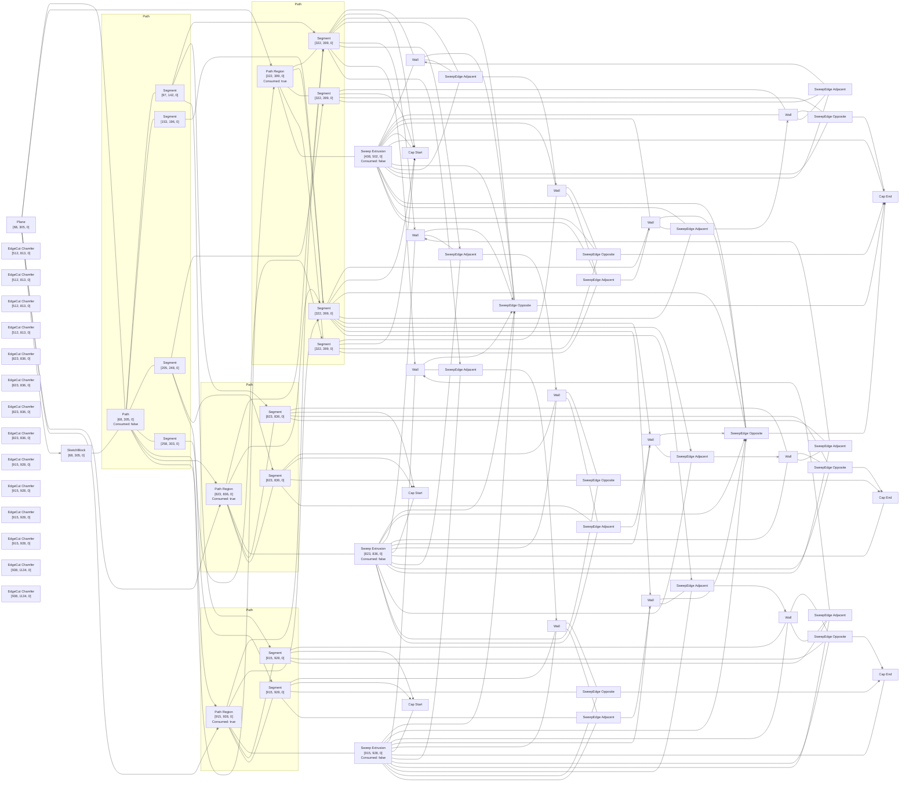

```mermaid
flowchart LR
  subgraph path2 [Path]
    2["Path<br>[68, 305, 0]<br>Consumed: false"]
      %% [ProgramBodyItem { index: 0 }, VariableDeclarationDeclaration, VariableDeclarationInit]
    3["Segment<br>[97, 142, 0]"]
      %% [ProgramBodyItem { index: 0 }, VariableDeclarationDeclaration, VariableDeclarationInit, SketchBlockBody, SketchBlockBodyItem { index: 0 }, VariableDeclarationDeclaration, VariableDeclarationInit]
    4["Segment<br>[153, 196, 0]"]
      %% [ProgramBodyItem { index: 0 }, VariableDeclarationDeclaration, VariableDeclarationInit, SketchBlockBody, SketchBlockBodyItem { index: 1 }, VariableDeclarationDeclaration, VariableDeclarationInit]
    5["Segment<br>[205, 248, 0]"]
      %% [ProgramBodyItem { index: 0 }, VariableDeclarationDeclaration, VariableDeclarationInit, SketchBlockBody, SketchBlockBodyItem { index: 2 }, VariableDeclarationDeclaration, VariableDeclarationInit]
    6["Segment<br>[258, 303, 0]"]
      %% [ProgramBodyItem { index: 0 }, VariableDeclarationDeclaration, VariableDeclarationInit, SketchBlockBody, SketchBlockBodyItem { index: 3 }, VariableDeclarationDeclaration, VariableDeclarationInit]
  end
  subgraph path7 [Path]
    7["Path Region<br>[322, 399, 0]<br>Consumed: true"]
      %% [ProgramBodyItem { index: 1 }, VariableDeclarationDeclaration, VariableDeclarationInit]
    8["Segment<br>[322, 399, 0]"]
      %% [ProgramBodyItem { index: 1 }, VariableDeclarationDeclaration, VariableDeclarationInit]
    9["Segment<br>[322, 399, 0]"]
      %% [ProgramBodyItem { index: 1 }, VariableDeclarationDeclaration, VariableDeclarationInit]
    10["Segment<br>[322, 399, 0]"]
      %% [ProgramBodyItem { index: 1 }, VariableDeclarationDeclaration, VariableDeclarationInit]
    11["Segment<br>[322, 399, 0]"]
      %% [ProgramBodyItem { index: 1 }, VariableDeclarationDeclaration, VariableDeclarationInit]
  end
  subgraph path32 [Path]
    32["Path Region<br>[823, 836, 0]<br>Consumed: true"]
      %% [ProgramBodyItem { index: 4 }, VariableDeclarationDeclaration, VariableDeclarationInit]
    33["Segment<br>[823, 836, 0]"]
      %% [ProgramBodyItem { index: 4 }, VariableDeclarationDeclaration, VariableDeclarationInit]
    34["Segment<br>[823, 836, 0]"]
      %% [ProgramBodyItem { index: 4 }, VariableDeclarationDeclaration, VariableDeclarationInit]
  end
  subgraph path52 [Path]
    52["Path Region<br>[915, 928, 0]<br>Consumed: true"]
      %% [ProgramBodyItem { index: 7 }, VariableDeclarationDeclaration, VariableDeclarationInit]
    53["Segment<br>[915, 928, 0]"]
      %% [ProgramBodyItem { index: 7 }, VariableDeclarationDeclaration, VariableDeclarationInit]
    54["Segment<br>[915, 928, 0]"]
      %% [ProgramBodyItem { index: 7 }, VariableDeclarationDeclaration, VariableDeclarationInit]
  end
  1["Plane<br>[68, 305, 0]"]
    %% [ProgramBodyItem { index: 0 }, VariableDeclarationDeclaration, VariableDeclarationInit]
  12["Sweep Extrusion<br>[408, 502, 0]<br>Consumed: false"]
    %% [ProgramBodyItem { index: 2 }, VariableDeclarationDeclaration, VariableDeclarationInit]
  13[Wall]
    %% face_code_ref=Missing NodePath
  14[Wall]
    %% face_code_ref=Missing NodePath
  15[Wall]
    %% face_code_ref=Missing NodePath
  16[Wall]
    %% face_code_ref=Missing NodePath
  17["Cap Start"]
    %% face_code_ref=Missing NodePath
  18["Cap End"]
    %% face_code_ref=Missing NodePath
  19["SweepEdge Opposite"]
  20["SweepEdge Adjacent"]
  21["SweepEdge Opposite"]
  22["SweepEdge Adjacent"]
  23["SweepEdge Opposite"]
  24["SweepEdge Adjacent"]
  25["SweepEdge Opposite"]
  26["SweepEdge Adjacent"]
  27["EdgeCut Chamfer<br>[512, 813, 0]"]
    %% [ProgramBodyItem { index: 3 }, VariableDeclarationDeclaration, VariableDeclarationInit]
  28["EdgeCut Chamfer<br>[512, 813, 0]"]
    %% [ProgramBodyItem { index: 3 }, VariableDeclarationDeclaration, VariableDeclarationInit]
  29["EdgeCut Chamfer<br>[512, 813, 0]"]
    %% [ProgramBodyItem { index: 3 }, VariableDeclarationDeclaration, VariableDeclarationInit]
  30["EdgeCut Chamfer<br>[512, 813, 0]"]
    %% [ProgramBodyItem { index: 3 }, VariableDeclarationDeclaration, VariableDeclarationInit]
  31["Sweep Extrusion<br>[823, 836, 0]<br>Consumed: false"]
    %% [ProgramBodyItem { index: 4 }, VariableDeclarationDeclaration, VariableDeclarationInit]
  35[Wall]
    %% face_code_ref=Missing NodePath
  36[Wall]
    %% face_code_ref=Missing NodePath
  37[Wall]
    %% face_code_ref=Missing NodePath
  38[Wall]
    %% face_code_ref=Missing NodePath
  39["Cap Start"]
    %% face_code_ref=Missing NodePath
  40["Cap End"]
    %% face_code_ref=Missing NodePath
  41["SweepEdge Adjacent"]
  42["SweepEdge Opposite"]
  43["SweepEdge Adjacent"]
  44["SweepEdge Adjacent"]
  45["SweepEdge Opposite"]
  46["SweepEdge Adjacent"]
  47["EdgeCut Chamfer<br>[823, 836, 0]"]
    %% [ProgramBodyItem { index: 4 }, VariableDeclarationDeclaration, VariableDeclarationInit]
  48["EdgeCut Chamfer<br>[823, 836, 0]"]
    %% [ProgramBodyItem { index: 4 }, VariableDeclarationDeclaration, VariableDeclarationInit]
  49["EdgeCut Chamfer<br>[823, 836, 0]"]
    %% [ProgramBodyItem { index: 4 }, VariableDeclarationDeclaration, VariableDeclarationInit]
  50["EdgeCut Chamfer<br>[823, 836, 0]"]
    %% [ProgramBodyItem { index: 4 }, VariableDeclarationDeclaration, VariableDeclarationInit]
  51["Sweep Extrusion<br>[915, 928, 0]<br>Consumed: false"]
    %% [ProgramBodyItem { index: 7 }, VariableDeclarationDeclaration, VariableDeclarationInit]
  55[Wall]
    %% face_code_ref=Missing NodePath
  56[Wall]
    %% face_code_ref=Missing NodePath
  57[Wall]
    %% face_code_ref=Missing NodePath
  58[Wall]
    %% face_code_ref=Missing NodePath
  59["Cap Start"]
    %% face_code_ref=Missing NodePath
  60["Cap End"]
    %% face_code_ref=Missing NodePath
  61["SweepEdge Adjacent"]
  62["SweepEdge Opposite"]
  63["SweepEdge Adjacent"]
  64["SweepEdge Adjacent"]
  65["SweepEdge Opposite"]
  66["SweepEdge Adjacent"]
  67["EdgeCut Chamfer<br>[915, 928, 0]"]
    %% [ProgramBodyItem { index: 7 }, VariableDeclarationDeclaration, VariableDeclarationInit]
  68["EdgeCut Chamfer<br>[915, 928, 0]"]
    %% [ProgramBodyItem { index: 7 }, VariableDeclarationDeclaration, VariableDeclarationInit]
  69["EdgeCut Chamfer<br>[915, 928, 0]"]
    %% [ProgramBodyItem { index: 7 }, VariableDeclarationDeclaration, VariableDeclarationInit]
  70["EdgeCut Chamfer<br>[915, 928, 0]"]
    %% [ProgramBodyItem { index: 7 }, VariableDeclarationDeclaration, VariableDeclarationInit]
  71["EdgeCut Chamfer<br>[938, 1134, 0]"]
    %% [ProgramBodyItem { index: 8 }, VariableDeclarationDeclaration, VariableDeclarationInit]
  72["EdgeCut Chamfer<br>[938, 1134, 0]"]
    %% [ProgramBodyItem { index: 8 }, VariableDeclarationDeclaration, VariableDeclarationInit]
  73["SketchBlock<br>[68, 305, 0]"]
    %% [ProgramBodyItem { index: 0 }, VariableDeclarationDeclaration, VariableDeclarationInit]
  1 --- 2
  1 <--x 7
  1 <--x 32
  1 <--x 52
  1 <--x 73
  2 --- 3
  2 --- 4
  2 --- 5
  2 --- 6
  2 <--x 7
  2 <--x 32
  2 <--x 52
  73 --- 2
  3 <--x 8
  3 <--x 33
  3 <--x 53
  4 <--x 9
  5 <--x 10
  5 <--x 34
  5 <--x 54
  6 <--x 11
  7 --- 8
  7 --- 9
  7 --- 10
  7 --- 11
  7 ---- 12
  8 --- 13
  8 x--> 17
  8 --- 19
  8 --- 20
  32 <--x 8
  8 <--x 35
  8 <--x 41
  52 <--x 8
  8 <--x 55
  8 <--x 61
  9 --- 15
  9 x--> 17
  9 --- 23
  9 --- 24
  32 <--x 9
  9 <--x 37
  9 <--x 44
  52 <--x 9
  9 <--x 57
  9 <--x 64
  10 --- 14
  10 x--> 17
  10 --- 21
  10 --- 22
  11 --- 16
  11 x--> 17
  11 --- 25
  11 --- 26
  12 --- 13
  12 --- 14
  12 --- 15
  12 --- 16
  12 --- 17
  12 --- 18
  12 --- 19
  12 --- 20
  12 --- 21
  12 --- 22
  12 --- 23
  12 --- 24
  12 --- 25
  12 --- 26
  13 --- 19
  13 --- 20
  22 <--x 13
  14 --- 21
  14 --- 22
  24 <--x 14
  15 --- 23
  15 --- 24
  26 <--x 15
  20 <--x 16
  16 --- 25
  16 --- 26
  19 <--x 18
  21 <--x 18
  23 <--x 18
  25 <--x 18
  31 <--x 19
  35 <--x 19
  51 <--x 19
  55 <--x 19
  31 <--x 23
  37 <--x 23
  51 <--x 23
  57 <--x 23
  32 ---- 31
  31 --- 35
  31 --- 36
  31 --- 37
  31 --- 38
  31 --- 39
  31 --- 40
  31 --- 41
  31 --- 42
  31 --- 43
  31 --- 44
  31 --- 45
  31 --- 46
  32 --- 33
  32 --- 34
  33 --- 36
  33 x--> 39
  33 --- 42
  33 --- 43
  34 --- 38
  34 x--> 39
  34 --- 45
  34 --- 46
  35 --- 41
  43 <--x 35
  36 --- 42
  36 --- 43
  44 <--x 36
  37 --- 44
  46 <--x 37
  41 <--x 38
  38 --- 45
  38 --- 46
  42 <--x 40
  45 <--x 40
  52 ---- 51
  51 --- 55
  51 --- 56
  51 --- 57
  51 --- 58
  51 --- 59
  51 --- 60
  51 --- 61
  51 --- 62
  51 --- 63
  51 --- 64
  51 --- 65
  51 --- 66
  52 --- 53
  52 --- 54
  53 --- 56
  53 x--> 59
  53 --- 62
  53 --- 63
  54 --- 58
  54 x--> 59
  54 --- 65
  54 --- 66
  55 --- 61
  63 <--x 55
  56 --- 62
  56 --- 63
  64 <--x 56
  57 --- 64
  66 <--x 57
  61 <--x 58
  58 --- 65
  58 --- 66
  62 <--x 60
  65 <--x 60
```
