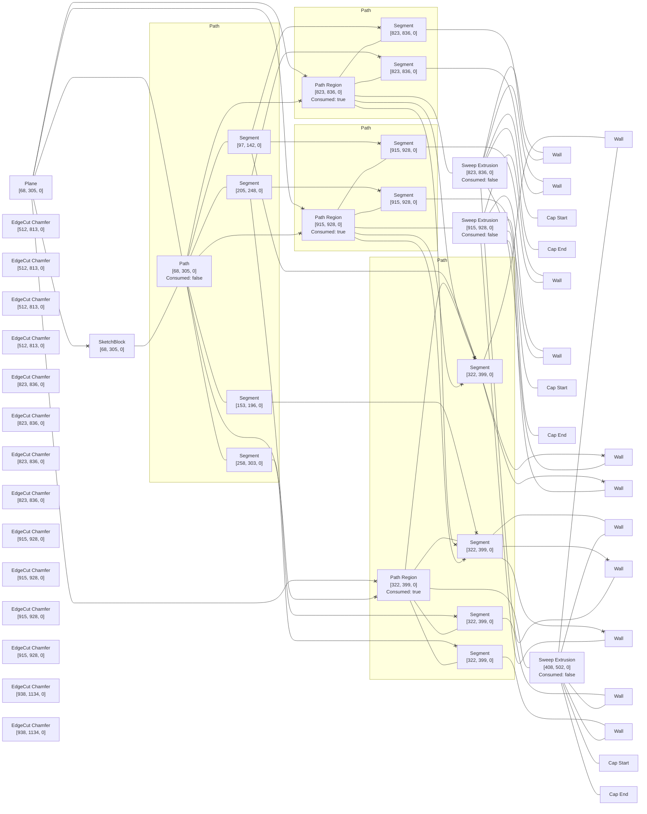

```mermaid
flowchart LR
  subgraph path2 [Path]
    2["Path<br>[68, 305, 0]<br>Consumed: false"]
      %% [ProgramBodyItem { index: 0 }, VariableDeclarationDeclaration, VariableDeclarationInit]
    3["Segment<br>[97, 142, 0]"]
      %% [ProgramBodyItem { index: 0 }, VariableDeclarationDeclaration, VariableDeclarationInit, SketchBlockBody, SketchBlockBodyItem { index: 0 }, VariableDeclarationDeclaration, VariableDeclarationInit]
    4["Segment<br>[153, 196, 0]"]
      %% [ProgramBodyItem { index: 0 }, VariableDeclarationDeclaration, VariableDeclarationInit, SketchBlockBody, SketchBlockBodyItem { index: 1 }, VariableDeclarationDeclaration, VariableDeclarationInit]
    5["Segment<br>[205, 248, 0]"]
      %% [ProgramBodyItem { index: 0 }, VariableDeclarationDeclaration, VariableDeclarationInit, SketchBlockBody, SketchBlockBodyItem { index: 2 }, VariableDeclarationDeclaration, VariableDeclarationInit]
    6["Segment<br>[258, 303, 0]"]
      %% [ProgramBodyItem { index: 0 }, VariableDeclarationDeclaration, VariableDeclarationInit, SketchBlockBody, SketchBlockBodyItem { index: 3 }, VariableDeclarationDeclaration, VariableDeclarationInit]
  end
  subgraph path7 [Path]
    7["Path Region<br>[322, 399, 0]<br>Consumed: true"]
      %% [ProgramBodyItem { index: 1 }, VariableDeclarationDeclaration, VariableDeclarationInit]
    8["Segment<br>[322, 399, 0]"]
      %% [ProgramBodyItem { index: 1 }, VariableDeclarationDeclaration, VariableDeclarationInit]
    9["Segment<br>[322, 399, 0]"]
      %% [ProgramBodyItem { index: 1 }, VariableDeclarationDeclaration, VariableDeclarationInit]
    10["Segment<br>[322, 399, 0]"]
      %% [ProgramBodyItem { index: 1 }, VariableDeclarationDeclaration, VariableDeclarationInit]
    11["Segment<br>[322, 399, 0]"]
      %% [ProgramBodyItem { index: 1 }, VariableDeclarationDeclaration, VariableDeclarationInit]
  end
  subgraph path24 [Path]
    24["Path Region<br>[823, 836, 0]<br>Consumed: true"]
      %% [ProgramBodyItem { index: 4 }, VariableDeclarationDeclaration, VariableDeclarationInit]
    25["Segment<br>[823, 836, 0]"]
      %% [ProgramBodyItem { index: 4 }, VariableDeclarationDeclaration, VariableDeclarationInit]
    26["Segment<br>[823, 836, 0]"]
      %% [ProgramBodyItem { index: 4 }, VariableDeclarationDeclaration, VariableDeclarationInit]
  end
  subgraph path38 [Path]
    38["Path Region<br>[915, 928, 0]<br>Consumed: true"]
      %% [ProgramBodyItem { index: 7 }, VariableDeclarationDeclaration, VariableDeclarationInit]
    39["Segment<br>[915, 928, 0]"]
      %% [ProgramBodyItem { index: 7 }, VariableDeclarationDeclaration, VariableDeclarationInit]
    40["Segment<br>[915, 928, 0]"]
      %% [ProgramBodyItem { index: 7 }, VariableDeclarationDeclaration, VariableDeclarationInit]
  end
  1["Plane<br>[68, 305, 0]"]
    %% [ProgramBodyItem { index: 0 }, VariableDeclarationDeclaration, VariableDeclarationInit]
  12["Sweep Extrusion<br>[408, 502, 0]<br>Consumed: false"]
    %% [ProgramBodyItem { index: 2 }, VariableDeclarationDeclaration, VariableDeclarationInit]
  13[Wall]
    %% face_code_ref=Missing NodePath
  14[Wall]
    %% face_code_ref=Missing NodePath
  15[Wall]
    %% face_code_ref=Missing NodePath
  16[Wall]
    %% face_code_ref=Missing NodePath
  17["Cap Start"]
    %% face_code_ref=Missing NodePath
  18["Cap End"]
    %% face_code_ref=Missing NodePath
  19["EdgeCut Chamfer<br>[512, 813, 0]"]
    %% [ProgramBodyItem { index: 3 }, VariableDeclarationDeclaration, VariableDeclarationInit]
  20["EdgeCut Chamfer<br>[512, 813, 0]"]
    %% [ProgramBodyItem { index: 3 }, VariableDeclarationDeclaration, VariableDeclarationInit]
  21["EdgeCut Chamfer<br>[512, 813, 0]"]
    %% [ProgramBodyItem { index: 3 }, VariableDeclarationDeclaration, VariableDeclarationInit]
  22["EdgeCut Chamfer<br>[512, 813, 0]"]
    %% [ProgramBodyItem { index: 3 }, VariableDeclarationDeclaration, VariableDeclarationInit]
  23["Sweep Extrusion<br>[823, 836, 0]<br>Consumed: false"]
    %% [ProgramBodyItem { index: 4 }, VariableDeclarationDeclaration, VariableDeclarationInit]
  27[Wall]
    %% face_code_ref=Missing NodePath
  28[Wall]
    %% face_code_ref=Missing NodePath
  29[Wall]
    %% face_code_ref=Missing NodePath
  30[Wall]
    %% face_code_ref=Missing NodePath
  31["Cap Start"]
    %% face_code_ref=Missing NodePath
  32["Cap End"]
    %% face_code_ref=Missing NodePath
  33["EdgeCut Chamfer<br>[823, 836, 0]"]
    %% [ProgramBodyItem { index: 4 }, VariableDeclarationDeclaration, VariableDeclarationInit]
  34["EdgeCut Chamfer<br>[823, 836, 0]"]
    %% [ProgramBodyItem { index: 4 }, VariableDeclarationDeclaration, VariableDeclarationInit]
  35["EdgeCut Chamfer<br>[823, 836, 0]"]
    %% [ProgramBodyItem { index: 4 }, VariableDeclarationDeclaration, VariableDeclarationInit]
  36["EdgeCut Chamfer<br>[823, 836, 0]"]
    %% [ProgramBodyItem { index: 4 }, VariableDeclarationDeclaration, VariableDeclarationInit]
  37["Sweep Extrusion<br>[915, 928, 0]<br>Consumed: false"]
    %% [ProgramBodyItem { index: 7 }, VariableDeclarationDeclaration, VariableDeclarationInit]
  41[Wall]
    %% face_code_ref=Missing NodePath
  42[Wall]
    %% face_code_ref=Missing NodePath
  43[Wall]
    %% face_code_ref=Missing NodePath
  44[Wall]
    %% face_code_ref=Missing NodePath
  45["Cap Start"]
    %% face_code_ref=Missing NodePath
  46["Cap End"]
    %% face_code_ref=Missing NodePath
  47["EdgeCut Chamfer<br>[915, 928, 0]"]
    %% [ProgramBodyItem { index: 7 }, VariableDeclarationDeclaration, VariableDeclarationInit]
  48["EdgeCut Chamfer<br>[915, 928, 0]"]
    %% [ProgramBodyItem { index: 7 }, VariableDeclarationDeclaration, VariableDeclarationInit]
  49["EdgeCut Chamfer<br>[915, 928, 0]"]
    %% [ProgramBodyItem { index: 7 }, VariableDeclarationDeclaration, VariableDeclarationInit]
  50["EdgeCut Chamfer<br>[915, 928, 0]"]
    %% [ProgramBodyItem { index: 7 }, VariableDeclarationDeclaration, VariableDeclarationInit]
  51["EdgeCut Chamfer<br>[938, 1134, 0]"]
    %% [ProgramBodyItem { index: 8 }, VariableDeclarationDeclaration, VariableDeclarationInit]
  52["EdgeCut Chamfer<br>[938, 1134, 0]"]
    %% [ProgramBodyItem { index: 8 }, VariableDeclarationDeclaration, VariableDeclarationInit]
  53["SketchBlock<br>[68, 305, 0]"]
    %% [ProgramBodyItem { index: 0 }, VariableDeclarationDeclaration, VariableDeclarationInit]
  1 --- 2
  1 <--x 7
  1 <--x 24
  1 <--x 38
  1 <--x 53
  2 --- 3
  2 --- 4
  2 --- 5
  2 --- 6
  2 <--x 7
  2 <--x 24
  2 <--x 38
  53 --- 2
  3 <--x 8
  3 <--x 25
  3 <--x 39
  4 <--x 9
  5 <--x 10
  5 <--x 26
  5 <--x 40
  6 <--x 11
  7 --- 8
  7 --- 9
  7 --- 10
  7 --- 11
  7 ---- 12
  8 --- 13
  24 <--x 8
  8 <--x 27
  38 <--x 8
  8 <--x 41
  9 --- 15
  24 <--x 9
  9 <--x 29
  38 <--x 9
  9 <--x 43
  10 --- 14
  11 --- 16
  12 --- 13
  12 --- 14
  12 --- 15
  12 --- 16
  12 --- 17
  12 --- 18
  24 ---- 23
  23 --- 27
  23 --- 28
  23 --- 29
  23 --- 30
  23 --- 31
  23 --- 32
  24 --- 25
  24 --- 26
  25 --- 28
  26 --- 30
  38 ---- 37
  37 --- 41
  37 --- 42
  37 --- 43
  37 --- 44
  37 --- 45
  37 --- 46
  38 --- 39
  38 --- 40
  39 --- 42
  40 --- 44
```
